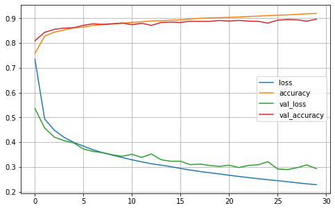
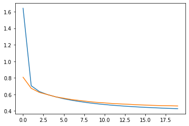
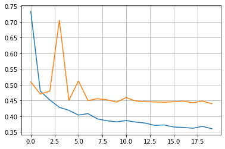

```python
import numpy as np
from sklearn.datasets import load_iris
from sklearn.linear_model import Perceptron
```


```python
iris = load_iris()
X = iris.data[:,(2,3)] #petal length, petal width
y = (iris.target == 0).astype(np.int) #iris setosa?
```


```python
per_clf = Perceptron()
per_clf.fit(X,y)
```


    Perceptron()


```python
y_pred = per_clf.predict([[2,0.5]])
print(y_pred)
```

    [0]


## Using Perceptron for logical functions


```python
import numpy as np

def unit_step(v):
    """ Heavyside Step Function. v must be scalar"""
    if v >= 0:
        return 1
    else:
        return 0
    
def perceptron(x,w,b):
    """ Function implemented by a perceptron with 
    weight vector w and bias b"""
    
    v = np.dot(w , x) + b
    y = unit_step(v)
    return y

```

### NOT Gate


```python
def NOT_percept(x):
    return perceptron(x,w = -1, b = 0.5)


""" heavyside step function (- 1 * 0 + 0.5) == 1"""
print("NOT(0) = {}".format(NOT_percept(0)))


""" heavyside step function (1 * -1 + 0.5) == 0"""
print("NOT(1) = {}".format(NOT_percept(1)))
```

    NOT(0) = 1
    NOT(1) = 0


### AND Gate

$y = \theta(w_1 * x_1 + w_2 * x_2 + b)$

Choose parameter $ w_1, w_2, b$ properly. 
$w_1 = 1, w_2 = 1, b = -1.5$


```python
def AND_percept(x):
    w = np.array([1,1])
    b = -1.5
    return perceptron(x,w,b)

# Test
example1 = np.array([0,0])
example2 = np.array([0,1])
example3 = np.array([1,0])
example4 = np.array([1,1])

print("AND({}, {}) = {}".format(0, 0, AND_percept(example1)))
print("AND({}, {}) = {}".format(0, 1, AND_percept(example2)))
print("AND({}, {}) = {}".format(1, 0, AND_percept(example3)))
print("AND({}, {}) = {}".format(1, 1, AND_percept(example4)))
```

    AND(0, 0) = 0
    AND(0, 1) = 0
    AND(1, 0) = 0
    AND(1, 1) = 1


### OR gate

$ w1 = 1, w2 = 1, b = -0.5 $


```python
def OR_percept(x):
    w = np.array([1,1])
    b = -0.5
    return perceptron(x,w,b)

# Test
example1 = np.array([0,0])
example2 = np.array([0,1])
example3 = np.array([1,0])
example4 = np.array([1,1])

print("OR({}, {}) = {}".format(0, 0, OR_percept(example1)))
print("OR({}, {}) = {}".format(0, 1, OR_percept(example2)))
print("OR({}, {}) = {}".format(1, 0, OR_percept(example3)))
print("OR({}, {}) = {}".format(1, 1, OR_percept(example4)))
```

    OR(0, 0) = 0
    OR(0, 1) = 1
    OR(1, 0) = 1
    OR(1, 1) = 1


### XOR Gate

Xor gate can be made from combination of 3 gates mentioned above

$ XOR(x_1,x_2) = AND(NOT(AND(x_1,x_2)), OR(x_1,x_2)) $


```python
def XOR_net(x):
    gate1 = AND_percept(x)
    gate2 = OR_percept(x)
    gate3 = NOT_percept(gate1)
    
    new_x = np.array([gate2,gate3])
    
    output = AND_percept(new_x)
    return output
    
# Test
example1 = np.array([0,0])
example2 = np.array([0,1])
example3 = np.array([1,0])
example4 = np.array([1,1])

    
print("XOR({}, {}) = {}".format(0, 0, XOR_net(example1)))
print("XOR({}, {}) = {}".format(0, 1, XOR_net(example2)))
print("XOR({}, {}) = {}".format(1, 0, XOR_net(example3)))
print("XOR({}, {}) = {}".format(1, 1, XOR_net(example4)))
```

    XOR(0, 0) = 0
    XOR(0, 1) = 1
    XOR(1, 0) = 1
    XOR(1, 1) = 0


This is the result we're looking for. We combined 3 perceptrons above to get a more complex logical function. 

So, **is it possible to do the same like before (by finding the paraemters w and b?**. NO, because they don't exist. **WHY?**. The answer is that the XOR problem is not **Linearly Seperable**. 


**Hence, the limitation of perceptrons can be eliminated by stacking multiple perceptrons**. The resulting ANN is called **Multi-Layer Perceptron (MLP).** 

An MLP is composed of one (passthrough) input layer, one or more layers of TLUs, called hidden layers, and one final layer of TLUs called the output layers. 

When an ANN contains a deep stack of hidden layers, it is called **deep neural network(DNN)**. 

## Training multi layer perceptron (ANN)

-> trained using backward propagation algorithm.   

-> performs gradient descent step. 

##### Algorithm in more detail:
- handles one mini-batch at a time (for example 32 instances each) and goes through the full training set multiple times. 

- each mini-batch is passed to the network input layer, which sends it to hidden layer and so on. Hence, we get the output. This is known as **forward pass**. It is exactly like making predictions, except all intermediate results are preserved since they are needed for backward pass. 

- Next, algorithm measures the network's output error (using loss function).  Compares desired output with network output. 

- Then it computes how much each output connection contributed to the error. Done analytically by chain rule of calculus. It does so until it reaches input layer. 

- Finally, the algorithm performs gradient descent step to tweak all the connection weights.  


In order for this algorithm to work properly, the authors made a key change to the MLP architecture's step function with the logistic sigmoid function. $\sigma(z) = \frac{1}{1 - \exp(-z)}$. This was essential because the step function contains only the flat segments, so there is no gradient to work with, while logistic function has a well defined non zero derivative every wehere, allowing gradient descent to make progress at every step. 


#### Now we know where Neural net came from, what exactly we can do with them? 

#### 1) Regression MLPs:
If you want to predict a single value (eg: price of house given many features) then you just need single output neuron. 
If you want to locate the center of an object on an image, you need to predict 2D coordinates, so you need two output neurons. .. and so on. 

In general, if you want to use MLPs for regression task, you should not use activation function for the output neurons, so they are free to output any range of values. 

#### 2) Classification MLPs:
MLPs also does classification tasks. For binary classification, you just need one output neuron using the logistic activation function. You can also use it for multilabel binary classification. eg. predicting email is ham or spam, and urgent or non-urgent. For this you need two output neuron. 

You can also use it for multiclass classification. Eg: Classifying MNIST dataset, for 0 to 9 digit, you need 10 output neurons, and you should use softmax activation function for whole output layer. (Softmax activation function basically assigns probability for whole output neurons, s.t their sum altogether is 1)

## Building an Image classifier using Sequential API


```python
import tensorflow as tf
from tensorflow import keras
```


```python
fashion_mnist = keras.datasets.fashion_mnist
(X_train_full,y_train_full),(X_test, y_test) = fashion_mnist.load_data()
```


```python
# every image is represented as 28 x 28 array rather than 1D array size of 784
print(X_train_full.shape)
print(X_train_full.dtype)
# There are 60000 dataset 
```

    (60000, 28, 28)
    uint8


```python
# Create a validation set. and, since we are going to train using gradient descent, we must scale the input feature
# For simplicity, divide by 255.0 to scale them in range 0-1.

X_valid, X_train = X_train_full[:5000] / 255.0, X_train_full[5000:]/255.0
y_valid, y_train = y_train_full[:5000], y_train_full[5000:]

```


```python
# the class names for y are:
class_names = ["T-shirt/Top","Trouser","Pullover","Dress","Coat",
              "Sandal","Shirt","Sneaker","Bag","Ankle Boot"]

class_names[y_train[0]]
```


    'Coat'


```python
# Now creating model using sequential API

# Sequential model -> simplest kind of keras model composed of single stack of layers connected sequentially.
model = keras.models.Sequential()

# first layer Flatten layer whose role is simply to convert each iput image to 1D array. Like X.reshape(-1,1)
# Alternatively, you could also do -> model.add(keras.layers.InputLayer(shape = [28,28]))
model.add(keras.layers.Flatten(input_shape = [28,28]))

# Add Dense hidden layer with 300 neuron && 100 neuron, and it will use ReLU activation
model.add(keras.layers.Dense(300,activation = "relu"))
model.add(keras.layers.Dense(100,activation = "relu"))

#Finally, we add Dense output layer with 10 neuron (one per class) using softmax activation function.
model.add(keras.layers.Dense(10,activation = "softmax"))
```


```python
# print model description
model.summary()
```

    Model: "sequential"
    _________________________________________________________________
    Layer (type)                 Output Shape              Param #   
    =================================================================
    flatten (Flatten)            (None, 784)               0         
    _________________________________________________________________
    dense (Dense)                (None, 300)               235500    
    _________________________________________________________________
    dense_1 (Dense)              (None, 100)               30100     
    _________________________________________________________________
    dense_2 (Dense)              (None, 10)                1010      
    =================================================================
    Total params: 266,610
    Trainable params: 266,610
    Non-trainable params: 0
    _________________________________________________________________


Dense layer often has lot of parameters. For example first hidden layer has 784 x 300 parameters + 300 bias terms which adds up to 235,500. This gives the model quite a lot of flexibility to fit the training data, but also means model runs the risk of overfitting, especially when you donot have a lot of training data. 


```python
# print model layers. 
model.layers

print(model.layers[0].name)
print(model.layers[1].name)
print(model.layers[2].name)
print(model.layers[3].name)
```

    flatten
    dense
    dense_1
    dense_2


All the parameters of a layer can be accessed using its get_weights() and set_weights() method. For a dense layer, this includes both the connection weights and bias terms. 


```python
hidden1 = model.layers[1]
weights,biases = hidden1.get_weights()
print("Weights:\r\n",weights)
print("\r\n")
print("Weight shape:",weights.shape)
```

    Weights:
     [[ 0.04958864 -0.04779727  0.00687333 ... -0.06269519  0.06484419
       0.05254701]
     [ 0.04169325  0.04855789 -0.01027607 ...  0.04412204 -0.0452532
      -0.06192764]
     [-0.04971872  0.05804987 -0.01706743 ... -0.013877   -0.04367473
      -0.01593555]
     ...
     [ 0.00556499  0.03387158  0.01763874 ... -0.01227954 -0.04701785
       0.0401414 ]
     [ 0.00731344 -0.05915475  0.0690787  ...  0.01081468  0.04263622
       0.00148878]
     [-0.00412194 -0.07362765  0.03361884 ...  0.061204   -0.06167354
       0.00611348]]
    
    
    Weight shape: (784, 300)


```python
biases
```


    array([0., 0., 0., 0., 0., 0., 0., 0., 0., 0., 0., 0., 0., 0., 0., 0., 0.,
           0., 0., 0., 0., 0., 0., 0., 0., 0., 0., 0., 0., 0., 0., 0., 0., 0.,
           0., 0., 0., 0., 0., 0., 0., 0., 0., 0., 0., 0., 0., 0., 0., 0., 0.,
           0., 0., 0., 0., 0., 0., 0., 0., 0., 0., 0., 0., 0., 0., 0., 0., 0.,
           0., 0., 0., 0., 0., 0., 0., 0., 0., 0., 0., 0., 0., 0., 0., 0., 0.,
           0., 0., 0., 0., 0., 0., 0., 0., 0., 0., 0., 0., 0., 0., 0., 0., 0.,
           0., 0., 0., 0., 0., 0., 0., 0., 0., 0., 0., 0., 0., 0., 0., 0., 0.,
           0., 0., 0., 0., 0., 0., 0., 0., 0., 0., 0., 0., 0., 0., 0., 0., 0.,
           0., 0., 0., 0., 0., 0., 0., 0., 0., 0., 0., 0., 0., 0., 0., 0., 0.,
           0., 0., 0., 0., 0., 0., 0., 0., 0., 0., 0., 0., 0., 0., 0., 0., 0.,
           0., 0., 0., 0., 0., 0., 0., 0., 0., 0., 0., 0., 0., 0., 0., 0., 0.,
           0., 0., 0., 0., 0., 0., 0., 0., 0., 0., 0., 0., 0., 0., 0., 0., 0.,
           0., 0., 0., 0., 0., 0., 0., 0., 0., 0., 0., 0., 0., 0., 0., 0., 0.,
           0., 0., 0., 0., 0., 0., 0., 0., 0., 0., 0., 0., 0., 0., 0., 0., 0.,
           0., 0., 0., 0., 0., 0., 0., 0., 0., 0., 0., 0., 0., 0., 0., 0., 0.,
           0., 0., 0., 0., 0., 0., 0., 0., 0., 0., 0., 0., 0., 0., 0., 0., 0.,
           0., 0., 0., 0., 0., 0., 0., 0., 0., 0., 0., 0., 0., 0., 0., 0., 0.,
           0., 0., 0., 0., 0., 0., 0., 0., 0., 0., 0.], dtype=float32)


```python
# After a model is created, you must call its compile() method to specify the loss function and the optimizer
# to use. 
model.compile(loss = "sparse_categorical_crossentropy",
             optimizer = "sgd",
             metrics = ["accuracy"])

# we used sgd optimizer i.e train the model using sgd. 
# Finally since this is classifier, it's useful to measure its "accuracy" during training and evaluation. 
```


```python
X_train.shape
# Although there are 55000 data, in epochs below, 1719 images are processed. This is because the default batch
# size is 32. i.e mean loss of 32 images are calculated at once. and weights are adjusted. 
# 55000 / 32 = 1719
```


    (55000, 28, 28)


```python
# Training and evaluating model

history = model.fit(X_train,y_train,epochs = 30,
                   validation_data = (X_valid,y_valid))
```

    Epoch 1/30
    1719/1719 [==============================] - 5s 3ms/step - loss: 0.7344 - accuracy: 0.7588 - val_loss: 0.5360 - val_accuracy: 0.8096
    Epoch 2/30
    1719/1719 [==============================] - 5s 3ms/step - loss: 0.4937 - accuracy: 0.8281 - val_loss: 0.4572 - val_accuracy: 0.8434
    Epoch 3/30
    1719/1719 [==============================] - 5s 3ms/step - loss: 0.4482 - accuracy: 0.8441 - val_loss: 0.4203 - val_accuracy: 0.8554
    Epoch 4/30
    1719/1719 [==============================] - 4s 3ms/step - loss: 0.4195 - accuracy: 0.8525 - val_loss: 0.4061 - val_accuracy: 0.8602
    Epoch 5/30
    1719/1719 [==============================] - 5s 3ms/step - loss: 0.3991 - accuracy: 0.8618 - val_loss: 0.3971 - val_accuracy: 0.8620
    Epoch 6/30
    1719/1719 [==============================] - 5s 3ms/step - loss: 0.3841 - accuracy: 0.8643 - val_loss: 0.3725 - val_accuracy: 0.8716
    Epoch 7/30
    1719/1719 [==============================] - 5s 3ms/step - loss: 0.3692 - accuracy: 0.8711 - val_loss: 0.3627 - val_accuracy: 0.8778
    Epoch 8/30
    1719/1719 [==============================] - 5s 3ms/step - loss: 0.3574 - accuracy: 0.8742 - val_loss: 0.3576 - val_accuracy: 0.8754
    Epoch 9/30
    1719/1719 [==============================] - 5s 3ms/step - loss: 0.3476 - accuracy: 0.8769 - val_loss: 0.3491 - val_accuracy: 0.8782
    Epoch 10/30
    1719/1719 [==============================] - 5s 3ms/step - loss: 0.3380 - accuracy: 0.8802 - val_loss: 0.3432 - val_accuracy: 0.8808
    Epoch 11/30
    1719/1719 [==============================] - 5s 3ms/step - loss: 0.3288 - accuracy: 0.8836 - val_loss: 0.3511 - val_accuracy: 0.8740
    Epoch 12/30
    1719/1719 [==============================] - 4s 3ms/step - loss: 0.3207 - accuracy: 0.8859 - val_loss: 0.3386 - val_accuracy: 0.8800
    Epoch 13/30
    1719/1719 [==============================] - 5s 3ms/step - loss: 0.3129 - accuracy: 0.8893 - val_loss: 0.3525 - val_accuracy: 0.8714
    Epoch 14/30
    1719/1719 [==============================] - 5s 3ms/step - loss: 0.3072 - accuracy: 0.8903 - val_loss: 0.3291 - val_accuracy: 0.8830
    Epoch 15/30
    1719/1719 [==============================] - 5s 3ms/step - loss: 0.3013 - accuracy: 0.8922 - val_loss: 0.3231 - val_accuracy: 0.8848
    Epoch 16/30
    1719/1719 [==============================] - 5s 3ms/step - loss: 0.2939 - accuracy: 0.8933 - val_loss: 0.3234 - val_accuracy: 0.8830
    Epoch 17/30
    1719/1719 [==============================] - 4s 3ms/step - loss: 0.2877 - accuracy: 0.8969 - val_loss: 0.3089 - val_accuracy: 0.8882
    Epoch 18/30
    1719/1719 [==============================] - 4s 3ms/step - loss: 0.2816 - accuracy: 0.9001 - val_loss: 0.3116 - val_accuracy: 0.8876
    Epoch 19/30
    1719/1719 [==============================] - 5s 3ms/step - loss: 0.2767 - accuracy: 0.9017 - val_loss: 0.3059 - val_accuracy: 0.8876
    Epoch 20/30
    1719/1719 [==============================] - 5s 3ms/step - loss: 0.2719 - accuracy: 0.9026 - val_loss: 0.3022 - val_accuracy: 0.8912
    Epoch 21/30
    1719/1719 [==============================] - 5s 3ms/step - loss: 0.2664 - accuracy: 0.9038 - val_loss: 0.3072 - val_accuracy: 0.8888
    Epoch 22/30
    1719/1719 [==============================] - 4s 3ms/step - loss: 0.2617 - accuracy: 0.9052 - val_loss: 0.2977 - val_accuracy: 0.8914
    Epoch 23/30
    1719/1719 [==============================] - 5s 3ms/step - loss: 0.2571 - accuracy: 0.9073 - val_loss: 0.3062 - val_accuracy: 0.8886
    Epoch 24/30
    1719/1719 [==============================] - 4s 3ms/step - loss: 0.2528 - accuracy: 0.9088 - val_loss: 0.3089 - val_accuracy: 0.8878
    Epoch 25/30
    1719/1719 [==============================] - 5s 3ms/step - loss: 0.2483 - accuracy: 0.9111 - val_loss: 0.3212 - val_accuracy: 0.8806
    Epoch 26/30
    1719/1719 [==============================] - 5s 3ms/step - loss: 0.2448 - accuracy: 0.9124 - val_loss: 0.2920 - val_accuracy: 0.8924
    Epoch 27/30
    1719/1719 [==============================] - 5s 3ms/step - loss: 0.2404 - accuracy: 0.9138 - val_loss: 0.2893 - val_accuracy: 0.8950
    Epoch 28/30
    1719/1719 [==============================] - 5s 3ms/step - loss: 0.2360 - accuracy: 0.9157 - val_loss: 0.2969 - val_accuracy: 0.8940
    Epoch 29/30
    1719/1719 [==============================] - 5s 3ms/step - loss: 0.2319 - accuracy: 0.9181 - val_loss: 0.3084 - val_accuracy: 0.8884
    Epoch 30/30
    1719/1719 [==============================] - 5s 3ms/step - loss: 0.2285 - accuracy: 0.9197 - val_loss: 0.2930 - val_accuracy: 0.8964


The fit() method returns a History object containing the training parameters (history.params), the list of epochs it went through (history.epoch) and most importantly a dictionary, (history.history) containing the loss and extra metrics it measured at the end of each epoch on training set and on the validation set (if any). 

If you create a pandas dataframe, you can call its plot() method to get learning curve. 


```python
import pandas as pd
import matplotlib.pyplot as plt

pd.DataFrame(history.history).plot(figsize = (8,5))
plt.grid(True)
```


    

    


```python
model.evaluate(X_test,y_test)
```

    313/313 [==============================] - 1s 2ms/step - loss: 62.7417 - accuracy: 0.8551


    [62.74165725708008, 0.8550999760627747]


```python
# Using model to make predictions
X_new = X_test[:3]
y_proba = model.predict(X_new)
y_proba.round(2)
```


    array([[0., 0., 0., 0., 0., 0., 0., 0., 0., 1.],
           [0., 0., 1., 0., 0., 0., 0., 0., 0., 0.],
           [0., 1., 0., 0., 0., 0., 0., 0., 0., 0.]], dtype=float32)


```python
y_pred = model.predict_classes(X_new)
y_pred
```

    WARNING:tensorflow:From <ipython-input-26-81ace37e545f>:1: Sequential.predict_classes (from tensorflow.python.keras.engine.sequential) is deprecated and will be removed after 2021-01-01.
    Instructions for updating:
    Please use instead:* `np.argmax(model.predict(x), axis=-1)`,   if your model does multi-class classification   (e.g. if it uses a `softmax` last-layer activation).* `(model.predict(x) > 0.5).astype("int32")`,   if your model does binary classification   (e.g. if it uses a `sigmoid` last-layer activation).


    array([9, 2, 1])


```python
np.array(class_names)[y_pred]
```


    array(['Ankle Boot', 'Pullover', 'Trouser'], dtype='<U11')


## Building a Regression MLP using Sequential API


```python
from sklearn.datasets import fetch_california_housing
from sklearn.model_selection import train_test_split
from sklearn.preprocessing import StandardScaler
```


```python
housing = fetch_california_housing()

X_train_full,X_test,y_train_full,y_test = train_test_split(housing.data,housing.target,random_state = 42)
```


```python
X_train,X_valid,y_train,y_valid = train_test_split(X_train_full,y_train_full,random_state = 42)
```


```python
np.random.seed(42)
tf.random.set_seed(42)
```


```python
scaler = StandardScaler()
X_train_scaled = scaler.fit_transform(X_train)
X_valid_scaled = scaler.fit_transform(X_valid)
X_test_scaled = scaler.fit_transform(X_test)
```


```python
X_train.shape[1:]
```


    (8,)


```python
model = keras.models.Sequential([
    keras.layers.Dense(30,activation = "relu",input_shape = X_train.shape[1:]),
    keras.layers.Dense(1)
    ])
model.summary()
```

    Model: "sequential_2"
    _________________________________________________________________
    Layer (type)                 Output Shape              Param #   
    =================================================================
    dense_8 (Dense)              (None, 30)                270       
    _________________________________________________________________
    dense_9 (Dense)              (None, 1)                 31        
    =================================================================
    Total params: 301
    Trainable params: 301
    Non-trainable params: 0
    _________________________________________________________________


```python
print(X_train.shape)
# 1 epoch = 11610 / 32 = 363
```

    (11610, 8)


```python
model.compile(loss = "mean_squared_error", optimizer=keras.optimizers.SGD(lr=1e-3))
history = model.fit(X_train_scaled,y_train,epochs = 20, validation_data = (X_valid_scaled,y_valid))
```

    Epoch 1/20
    363/363 [==============================] - 1s 1ms/step - loss: 1.6419 - val_loss: 0.8077
    Epoch 2/20
    363/363 [==============================] - 0s 1ms/step - loss: 0.7047 - val_loss: 0.6736
    Epoch 3/20
    363/363 [==============================] - 0s 1ms/step - loss: 0.6345 - val_loss: 0.6243
    Epoch 4/20
    363/363 [==============================] - 0s 997us/step - loss: 0.5977 - val_loss: 0.5977
    Epoch 5/20
    363/363 [==============================] - 0s 1ms/step - loss: 0.5706 - val_loss: 0.5708
    Epoch 6/20
    363/363 [==============================] - 0s 1ms/step - loss: 0.5472 - val_loss: 0.5538
    Epoch 7/20
    363/363 [==============================] - 0s 1ms/step - loss: 0.5288 - val_loss: 0.5370
    Epoch 8/20
    363/363 [==============================] - 0s 1ms/step - loss: 0.5130 - val_loss: 0.5257
    Epoch 9/20
    363/363 [==============================] - 0s 1ms/step - loss: 0.4992 - val_loss: 0.5142
    Epoch 10/20
    363/363 [==============================] - 0s 1ms/step - loss: 0.4875 - val_loss: 0.5040
    Epoch 11/20
    363/363 [==============================] - 0s 1ms/step - loss: 0.4777 - val_loss: 0.4977
    Epoch 12/20
    363/363 [==============================] - 0s 1ms/step - loss: 0.4688 - val_loss: 0.4894
    Epoch 13/20
    363/363 [==============================] - 0s 1ms/step - loss: 0.4615 - val_loss: 0.4848
    Epoch 14/20
    363/363 [==============================] - 0s 1ms/step - loss: 0.4547 - val_loss: 0.4804
    Epoch 15/20
    363/363 [==============================] - 0s 1ms/step - loss: 0.4488 - val_loss: 0.4747
    Epoch 16/20
    363/363 [==============================] - 0s 1ms/step - loss: 0.4435 - val_loss: 0.4713
    Epoch 17/20
    363/363 [==============================] - 0s 1ms/step - loss: 0.4389 - val_loss: 0.4672
    Epoch 18/20
    363/363 [==============================] - 0s 1ms/step - loss: 0.4347 - val_loss: 0.4642
    Epoch 19/20
    363/363 [==============================] - 0s 1ms/step - loss: 0.4306 - val_loss: 0.4629
    Epoch 20/20
    363/363 [==============================] - 0s 1ms/step - loss: 0.4273 - val_loss: 0.4603


```python
plt.plot(pd.DataFrame(history.history))
plt.grid(True)
```


    

    


```python
mse_test = model.evaluate(X_test_scaled,y_test)
```

    162/162 [==============================] - 0s 807us/step - loss: 0.4190


```python
X_new = X_test_scaled[:3]
y_pred = model.predict(X_new)
print(y_pred)
```

    [[0.32761034]
     [1.7185787 ]
     [3.3415675 ]]


As you can see, sequential API is quite easy to use. However, although sequential models are extremely common, it is sometimes useful to build neural networks with more complex topologies, or with multiple input outputs. For this purpose, keras offers functional APIs

## Building Complex Models Using the Functional API

One example of non-sequential neural network is *Wide and Deep neural network*. It connects all or part of inputs directly to the output later. This architecture makes it possible for the neural network to learn both deep patterns (using deep path) and simple rules (through short path). Let's build such neural network to tackle the housing dataset above


```python
from sklearn.datasets import fetch_california_housing
from sklearn.model_selection import train_test_split
from sklearn.preprocessing import StandardScaler

housing = fetch_california_housing()

X_train_full,X_test,y_train_full,y_test = train_test_split(housing.data,housing.target,random_state = 42)

X_train,X_valid,y_train,y_valid = train_test_split(X_train_full,y_train_full,random_state = 42)
```


```python
np.random.seed(42)
tf.random.set_seed(42)

scaler = StandardScaler()
X_train_scaled = scaler.fit_transform(X_train)
X_valid_scaled = scaler.fit_transform(X_valid)
X_test_scaled = scaler.fit_transform(X_test)
```


```python
# First creating input object. This is needed because we may have multiple inputs
input = keras.layers.Input(shape = X_train.shape[1:])

# Dense layer with 30 neurons. As soon as it is created, we pass input. This is functional API
hidden1 = keras.layers.Dense(30,activation = 'relu')(input)

# 2nd Dense layer with 30 neurons. again use it as function
hidden2 = keras.layers.Dense(30,activation = "relu")(hidden1)

# concatenate layer to concatenate input and output of the second hidden layer. 
concat = keras.layers.Concatenate()([input,hidden2])

# output layer with single  neuron 
output = keras.layers.Dense(1)(concat)


model = keras.models.Model(inputs = [input],outputs = [output])

```


```python
model.summary()
```

    Model: "functional_3"
    __________________________________________________________________________________________________
    Layer (type)                    Output Shape         Param #     Connected to                     
    ==================================================================================================
    input_2 (InputLayer)            [(None, 8)]          0                                            
    __________________________________________________________________________________________________
    dense_10 (Dense)                (None, 30)           270         input_2[0][0]                    
    __________________________________________________________________________________________________
    dense_11 (Dense)                (None, 30)           930         dense_10[0][0]                   
    __________________________________________________________________________________________________
    concatenate_1 (Concatenate)     (None, 38)           0           input_2[0][0]                    
                                                                     dense_11[0][0]                   
    __________________________________________________________________________________________________
    dense_12 (Dense)                (None, 1)            39          concatenate_1[0][0]              
    ==================================================================================================
    Total params: 1,239
    Trainable params: 1,239
    Non-trainable params: 0
    __________________________________________________________________________________________________


```python
model.compile(loss = "mean_squared_error", optimizer=keras.optimizers.SGD(lr=1e-3))
model.fit(X_train_scaled,y_train,epochs = 20, validation_data = (X_valid_scaled,y_valid))
```

    Epoch 1/20
    363/363 [==============================] - 1s 1ms/step - loss: 1.2611 - val_loss: 0.7115
    Epoch 2/20
    363/363 [==============================] - 0s 1ms/step - loss: 0.6580 - val_loss: 0.6351
    Epoch 3/20
    363/363 [==============================] - 0s 1ms/step - loss: 0.5878 - val_loss: 0.5926
    Epoch 4/20
    363/363 [==============================] - 0s 1ms/step - loss: 0.5582 - val_loss: 0.5727
    Epoch 5/20
    363/363 [==============================] - 0s 1ms/step - loss: 0.5347 - val_loss: 0.5501
    Epoch 6/20
    363/363 [==============================] - 0s 1ms/step - loss: 0.5158 - val_loss: 0.5337
    Epoch 7/20
    363/363 [==============================] - 0s 1ms/step - loss: 0.5002 - val_loss: 0.5209
    Epoch 8/20
    363/363 [==============================] - 0s 1ms/step - loss: 0.4876 - val_loss: 0.5110
    Epoch 9/20
    363/363 [==============================] - 0s 1ms/step - loss: 0.4760 - val_loss: 0.4997
    Epoch 10/20
    363/363 [==============================] - 0s 1ms/step - loss: 0.4659 - val_loss: 0.4907
    Epoch 11/20
    363/363 [==============================] - 1s 1ms/step - loss: 0.4577 - val_loss: 0.4855
    Epoch 12/20
    363/363 [==============================] - 0s 1ms/step - loss: 0.4498 - val_loss: 0.4779
    Epoch 13/20
    363/363 [==============================] - 0s 1ms/step - loss: 0.4428 - val_loss: 0.4746
    Epoch 14/20
    363/363 [==============================] - 0s 1ms/step - loss: 0.4366 - val_loss: 0.4693
    Epoch 15/20
    363/363 [==============================] - 0s 1ms/step - loss: 0.4307 - val_loss: 0.4644
    Epoch 16/20
    363/363 [==============================] - 0s 1ms/step - loss: 0.4257 - val_loss: 0.4594
    Epoch 17/20
    363/363 [==============================] - 0s 1ms/step - loss: 0.4210 - val_loss: 0.4563
    Epoch 18/20
    363/363 [==============================] - 0s 1ms/step - loss: 0.4167 - val_loss: 0.4534
    Epoch 19/20
    363/363 [==============================] - 0s 1ms/step - loss: 0.4121 - val_loss: 0.4515
    Epoch 20/20
    363/363 [==============================] - 0s 1ms/step - loss: 0.4088 - val_loss: 0.4499


    <tensorflow.python.keras.callbacks.History at 0x7fae9fbe8be0>


```python
plt.plot(pd.DataFrame(history.history))
plt.show()
```


    

    


```python
mse_test = model.evaluate(X_test_scaled,y_test)
X_new = X_test_scaled[:3]
y_pred = model.predict(X_new)
print(y_pred)
```

    162/162 [==============================] - 0s 794us/step - loss: 0.4122
    [[0.3919998]
     [1.9343274]
     [3.6921172]]


## Multiple Input
What if you want to send different subsets of input features through the wide or deep paths? We will send 5 features (features 0 to 4) through wide path, and 6 features through the deep path. (features 2 to 7)


```python
input_A = keras.layers.Input(shape = [5],name = "wide_input")
input_B = keras.layers.Input(shape = [6],name = "deep_input")
hidden1 = keras.layers.Dense(30,activation = 'relu')(input_B)
hidden2 = keras.layers.Dense(30,activation = 'relu')(hidden1)
concat = keras.layers.concatenate([input_A,hidden2])
output = keras.layers.Dense(1)(concat)

model = keras.models.Model(inputs=[input_A,input_B],outputs = [output])
```


```python
model.summary()
```

    Model: "functional_5"
    __________________________________________________________________________________________________
    Layer (type)                    Output Shape         Param #     Connected to                     
    ==================================================================================================
    deep_input (InputLayer)         [(None, 6)]          0                                            
    __________________________________________________________________________________________________
    dense_14 (Dense)                (None, 30)           210         deep_input[0][0]                 
    __________________________________________________________________________________________________
    wide_input (InputLayer)         [(None, 5)]          0                                            
    __________________________________________________________________________________________________
    dense_15 (Dense)                (None, 30)           930         dense_14[0][0]                   
    __________________________________________________________________________________________________
    concatenate_2 (Concatenate)     (None, 35)           0           wide_input[0][0]                 
                                                                     dense_15[0][0]                   
    __________________________________________________________________________________________________
    dense_16 (Dense)                (None, 1)            36          concatenate_2[0][0]              
    ==================================================================================================
    Total params: 1,176
    Trainable params: 1,176
    Non-trainable params: 0
    __________________________________________________________________________________________________


```python
model.compile(loss = "mse",optimizer = "sgd")
```


```python
# Prepare data to pass through model
X_train_A,X_train_B = X_train_scaled[:,:5],X_train_scaled[:,2:]
X_valid_A,X_valid_B = X_valid_scaled[:,:5],X_valid_scaled[:,2:]
X_test_A,X_test_B = X_test_scaled[:,:5],X_test_scaled[:,2:]
X_new_A,X_new_B = X_test_A[:3],X_test_B[:3]
```


```python
history = model.fit((X_train_A,X_train_B),y_train,epochs = 20,
                    validation_data = ((X_valid_A,X_valid_B),y_valid))
```

    Epoch 1/20
    363/363 [==============================] - 1s 1ms/step - loss: 0.7335 - val_loss: 0.5095
    Epoch 2/20
    363/363 [==============================] - 0s 1ms/step - loss: 0.4801 - val_loss: 0.4708
    Epoch 3/20
    363/363 [==============================] - 0s 1ms/step - loss: 0.4519 - val_loss: 0.4803
    Epoch 4/20
    363/363 [==============================] - 0s 1ms/step - loss: 0.4283 - val_loss: 0.7056
    Epoch 5/20
    363/363 [==============================] - 0s 1ms/step - loss: 0.4191 - val_loss: 0.4510
    Epoch 6/20
    363/363 [==============================] - 0s 1ms/step - loss: 0.4039 - val_loss: 0.5124
    Epoch 7/20
    363/363 [==============================] - 0s 1ms/step - loss: 0.4086 - val_loss: 0.4503
    Epoch 8/20
    363/363 [==============================] - 0s 1ms/step - loss: 0.3918 - val_loss: 0.4559
    Epoch 9/20
    363/363 [==============================] - 0s 1ms/step - loss: 0.3857 - val_loss: 0.4527
    Epoch 10/20
    363/363 [==============================] - 0s 1ms/step - loss: 0.3825 - val_loss: 0.4451
    Epoch 11/20
    363/363 [==============================] - 0s 1ms/step - loss: 0.3865 - val_loss: 0.4597
    Epoch 12/20
    363/363 [==============================] - 0s 1ms/step - loss: 0.3817 - val_loss: 0.4489
    Epoch 13/20
    363/363 [==============================] - 0s 1ms/step - loss: 0.3785 - val_loss: 0.4464
    Epoch 14/20
    363/363 [==============================] - 0s 1ms/step - loss: 0.3712 - val_loss: 0.4457
    Epoch 15/20
    363/363 [==============================] - 0s 1ms/step - loss: 0.3724 - val_loss: 0.4448
    Epoch 16/20
    363/363 [==============================] - 0s 1ms/step - loss: 0.3661 - val_loss: 0.4464
    Epoch 17/20
    363/363 [==============================] - 0s 1ms/step - loss: 0.3645 - val_loss: 0.4486
    Epoch 18/20
    363/363 [==============================] - 0s 1ms/step - loss: 0.3620 - val_loss: 0.4429
    Epoch 19/20
    363/363 [==============================] - 0s 1ms/step - loss: 0.3679 - val_loss: 0.4485
    Epoch 20/20
    363/363 [==============================] - 0s 1ms/step - loss: 0.3604 - val_loss: 0.4399


```python
plt.plot(pd.DataFrame(history.history))
plt.grid(True)
```


    

    


```python
mse_test = model.evaluate((X_test_A,X_test_B),y_test)
y_pred = model.predict((X_new_A,X_new_B))
print(y_pred)
```

    162/162 [==============================] - 0s 1ms/step - loss: 0.4063
    [[0.43741655]
     [1.690215  ]
     [4.2978745 ]]


## Multiple Output

There are also many use cases in which you may want to have multiple output. 
- If you want to **locate** and **classify** the main object in a picture. This is both a regression task and classification task.

- When you have multiple independent tasks to perform based on the same data. 

- As a regularization technique (i.e training constraint whose objective is to reduce overfitting and thus improve the model's ability to generalize)


For adding extra output, connect them to the appropriate layers and add them to your model's list of outputs. 


```python
input_A = keras.layers.Input(shape = [5],name = "wide_input")
input_B = keras.layers.Input(shape = [6],name = "deep_input")
hidden1 = keras.layers.Dense(30,activation = 'relu')(input_B)
hidden2 = keras.layers.Dense(30,activation = 'relu')(hidden1)
concat = keras.layers.concatenate([input_A,hidden2])
output = keras.layers.Dense(1,name = "Main_output")(concat)
aux_output = keras.layers.Dense(1,name = "Aux_output")(hidden2)

model = keras.models.Model(inputs = [input_A,input_B],outputs = [output,aux_output])
```


```python
model.summary()
```

    Model: "functional_9"
    __________________________________________________________________________________________________
    Layer (type)                    Output Shape         Param #     Connected to                     
    ==================================================================================================
    deep_input (InputLayer)         [(None, 6)]          0                                            
    __________________________________________________________________________________________________
    dense_23 (Dense)                (None, 30)           210         deep_input[0][0]                 
    __________________________________________________________________________________________________
    wide_input (InputLayer)         [(None, 5)]          0                                            
    __________________________________________________________________________________________________
    dense_24 (Dense)                (None, 30)           930         dense_23[0][0]                   
    __________________________________________________________________________________________________
    concatenate_5 (Concatenate)     (None, 35)           0           wide_input[0][0]                 
                                                                     dense_24[0][0]                   
    __________________________________________________________________________________________________
    Main_output (Dense)             (None, 1)            36          concatenate_5[0][0]              
    __________________________________________________________________________________________________
    Aux_output (Dense)              (None, 1)            31          dense_24[0][0]                   
    ==================================================================================================
    Total params: 1,207
    Trainable params: 1,207
    Non-trainable params: 0
    __________________________________________________________________________________________________


```python
# if we pass single "mse", mse will be used for both output
model.compile(loss = ["mse","mse"], loss_weights = [0.9,0.1],optimizer = "sgd")
# Keras will compute losses and add simply add them to get final loss. 
# if we care much more about main output then aux output then, we assign
# weights accordingly
```


```python
history = model.fit(
    [X_train_A,X_train_B],[y_train,y_train],epochs = 20,
    validation_data = ([X_valid_A,X_valid_B],[y_valid,y_valid])
)
```

    Epoch 1/20
    363/363 [==============================] - 1s 2ms/step - loss: 0.8447 - Main_output_loss: 0.7632 - Aux_output_loss: 1.5784 - val_loss: 0.5905 - val_Main_output_loss: 0.5413 - val_Aux_output_loss: 1.0334
    Epoch 2/20
    363/363 [==============================] - 0s 1ms/step - loss: 0.5296 - Main_output_loss: 0.4920 - Aux_output_loss: 0.8681 - val_loss: 0.5445 - val_Main_output_loss: 0.5135 - val_Aux_output_loss: 0.8235
    Epoch 3/20
    363/363 [==============================] - 0s 1ms/step - loss: 0.4824 - Main_output_loss: 0.4529 - Aux_output_loss: 0.7478 - val_loss: 0.4955 - val_Main_output_loss: 0.4679 - val_Aux_output_loss: 0.7440
    Epoch 4/20
    363/363 [==============================] - 0s 1ms/step - loss: 0.4415 - Main_output_loss: 0.4161 - Aux_output_loss: 0.6700 - val_loss: 0.4931 - val_Main_output_loss: 0.4694 - val_Aux_output_loss: 0.7062
    Epoch 5/20
    363/363 [==============================] - 1s 1ms/step - loss: 0.4298 - Main_output_loss: 0.4075 - Aux_output_loss: 0.6301 - val_loss: 0.4819 - val_Main_output_loss: 0.4598 - val_Aux_output_loss: 0.6805
    Epoch 6/20
    363/363 [==============================] - 1s 1ms/step - loss: 0.4205 - Main_output_loss: 0.3999 - Aux_output_loss: 0.6060 - val_loss: 0.4975 - val_Main_output_loss: 0.4774 - val_Aux_output_loss: 0.6786
    Epoch 7/20
    363/363 [==============================] - 1s 1ms/step - loss: 0.4187 - Main_output_loss: 0.4001 - Aux_output_loss: 0.5859 - val_loss: 0.4827 - val_Main_output_loss: 0.4620 - val_Aux_output_loss: 0.6691
    Epoch 8/20
    363/363 [==============================] - 1s 1ms/step - loss: 0.4126 - Main_output_loss: 0.3946 - Aux_output_loss: 0.5742 - val_loss: 0.4911 - val_Main_output_loss: 0.4707 - val_Aux_output_loss: 0.6746
    Epoch 9/20
    363/363 [==============================] - 1s 1ms/step - loss: 0.4063 - Main_output_loss: 0.3889 - Aux_output_loss: 0.5629 - val_loss: 0.4807 - val_Main_output_loss: 0.4606 - val_Aux_output_loss: 0.6616
    Epoch 10/20
    363/363 [==============================] - 1s 1ms/step - loss: 0.4040 - Main_output_loss: 0.3872 - Aux_output_loss: 0.5557 - val_loss: 0.4753 - val_Main_output_loss: 0.4563 - val_Aux_output_loss: 0.6463
    Epoch 11/20
    363/363 [==============================] - 1s 1ms/step - loss: 0.4015 - Main_output_loss: 0.3855 - Aux_output_loss: 0.5454 - val_loss: 0.4804 - val_Main_output_loss: 0.4614 - val_Aux_output_loss: 0.6519
    Epoch 12/20
    363/363 [==============================] - 0s 1ms/step - loss: 0.3971 - Main_output_loss: 0.3813 - Aux_output_loss: 0.5394 - val_loss: 0.4751 - val_Main_output_loss: 0.4559 - val_Aux_output_loss: 0.6481
    Epoch 13/20
    363/363 [==============================] - 0s 1ms/step - loss: 0.3937 - Main_output_loss: 0.3783 - Aux_output_loss: 0.5315 - val_loss: 0.4755 - val_Main_output_loss: 0.4570 - val_Aux_output_loss: 0.6420
    Epoch 14/20
    363/363 [==============================] - 1s 1ms/step - loss: 0.3894 - Main_output_loss: 0.3742 - Aux_output_loss: 0.5261 - val_loss: 0.4743 - val_Main_output_loss: 0.4561 - val_Aux_output_loss: 0.6373
    Epoch 15/20
    363/363 [==============================] - 1s 1ms/step - loss: 0.3877 - Main_output_loss: 0.3731 - Aux_output_loss: 0.5188 - val_loss: 0.4739 - val_Main_output_loss: 0.4560 - val_Aux_output_loss: 0.6346
    Epoch 16/20
    363/363 [==============================] - 0s 1ms/step - loss: 0.3845 - Main_output_loss: 0.3699 - Aux_output_loss: 0.5157 - val_loss: 0.4748 - val_Main_output_loss: 0.4571 - val_Aux_output_loss: 0.6335
    Epoch 17/20
    363/363 [==============================] - 0s 1ms/step - loss: 0.3822 - Main_output_loss: 0.3680 - Aux_output_loss: 0.5102 - val_loss: 0.4770 - val_Main_output_loss: 0.4595 - val_Aux_output_loss: 0.6352
    Epoch 18/20
    363/363 [==============================] - 1s 1ms/step - loss: 0.3797 - Main_output_loss: 0.3658 - Aux_output_loss: 0.5048 - val_loss: 0.4722 - val_Main_output_loss: 0.4546 - val_Aux_output_loss: 0.6304
    Epoch 19/20
    363/363 [==============================] - 0s 1ms/step - loss: 0.3791 - Main_output_loss: 0.3655 - Aux_output_loss: 0.5007 - val_loss: 0.4741 - val_Main_output_loss: 0.4574 - val_Aux_output_loss: 0.6247
    Epoch 20/20
    363/363 [==============================] - 0s 1ms/step - loss: 0.3778 - Main_output_loss: 0.3646 - Aux_output_loss: 0.4962 - val_loss: 0.4685 - val_Main_output_loss: 0.4515 - val_Aux_output_loss: 0.6212


```python
total_loss,main_loss,aux_loss = model.evaluate([X_test_A,X_test_B],[y_test,y_test])
```

    162/162 [==============================] - 0s 777us/step - loss: 0.4244 - Main_output_loss: 0.4076 - Aux_output_loss: 0.5758


```python
print(main_loss)
print(aux_loss)
print(total_loss)
```

    0.40762612223625183
    0.5757866501808167
    0.4244421720504761


```python
y_pred_main,y_pred_aux = model.predict([X_new_A,X_new_B])
print(y_pred_main)
print(y_pred_aux)
```

    [[0.53341085]
     [1.949464  ]
     [4.278716  ]]
    [[0.62737286]
     [2.263744  ]
     [4.2259927 ]]


## The Subclassing API (For dynamic models)


```python
class WideAndDeepModel(keras.models.Model):
    def __init__(self,units = 30,activation = "relu",**kwargs):
        super().__init__(**kwargs)
        self.hidden1 = keras.layers.Dense(units,activation = activation)
        self.hidden2 = keras.layers.Dense(units,activation = activation)
        self.main_output = keras.layers.Dense(1,name = "main_output")
        self.aux_output = keras.layers.Dense(1,name = "aux_output")
        
    def call(self,inputs):
        input_A,input_B = inputs
        hidden1 = self.hidden1(input_B)
        hidden2 = self.hidden2(hidden1)
        concat = keras.layers.concatenate([input_A,hidden2])
        main_output = self.main_output(concat)
        aux_output = self.aux_output(hidden2)
        
        return main_output,aux_output
    
model = WideAndDeepModel()
```


```python
model.compile(loss="mse", loss_weights=[0.9, 0.1], optimizer=keras.optimizers.SGD(lr=1e-3))
history = model.fit((X_train_A, X_train_B), (y_train, y_train), epochs=10,
                    validation_data=((X_valid_A, X_valid_B), (y_valid, y_valid)))
total_loss, main_loss, aux_loss = model.evaluate((X_test_A, X_test_B), (y_test, y_test))
y_pred_main, y_pred_aux = model.predict((X_new_A, X_new_B))
```

    Epoch 1/10
    363/363 [==============================] - 1s 2ms/step - loss: 2.2231 - output_1_loss: 2.0005 - output_2_loss: 4.2267 - val_loss: 1.0602 - val_output_1_loss: 0.8303 - val_output_2_loss: 3.1295
    Epoch 2/10
    363/363 [==============================] - 0s 1ms/step - loss: 0.9109 - output_1_loss: 0.7164 - output_2_loss: 2.6613 - val_loss: 0.8413 - val_output_1_loss: 0.6955 - val_output_2_loss: 2.1541
    Epoch 3/10
    363/363 [==============================] - 1s 1ms/step - loss: 0.7703 - output_1_loss: 0.6407 - output_2_loss: 1.9365 - val_loss: 0.7551 - val_output_1_loss: 0.6504 - val_output_2_loss: 1.6978
    Epoch 4/10
    363/363 [==============================] - 0s 1ms/step - loss: 0.7006 - output_1_loss: 0.6039 - output_2_loss: 1.5708 - val_loss: 0.7090 - val_output_1_loss: 0.6262 - val_output_2_loss: 1.4538
    Epoch 5/10
    363/363 [==============================] - 0s 1ms/step - loss: 0.6555 - output_1_loss: 0.5761 - output_2_loss: 1.3703 - val_loss: 0.6716 - val_output_1_loss: 0.5989 - val_output_2_loss: 1.3259
    Epoch 6/10
    363/363 [==============================] - 1s 1ms/step - loss: 0.6220 - output_1_loss: 0.5518 - output_2_loss: 1.2539 - val_loss: 0.6470 - val_output_1_loss: 0.5808 - val_output_2_loss: 1.2427
    Epoch 7/10
    363/363 [==============================] - 0s 1ms/step - loss: 0.5959 - output_1_loss: 0.5314 - output_2_loss: 1.1761 - val_loss: 0.6242 - val_output_1_loss: 0.5620 - val_output_2_loss: 1.1846
    Epoch 8/10
    363/363 [==============================] - 1s 1ms/step - loss: 0.5745 - output_1_loss: 0.5141 - output_2_loss: 1.1181 - val_loss: 0.6064 - val_output_1_loss: 0.5470 - val_output_2_loss: 1.1411
    Epoch 9/10
    363/363 [==============================] - 1s 1ms/step - loss: 0.5563 - output_1_loss: 0.4988 - output_2_loss: 1.0734 - val_loss: 0.5914 - val_output_1_loss: 0.5344 - val_output_2_loss: 1.1044
    Epoch 10/10
    363/363 [==============================] - 0s 1ms/step - loss: 0.5410 - output_1_loss: 0.4861 - output_2_loss: 1.0358 - val_loss: 0.5771 - val_output_1_loss: 0.5221 - val_output_2_loss: 1.0722
    162/162 [==============================] - 0s 1ms/step - loss: 0.5224 - output_1_loss: 0.4681 - output_2_loss: 1.0110
    WARNING:tensorflow:7 out of the last 11 calls to <function Model.make_predict_function.<locals>.predict_function at 0x7fae9fac1a60> triggered tf.function retracing. Tracing is expensive and the excessive number of tracings could be due to (1) creating @tf.function repeatedly in a loop, (2) passing tensors with different shapes, (3) passing Python objects instead of tensors. For (1), please define your @tf.function outside of the loop. For (2), @tf.function has experimental_relax_shapes=True option that relaxes argument shapes that can avoid unnecessary retracing. For (3), please refer to https://www.tensorflow.org/tutorials/customization/performance#python_or_tensor_args and https://www.tensorflow.org/api_docs/python/tf/function for  more details.


The example looks very much like Functional API, except we do not need to create the inputs, we just use the input argument to call() method, and we separate the creation of layers in the constructor from their usage in the call() method.

you can do anything you like with call statements. for loops, while, if statements, etc. This is great for experimenting with new ideas. 


However, your model's architecture is hidden within the call() function, so keras cannot easily inspect it, it cannot save or clone it, and when you call summary() method, you only get a list of layers, without any information on how they are connected to each other. 


```python
model.summary()
```

    Model: "wide_and_deep_model_6"
    _________________________________________________________________
    Layer (type)                 Output Shape              Param #   
    =================================================================
    dense_41 (Dense)             multiple                  210       
    _________________________________________________________________
    dense_42 (Dense)             multiple                  930       
    _________________________________________________________________
    main_output (Dense)          multiple                  36        
    _________________________________________________________________
    aux_output (Dense)           multiple                  31        
    =================================================================
    Total params: 1,207
    Trainable params: 1,207
    Non-trainable params: 0
    _________________________________________________________________


## Saving and restoring a model


```python
np.random.seed(42)
tf.random.set_seed(42)

model = keras.models.Sequential([
    keras.layers.Dense(30, activation="relu", input_shape=[8]),
    keras.layers.Dense(30, activation="relu"),
    keras.layers.Dense(1)
])


model.compile(loss="mse", optimizer=keras.optimizers.SGD(lr=1e-3))
history = model.fit(X_train_scaled, y_train, epochs=10, validation_data=(X_valid_scaled, y_valid))
mse_test = model.evaluate(X_test, y_test)


```

    Epoch 1/10
    363/363 [==============================] - 0s 1ms/step - loss: 1.8866 - val_loss: 0.7414
    Epoch 2/10
    363/363 [==============================] - 0s 1ms/step - loss: 0.6577 - val_loss: 0.6221
    Epoch 3/10
    363/363 [==============================] - 0s 1ms/step - loss: 0.5934 - val_loss: 0.5779
    Epoch 4/10
    363/363 [==============================] - 0s 1ms/step - loss: 0.5557 - val_loss: 0.5572
    Epoch 5/10
    363/363 [==============================] - 0s 1ms/step - loss: 0.5272 - val_loss: 0.5305
    Epoch 6/10
    363/363 [==============================] - 0s 1ms/step - loss: 0.5033 - val_loss: 0.5113
    Epoch 7/10
    363/363 [==============================] - 0s 1ms/step - loss: 0.4854 - val_loss: 0.4974
    Epoch 8/10
    363/363 [==============================] - 0s 1ms/step - loss: 0.4709 - val_loss: 0.4903
    Epoch 9/10
    363/363 [==============================] - 0s 1ms/step - loss: 0.4578 - val_loss: 0.4773
    Epoch 10/10
    363/363 [==============================] - 0s 1ms/step - loss: 0.4474 - val_loss: 0.4696
    162/162 [==============================] - 0s 673us/step - loss: 50316.0156


```python
# saving weights.
model.save_weights("my_keras_weights.ckpt")
# saving model.
model.save("my_keras_mode.h5")
```

You will typically have a script that trains a model and saves it. But what if the training lasts for hours? This is quite common, especially when training on large datasets. In this case, you should not only save your model at the end of training, but also save checkpoints at regular intervals during training. You can do this by using **Callbacks**.

## Using Callbacks during Training.


```python
keras.backend.clear_session()

np.random.seed(42)
tf.random.set_seed(42)

model = keras.models.Sequential([
    keras.layers.Dense(30, activation="relu", input_shape=[8]),
    keras.layers.Dense(30, activation="relu"),
    keras.layers.Dense(1)
])

model.compile(loss="mse", optimizer=keras.optimizers.SGD(lr=1e-3))
```


```python
checkpoint_cb = keras.callbacks.ModelCheckpoint("my_keras_model.h5",save_best_only = True)
# save best only true means it will only save your model when its performance on validation
# set is the best so far. 
history = model.fit(X_train_scaled, y_train, epochs=10,
                    validation_data=(X_valid_scaled, y_valid),
                    callbacks=[checkpoint_cb])

model = keras.models.load_model("my_keras_model.h5") # rollback to best model
mse_test = model.evaluate(X_test, y_test)
```

    Epoch 1/10
    363/363 [==============================] - 0s 1ms/step - loss: 0.4393 - val_loss: 0.4655
    Epoch 2/10
    363/363 [==============================] - 0s 1ms/step - loss: 0.4315 - val_loss: 0.4627
    Epoch 3/10
    363/363 [==============================] - 0s 1ms/step - loss: 0.4259 - val_loss: 0.4562
    Epoch 4/10
    363/363 [==============================] - 0s 1ms/step - loss: 0.4201 - val_loss: 0.4554
    Epoch 5/10
    363/363 [==============================] - 0s 1ms/step - loss: 0.4154 - val_loss: 0.4506
    Epoch 6/10
    363/363 [==============================] - 0s 1ms/step - loss: 0.4111 - val_loss: 0.4461
    Epoch 7/10
    363/363 [==============================] - 0s 1ms/step - loss: 0.4074 - val_loss: 0.4446
    Epoch 8/10
    363/363 [==============================] - 0s 1ms/step - loss: 0.4040 - val_loss: 0.4434
    Epoch 9/10
    363/363 [==============================] - 0s 1ms/step - loss: 0.4008 - val_loss: 0.4391
    Epoch 10/10
    363/363 [==============================] - 0s 1ms/step - loss: 0.3976 - val_loss: 0.4363
    162/162 [==============================] - 0s 722us/step - loss: 24681.2285


Another way to implement early stopping is to use EarlyStopping callback. It will interrupt training when it measures no progress on the validation set for a number of epochs (defined by patience argument), and it will optionally roll back to the best model. 


```python
model.compile(loss="mse", optimizer=keras.optimizers.SGD(lr=1e-3))
early_stopping_cb = keras.callbacks.EarlyStopping(patience = 10, restore_best_weights = True)

history = model.fit(X_train_scaled, y_train, epochs=100,
                    validation_data=(X_valid_scaled, y_valid),
                    callbacks=[checkpoint_cb,early_stopping_cb])

# The number of epochs can be set to a large value since training will stop automatically when there is no more progress. 
mse_test = model.evaluate(X_test,y_test)

```

    Epoch 1/100
    363/363 [==============================] - 0s 1ms/step - loss: 0.3949 - val_loss: 0.4344
    Epoch 2/100
    363/363 [==============================] - 0s 1ms/step - loss: 0.3923 - val_loss: 0.4354
    Epoch 3/100
    363/363 [==============================] - 0s 1ms/step - loss: 0.3898 - val_loss: 0.4317
    Epoch 4/100
    363/363 [==============================] - 0s 1ms/step - loss: 0.3873 - val_loss: 0.4311
    Epoch 5/100
    363/363 [==============================] - 0s 1ms/step - loss: 0.3851 - val_loss: 0.4287
    Epoch 6/100
    363/363 [==============================] - 0s 1ms/step - loss: 0.3829 - val_loss: 0.4266
    Epoch 7/100
    363/363 [==============================] - 0s 1ms/step - loss: 0.3808 - val_loss: 0.4262
    Epoch 8/100
    363/363 [==============================] - 0s 1ms/step - loss: 0.3788 - val_loss: 0.4252
    Epoch 9/100
    363/363 [==============================] - 0s 1ms/step - loss: 0.3768 - val_loss: 0.4231
    Epoch 10/100
    363/363 [==============================] - 0s 1ms/step - loss: 0.3749 - val_loss: 0.4218
    Epoch 11/100
    363/363 [==============================] - 0s 1ms/step - loss: 0.3733 - val_loss: 0.4208
    Epoch 12/100
    363/363 [==============================] - 0s 1ms/step - loss: 0.3716 - val_loss: 0.4204
    Epoch 13/100
    363/363 [==============================] - 0s 1ms/step - loss: 0.3700 - val_loss: 0.4197
    Epoch 14/100
    363/363 [==============================] - 0s 1ms/step - loss: 0.3685 - val_loss: 0.4192
    Epoch 15/100
    363/363 [==============================] - 0s 1ms/step - loss: 0.3671 - val_loss: 0.4181
    Epoch 16/100
    363/363 [==============================] - 0s 1ms/step - loss: 0.3659 - val_loss: 0.4156
    Epoch 17/100
    363/363 [==============================] - 0s 1ms/step - loss: 0.3648 - val_loss: 0.4157
    Epoch 18/100
    363/363 [==============================] - 0s 1ms/step - loss: 0.3635 - val_loss: 0.4160
    Epoch 19/100
    363/363 [==============================] - 0s 1ms/step - loss: 0.3622 - val_loss: 0.4153
    Epoch 20/100
    363/363 [==============================] - 0s 1ms/step - loss: 0.3613 - val_loss: 0.4145
    Epoch 21/100
    363/363 [==============================] - 0s 1ms/step - loss: 0.3602 - val_loss: 0.4140
    Epoch 22/100
    363/363 [==============================] - 0s 1ms/step - loss: 0.3590 - val_loss: 0.4155
    Epoch 23/100
    363/363 [==============================] - 0s 1ms/step - loss: 0.3583 - val_loss: 0.4133
    Epoch 24/100
    363/363 [==============================] - 0s 1ms/step - loss: 0.3571 - val_loss: 0.4140
    Epoch 25/100
    363/363 [==============================] - 0s 1ms/step - loss: 0.3562 - val_loss: 0.4116
    Epoch 26/100
    363/363 [==============================] - 0s 1ms/step - loss: 0.3553 - val_loss: 0.4118
    Epoch 27/100
    363/363 [==============================] - 0s 1ms/step - loss: 0.3547 - val_loss: 0.4107
    Epoch 28/100
    363/363 [==============================] - 0s 1ms/step - loss: 0.3538 - val_loss: 0.4113
    Epoch 29/100
    363/363 [==============================] - 0s 1ms/step - loss: 0.3532 - val_loss: 0.4103
    Epoch 30/100
    363/363 [==============================] - 0s 1ms/step - loss: 0.3523 - val_loss: 0.4106
    Epoch 31/100
    363/363 [==============================] - 0s 1ms/step - loss: 0.3516 - val_loss: 0.4100
    Epoch 32/100
    363/363 [==============================] - 0s 1ms/step - loss: 0.3507 - val_loss: 0.4119
    Epoch 33/100
    363/363 [==============================] - 0s 1ms/step - loss: 0.3505 - val_loss: 0.4083
    Epoch 34/100
    363/363 [==============================] - 0s 1ms/step - loss: 0.3496 - val_loss: 0.4091
    Epoch 35/100
    363/363 [==============================] - 0s 1ms/step - loss: 0.3490 - val_loss: 0.4098
    Epoch 36/100
    363/363 [==============================] - 0s 1ms/step - loss: 0.3485 - val_loss: 0.4089
    Epoch 37/100
    363/363 [==============================] - 0s 1ms/step - loss: 0.3478 - val_loss: 0.4088
    Epoch 38/100
    363/363 [==============================] - 0s 1ms/step - loss: 0.3472 - val_loss: 0.4088
    Epoch 39/100
    363/363 [==============================] - 0s 1ms/step - loss: 0.3466 - val_loss: 0.4080
    Epoch 40/100
    363/363 [==============================] - 0s 1ms/step - loss: 0.3460 - val_loss: 0.4074
    Epoch 41/100
    363/363 [==============================] - 0s 1ms/step - loss: 0.3454 - val_loss: 0.4066
    Epoch 42/100
    363/363 [==============================] - 0s 1ms/step - loss: 0.3451 - val_loss: 0.4080
    Epoch 43/100
    363/363 [==============================] - 0s 1ms/step - loss: 0.3442 - val_loss: 0.4080
    Epoch 44/100
    363/363 [==============================] - 0s 1ms/step - loss: 0.3439 - val_loss: 0.4071
    Epoch 45/100
    363/363 [==============================] - 0s 1ms/step - loss: 0.3435 - val_loss: 0.4078
    Epoch 46/100
    363/363 [==============================] - 0s 1ms/step - loss: 0.3426 - val_loss: 0.4074
    Epoch 47/100
    363/363 [==============================] - 0s 1ms/step - loss: 0.3425 - val_loss: 0.4075
    Epoch 48/100
    363/363 [==============================] - 0s 1ms/step - loss: 0.3419 - val_loss: 0.4057
    Epoch 49/100
    363/363 [==============================] - 0s 1ms/step - loss: 0.3416 - val_loss: 0.4051
    Epoch 50/100
    363/363 [==============================] - 0s 1ms/step - loss: 0.3410 - val_loss: 0.4072
    Epoch 51/100
    363/363 [==============================] - 0s 1ms/step - loss: 0.3405 - val_loss: 0.4058
    Epoch 52/100
    363/363 [==============================] - 0s 1ms/step - loss: 0.3401 - val_loss: 0.4079
    Epoch 53/100
    363/363 [==============================] - 0s 1ms/step - loss: 0.3397 - val_loss: 0.4082
    Epoch 54/100
    363/363 [==============================] - 0s 1ms/step - loss: 0.3393 - val_loss: 0.4040
    Epoch 55/100
    363/363 [==============================] - 0s 1ms/step - loss: 0.3390 - val_loss: 0.4067
    Epoch 56/100
    363/363 [==============================] - 0s 1ms/step - loss: 0.3385 - val_loss: 0.4056
    Epoch 57/100
    363/363 [==============================] - 0s 1ms/step - loss: 0.3378 - val_loss: 0.4060
    Epoch 58/100
    363/363 [==============================] - 0s 1ms/step - loss: 0.3375 - val_loss: 0.4086
    Epoch 59/100
    363/363 [==============================] - 0s 1ms/step - loss: 0.3374 - val_loss: 0.4055
    Epoch 60/100
    363/363 [==============================] - 0s 1ms/step - loss: 0.3367 - val_loss: 0.4062
    Epoch 61/100
    363/363 [==============================] - 0s 1ms/step - loss: 0.3362 - val_loss: 0.4047
    Epoch 62/100
    363/363 [==============================] - 0s 1ms/step - loss: 0.3361 - val_loss: 0.4044
    Epoch 63/100
    363/363 [==============================] - 0s 1ms/step - loss: 0.3352 - val_loss: 0.4070
    Epoch 64/100
    363/363 [==============================] - 0s 1ms/step - loss: 0.3352 - val_loss: 0.4041
    162/162 [==============================] - 0s 656us/step - loss: 11025.4502


```python
# If you need extra control, you can write your custom callbacks.
class PrintValTrainRatioCallback(keras.callbacks.Callback):
    def on_epoch_end(self,epoch,logs):
        print("\nval/train: {:.2f}".format(logs["val_loss"]/logs["loss"]))
```


```python

val_train_ratio_cb = PrintValTrainRatioCallback()
history = model.fit(X_train_scaled,y_train,epochs = 1,
                   validation_data = (X_valid_scaled,y_valid),
                   callbacks = [val_train_ratio_cb])
```

    343/363 [===========================>..] - ETA: 0s - loss: 0.3358
    val/train: 1.20
    363/363 [==============================] - 0s 1ms/step - loss: 0.3384 - val_loss: 0.4052


## Visualization using Tensorboard


```python
import os
import time
root_logdir = os.path.join(os.curdir,"my_logs")
```


```python
def get_run_logdir():
    run_id = time.strftime("run_%Y_%m_%d - %H_%M_%S")
    return os.path.join(root_logdir,run_id)

run_logdir = get_run_logdir()
print(run_logdir)
```

    ./my_logs/run_2021_05_20 - 09_24_13


```python
keras.backend.clear_session()
np.random.seed(42)
tf.random.set_seed(42)
```


```python
model = keras.models.Sequential([
    keras.layers.Dense(30, activation="relu", input_shape=[8]),
    keras.layers.Dense(30, activation="relu"),
    keras.layers.Dense(1)
])    
model.compile(loss="mse", optimizer=keras.optimizers.SGD(lr=1e-3))
```


```python
tensorboard_cb = keras.callbacks.TensorBoard(run_logdir)
history = model.fit(X_train_scaled, y_train, epochs = 30,
                   validation_data = (X_valid_scaled,y_valid),
                   callbacks = [checkpoint_cb, tensorboard_cb])
```

    Epoch 1/30
      1/363 [..............................] - ETA: 0s - loss: 0.6787WARNING:tensorflow:Callbacks method `on_train_batch_end` is slow compared to the batch time (batch time: 0.0007s vs `on_train_batch_end` time: 0.0101s). Check your callbacks.
    363/363 [==============================] - 0s 1ms/step - loss: 0.3731 - val_loss: 0.4204
    Epoch 2/30
    363/363 [==============================] - 0s 1ms/step - loss: 0.3714 - val_loss: 0.4214
    Epoch 3/30
    363/363 [==============================] - 0s 1ms/step - loss: 0.3700 - val_loss: 0.4198
    Epoch 4/30
    363/363 [==============================] - 0s 1ms/step - loss: 0.3685 - val_loss: 0.4185
    Epoch 5/30
    363/363 [==============================] - 0s 1ms/step - loss: 0.3671 - val_loss: 0.4182
    Epoch 6/30
    363/363 [==============================] - 0s 1ms/step - loss: 0.3658 - val_loss: 0.4171
    Epoch 7/30
    363/363 [==============================] - 0s 1ms/step - loss: 0.3646 - val_loss: 0.4173
    Epoch 8/30
    363/363 [==============================] - 0s 1ms/step - loss: 0.3635 - val_loss: 0.4163
    Epoch 9/30
    363/363 [==============================] - 0s 1ms/step - loss: 0.3624 - val_loss: 0.4154
    Epoch 10/30
    363/363 [==============================] - 0s 1ms/step - loss: 0.3612 - val_loss: 0.4146
    Epoch 11/30
    363/363 [==============================] - 0s 1ms/step - loss: 0.3603 - val_loss: 0.4135
    Epoch 12/30
    363/363 [==============================] - 0s 1ms/step - loss: 0.3592 - val_loss: 0.4138
    Epoch 13/30
    363/363 [==============================] - 0s 1ms/step - loss: 0.3583 - val_loss: 0.4125
    Epoch 14/30
    363/363 [==============================] - 0s 1ms/step - loss: 0.3572 - val_loss: 0.4128
    Epoch 15/30
    363/363 [==============================] - 0s 1ms/step - loss: 0.3562 - val_loss: 0.4117
    Epoch 16/30
    363/363 [==============================] - 0s 1ms/step - loss: 0.3555 - val_loss: 0.4103
    Epoch 17/30
    363/363 [==============================] - 0s 1ms/step - loss: 0.3547 - val_loss: 0.4108
    Epoch 18/30
    363/363 [==============================] - 0s 1ms/step - loss: 0.3539 - val_loss: 0.4117
    Epoch 19/30
    363/363 [==============================] - 0s 1ms/step - loss: 0.3529 - val_loss: 0.4112
    Epoch 20/30
    363/363 [==============================] - 0s 1ms/step - loss: 0.3524 - val_loss: 0.4104
    Epoch 21/30
    363/363 [==============================] - 0s 1ms/step - loss: 0.3517 - val_loss: 0.4100
    Epoch 22/30
    363/363 [==============================] - 0s 1ms/step - loss: 0.3508 - val_loss: 0.4120
    Epoch 23/30
    363/363 [==============================] - 0s 1ms/step - loss: 0.3505 - val_loss: 0.4107
    Epoch 24/30
    363/363 [==============================] - 0s 1ms/step - loss: 0.3496 - val_loss: 0.4111
    Epoch 25/30
    363/363 [==============================] - 0s 1ms/step - loss: 0.3490 - val_loss: 0.4089
    Epoch 26/30
    363/363 [==============================] - 0s 1ms/step - loss: 0.3482 - val_loss: 0.4092
    Epoch 27/30
    363/363 [==============================] - 0s 1ms/step - loss: 0.3479 - val_loss: 0.4082
    Epoch 28/30
    363/363 [==============================] - 0s 1ms/step - loss: 0.3472 - val_loss: 0.4086
    Epoch 29/30
    363/363 [==============================] - 0s 1ms/step - loss: 0.3468 - val_loss: 0.4077
    Epoch 30/30
    363/363 [==============================] - 0s 1ms/step - loss: 0.3460 - val_loss: 0.4084


To start the TensorBoard server, one option is to open a terminal, if needed activate the virtualenv where you installed TensorBoard, go to this notebook's directory, then type:

```$ tensorboard --logdir=./my_logs --port=6006```

You can then open your web browser to localhost:6006 and use TensorBoard. Once you are done, press Ctrl-C in the terminal window, this will shutdown the TensorBoard server.

Alternatively, you can load TensorBoard's Jupyter extension and run it like this:


```python
%load_ext tensorboard
%tensorboard --logdir=./my_logs --port=6006
```


    Reusing TensorBoard on port 6006 (pid 34236), started 0:00:50 ago. (Use '!kill 34236' to kill it.)


<iframe id="tensorboard-frame-4f5210907294ccc9" width="100%" height="800" frameborder="0">
</iframe>
<script>
  (function() {
    const frame = document.getElementById("tensorboard-frame-4f5210907294ccc9");
    const url = new URL("/", window.location);
    const port = 6006;
    if (port) {
      url.port = port;
    }
    frame.src = url;
  })();
</script>


```python
run_logdir2 = get_run_logdir()
run_logdir2

```


    './my_logs/run_2021_05_20 - 09_33_32'


```python
keras.backend.clear_session()
np.random.seed(42)
tf.random.set_seed(42)
```


```python
model = keras.models.Sequential([
    keras.layers.Dense(30, activation="relu", input_shape=[8]),
    keras.layers.Dense(30, activation="relu"),
    keras.layers.Dense(1)
])    
model.compile(loss="mse", optimizer=keras.optimizers.SGD(lr=0.05))
```


```python
tensorboard_cb = keras.callbacks.TensorBoard(run_logdir2)
history = model.fit(X_train_scaled, y_train, epochs = 30,
                   validation_data = (X_valid_scaled,y_valid),
                   callbacks = [checkpoint_cb, tensorboard_cb])
```

    Epoch 1/30
      1/363 [..............................] - ETA: 0s - loss: 7.8215WARNING:tensorflow:Callbacks method `on_train_batch_end` is slow compared to the batch time (batch time: 0.0011s vs `on_train_batch_end` time: 0.0136s). Check your callbacks.
    363/363 [==============================] - 0s 1ms/step - loss: 0.5530 - val_loss: 3.4409
    Epoch 2/30
    363/363 [==============================] - 0s 1ms/step - loss: 5292745216.0000 - val_loss: 1.3230
    Epoch 3/30
    363/363 [==============================] - 0s 1ms/step - loss: 1.3411 - val_loss: 1.3176
    Epoch 4/30
    363/363 [==============================] - 0s 1ms/step - loss: 1.3423 - val_loss: 1.3261
    Epoch 5/30
    363/363 [==============================] - 0s 1ms/step - loss: 1.3423 - val_loss: 1.3154
    Epoch 6/30
    363/363 [==============================] - 0s 1ms/step - loss: 1.3431 - val_loss: 1.3203
    Epoch 7/30
    363/363 [==============================] - 0s 1ms/step - loss: 1.3425 - val_loss: 1.3149
    Epoch 8/30
    363/363 [==============================] - 0s 1ms/step - loss: 1.3433 - val_loss: 1.3157
    Epoch 9/30
    363/363 [==============================] - 0s 1ms/step - loss: 1.3435 - val_loss: 1.3150
    Epoch 10/30
    363/363 [==============================] - 0s 1ms/step - loss: 1.3423 - val_loss: 1.3172
    Epoch 11/30
    363/363 [==============================] - 0s 1ms/step - loss: 1.3432 - val_loss: 1.3174
    Epoch 12/30
    363/363 [==============================] - 0s 1ms/step - loss: 1.3426 - val_loss: 1.3150
    Epoch 13/30
    363/363 [==============================] - 0s 1ms/step - loss: 1.3422 - val_loss: 1.3270
    Epoch 14/30
    363/363 [==============================] - 0s 1ms/step - loss: 1.3430 - val_loss: 1.3195
    Epoch 15/30
    363/363 [==============================] - 0s 1ms/step - loss: 1.3426 - val_loss: 1.3157
    Epoch 16/30
    363/363 [==============================] - 0s 1ms/step - loss: 1.3422 - val_loss: 1.3182
    Epoch 17/30
    363/363 [==============================] - 0s 1ms/step - loss: 1.3429 - val_loss: 1.3223
    Epoch 18/30
    363/363 [==============================] - 0s 1ms/step - loss: 1.3422 - val_loss: 1.3154
    Epoch 19/30
    363/363 [==============================] - 0s 1ms/step - loss: 1.3421 - val_loss: 1.3168
    Epoch 20/30
    363/363 [==============================] - 0s 1ms/step - loss: 1.3430 - val_loss: 1.3151
    Epoch 21/30
    363/363 [==============================] - 0s 1ms/step - loss: 1.3418 - val_loss: 1.3174
    Epoch 22/30
    363/363 [==============================] - 0s 1ms/step - loss: 1.3424 - val_loss: 1.3204
    Epoch 23/30
    363/363 [==============================] - 0s 1ms/step - loss: 1.3420 - val_loss: 1.3164
    Epoch 24/30
    363/363 [==============================] - 0s 1ms/step - loss: 1.3429 - val_loss: 1.3157
    Epoch 25/30
    363/363 [==============================] - 0s 1ms/step - loss: 1.3422 - val_loss: 1.3180
    Epoch 26/30
    363/363 [==============================] - 0s 1ms/step - loss: 1.3425 - val_loss: 1.3195
    Epoch 27/30
    363/363 [==============================] - 0s 1ms/step - loss: 1.3422 - val_loss: 1.3157
    Epoch 28/30
    363/363 [==============================] - 0s 1ms/step - loss: 1.3425 - val_loss: 1.3222
    Epoch 29/30
    363/363 [==============================] - 0s 1ms/step - loss: 1.3431 - val_loss: 1.3267
    Epoch 30/30
    363/363 [==============================] - 0s 1ms/step - loss: 1.3424 - val_loss: 1.3174


```python
help(keras.callbacks.TensorBoard.__init__)
```

    Help on function __init__ in module tensorflow.python.keras.callbacks:
    
    __init__(self, log_dir='logs', histogram_freq=0, write_graph=True, write_images=False, update_freq='epoch', profile_batch=2, embeddings_freq=0, embeddings_metadata=None, **kwargs)
        Initialize self.  See help(type(self)) for accurate signature.
    


## Hyperparameter tuning

Flexibility of ANN is also its main drawback. There are many hyperparameters to tweak. 
How do you know what combination of hyperparameters is best for your task?

1) Try many combinations of hyperparameters. Use **RandomizedSearchCV** or **GridSearchCV** to explore the hyperparameter space. For this, we nee to wrap our keras models in objects that mimic regular scikit-learn regressors. First step is to build function that will build and compile a keras model. 


```python
def build_model(n_hidden = 1,n_neurons = 30,learning_rate = 3e-3,input_shape = [8]):
    model = keras.models.Sequential()
    options = {"input_shape": input_shape}
    for layer in range(n_hidden):
        model.add(keras.layers.Dense(n_neurons,activation = "relu",**options))
        options = {}
    model.add(keras.layers.Dense(1,**options))
    optimizer = keras.optimizers.SGD(learning_rate)
    model.compile(loss = "mse",optimizer = optimizer)
    return model
            
```


```python
# let's create keras regressor based on this build_model()
keras_reg = keras.wrappers.scikit_learn.KerasRegressor(build_model)
```


```python
keras_reg.fit(X_train_scaled,y_train,epochs = 100,
             validation_data = (X_valid_scaled,y_valid),
             callbacks = [keras.callbacks.EarlyStopping(patience = 10)]
             )
mse_test = keras_reg.score(X_test_scaled,y_test)
y_pred = keras_reg.predict(X_new)
```

    Epoch 1/100
    363/363 [==============================] - 0s 1ms/step - loss: 1.1199 - val_loss: 0.7570
    Epoch 2/100
    363/363 [==============================] - 0s 1ms/step - loss: 0.6678 - val_loss: 0.5878
    Epoch 3/100
    363/363 [==============================] - 0s 1ms/step - loss: 0.5200 - val_loss: 0.5456
    Epoch 4/100
    363/363 [==============================] - 0s 1ms/step - loss: 0.4855 - val_loss: 0.5223
    Epoch 5/100
    363/363 [==============================] - 0s 1ms/step - loss: 0.4632 - val_loss: 0.5025
    Epoch 6/100
    363/363 [==============================] - 0s 1ms/step - loss: 0.4478 - val_loss: 0.4908
    Epoch 7/100
    363/363 [==============================] - 0s 989us/step - loss: 0.4367 - val_loss: 0.4792
    Epoch 8/100
    363/363 [==============================] - 0s 969us/step - loss: 0.4288 - val_loss: 0.4719
    Epoch 9/100
    363/363 [==============================] - 0s 1ms/step - loss: 0.4220 - val_loss: 0.4635
    Epoch 10/100
    363/363 [==============================] - 0s 1ms/step - loss: 0.4169 - val_loss: 0.4583
    Epoch 11/100
    363/363 [==============================] - 0s 1ms/step - loss: 0.4133 - val_loss: 0.4566
    Epoch 12/100
    363/363 [==============================] - 0s 1ms/step - loss: 0.4093 - val_loss: 0.4534
    Epoch 13/100
    363/363 [==============================] - 0s 945us/step - loss: 0.4062 - val_loss: 0.4520
    Epoch 14/100
    363/363 [==============================] - 0s 1ms/step - loss: 0.4034 - val_loss: 0.4502
    Epoch 15/100
    363/363 [==============================] - 0s 986us/step - loss: 0.4005 - val_loss: 0.4474
    Epoch 16/100
    363/363 [==============================] - 0s 1ms/step - loss: 0.3979 - val_loss: 0.4451
    Epoch 17/100
    363/363 [==============================] - 0s 991us/step - loss: 0.3955 - val_loss: 0.4442
    Epoch 18/100
    363/363 [==============================] - 0s 984us/step - loss: 0.3939 - val_loss: 0.4436
    Epoch 19/100
    363/363 [==============================] - 0s 1ms/step - loss: 0.3913 - val_loss: 0.4434
    Epoch 20/100
    363/363 [==============================] - 0s 972us/step - loss: 0.3900 - val_loss: 0.4398
    Epoch 21/100
    363/363 [==============================] - 0s 989us/step - loss: 0.3881 - val_loss: 0.4414
    Epoch 22/100
    363/363 [==============================] - 0s 1ms/step - loss: 0.3865 - val_loss: 0.4416
    Epoch 23/100
    363/363 [==============================] - 0s 1ms/step - loss: 0.3848 - val_loss: 0.4373
    Epoch 24/100
    363/363 [==============================] - 0s 1ms/step - loss: 0.3830 - val_loss: 0.4404
    Epoch 25/100
    363/363 [==============================] - 0s 932us/step - loss: 0.3814 - val_loss: 0.4351
    Epoch 26/100
    363/363 [==============================] - 0s 1ms/step - loss: 0.3804 - val_loss: 0.4339
    Epoch 27/100
    363/363 [==============================] - 0s 994us/step - loss: 0.3796 - val_loss: 0.4335
    Epoch 28/100
    363/363 [==============================] - 0s 1ms/step - loss: 0.3782 - val_loss: 0.4341
    Epoch 29/100
    363/363 [==============================] - 0s 1ms/step - loss: 0.3770 - val_loss: 0.4331
    Epoch 30/100
    363/363 [==============================] - 0s 1ms/step - loss: 0.3756 - val_loss: 0.4344
    Epoch 31/100
    363/363 [==============================] - 0s 952us/step - loss: 0.3742 - val_loss: 0.4331
    Epoch 32/100
    363/363 [==============================] - 0s 1ms/step - loss: 0.3730 - val_loss: 0.4370
    Epoch 33/100
    363/363 [==============================] - 0s 1ms/step - loss: 0.3730 - val_loss: 0.4318
    Epoch 34/100
    363/363 [==============================] - 0s 1ms/step - loss: 0.3711 - val_loss: 0.4320
    Epoch 35/100
    363/363 [==============================] - 0s 1ms/step - loss: 0.3705 - val_loss: 0.4317
    Epoch 36/100
    363/363 [==============================] - 0s 1ms/step - loss: 0.3697 - val_loss: 0.4327
    Epoch 37/100
    363/363 [==============================] - 0s 1ms/step - loss: 0.3685 - val_loss: 0.4296
    Epoch 38/100
    363/363 [==============================] - 0s 1ms/step - loss: 0.3677 - val_loss: 0.4295
    Epoch 39/100
    363/363 [==============================] - 0s 1ms/step - loss: 0.3668 - val_loss: 0.4301
    Epoch 40/100
    363/363 [==============================] - 0s 984us/step - loss: 0.3656 - val_loss: 0.4280
    Epoch 41/100
    363/363 [==============================] - 0s 1ms/step - loss: 0.3655 - val_loss: 0.4267
    Epoch 42/100
    363/363 [==============================] - 0s 988us/step - loss: 0.3646 - val_loss: 0.4275
    Epoch 43/100
    363/363 [==============================] - 0s 1ms/step - loss: 0.3633 - val_loss: 0.4307
    Epoch 44/100
    363/363 [==============================] - 0s 1ms/step - loss: 0.3622 - val_loss: 0.4283
    Epoch 45/100
    363/363 [==============================] - 0s 1ms/step - loss: 0.3622 - val_loss: 0.4270
    Epoch 46/100
    363/363 [==============================] - 0s 993us/step - loss: 0.3603 - val_loss: 0.4288
    Epoch 47/100
    363/363 [==============================] - 0s 1ms/step - loss: 0.3598 - val_loss: 0.4254
    Epoch 48/100
    363/363 [==============================] - 0s 1ms/step - loss: 0.3589 - val_loss: 0.4249
    Epoch 49/100
    363/363 [==============================] - 0s 1ms/step - loss: 0.3595 - val_loss: 0.4233
    Epoch 50/100
    363/363 [==============================] - 0s 986us/step - loss: 0.3573 - val_loss: 0.4285
    Epoch 51/100
    363/363 [==============================] - 0s 1ms/step - loss: 0.3563 - val_loss: 0.4234
    Epoch 52/100
    363/363 [==============================] - 0s 1ms/step - loss: 0.3557 - val_loss: 0.4273
    Epoch 53/100
    363/363 [==============================] - 0s 1ms/step - loss: 0.3550 - val_loss: 0.4281
    Epoch 54/100
    363/363 [==============================] - 0s 1ms/step - loss: 0.3556 - val_loss: 0.4246
    Epoch 55/100
    363/363 [==============================] - 0s 1ms/step - loss: 0.3555 - val_loss: 0.4240
    Epoch 56/100
    363/363 [==============================] - 0s 1ms/step - loss: 0.3538 - val_loss: 0.4241
    Epoch 57/100
    363/363 [==============================] - 0s 988us/step - loss: 0.3528 - val_loss: 0.4236
    Epoch 58/100
    363/363 [==============================] - 0s 1ms/step - loss: 0.3517 - val_loss: 0.4332
    Epoch 59/100
    363/363 [==============================] - 0s 1ms/step - loss: 0.3544 - val_loss: 0.4263
    162/162 [==============================] - 0s 761us/step - loss: 0.3818
    WARNING:tensorflow:7 out of the last 11 calls to <function Model.make_predict_function.<locals>.predict_function at 0x7fae9e294280> triggered tf.function retracing. Tracing is expensive and the excessive number of tracings could be due to (1) creating @tf.function repeatedly in a loop, (2) passing tensors with different shapes, (3) passing Python objects instead of tensors. For (1), please define your @tf.function outside of the loop. For (2), @tf.function has experimental_relax_shapes=True option that relaxes argument shapes that can avoid unnecessary retracing. For (3), please refer to https://www.tensorflow.org/tutorials/customization/performance#python_or_tensor_args and https://www.tensorflow.org/api_docs/python/tf/function for  more details.


We do not actually want to train and evaluate a single model like this. We want to train hundreds of variants and see which one performs best on the validation set. Since there are many hyperparameters, it is preferable to use **randomized search** rather than grid search. 


```python
from scipy.stats import reciprocal
from sklearn.model_selection import RandomizedSearchCV

param_distribs = {
    "n_hidden":[0,1,2,3],
    "n_neurons":np.arange(1,100),
    "learning_rate":reciprocal(3e-4,3e-2),
}


rnd_search_cv = RandomizedSearchCV(keras_reg, param_distribs, n_iter=10, cv=3, verbose=2)
rnd_search_cv.fit(X_train_scaled, y_train, epochs=100,
                  validation_data=(X_valid_scaled, y_valid),
                  callbacks=[keras.callbacks.EarlyStopping(patience=10)])
```

    Fitting 3 folds for each of 10 candidates, totalling 30 fits
    [CV] learning_rate=0.00037192261022352417, n_hidden=3, n_neurons=80 ..
    Epoch 1/100


    [Parallel(n_jobs=1)]: Using backend SequentialBackend with 1 concurrent workers.


    242/242 [==============================] - 0s 2ms/step - loss: 2.9763 - val_loss: 1.6290
    Epoch 2/100
    242/242 [==============================] - 0s 2ms/step - loss: 1.3693 - val_loss: 1.0131
    Epoch 3/100
    242/242 [==============================] - 0s 2ms/step - loss: 0.9477 - val_loss: 0.8231
    Epoch 4/100
    242/242 [==============================] - 0s 1ms/step - loss: 0.7983 - val_loss: 0.7350
    Epoch 5/100
    242/242 [==============================] - 0s 2ms/step - loss: 0.7266 - val_loss: 0.6875
    Epoch 6/100
    242/242 [==============================] - 0s 1ms/step - loss: 0.6864 - val_loss: 0.6592
    Epoch 7/100
    242/242 [==============================] - 0s 1ms/step - loss: 0.6593 - val_loss: 0.6352
    Epoch 8/100
    242/242 [==============================] - 0s 2ms/step - loss: 0.6378 - val_loss: 0.6180
    Epoch 9/100
    242/242 [==============================] - 0s 1ms/step - loss: 0.6195 - val_loss: 0.6034
    Epoch 10/100
    242/242 [==============================] - 0s 1ms/step - loss: 0.6026 - val_loss: 0.5902
    Epoch 11/100
    242/242 [==============================] - 0s 1ms/step - loss: 0.5871 - val_loss: 0.5794
    Epoch 12/100
    242/242 [==============================] - 0s 1ms/step - loss: 0.5726 - val_loss: 0.5683
    Epoch 13/100
    242/242 [==============================] - 0s 1ms/step - loss: 0.5590 - val_loss: 0.5582
    Epoch 14/100
    242/242 [==============================] - 0s 2ms/step - loss: 0.5461 - val_loss: 0.5511
    Epoch 15/100
    242/242 [==============================] - 0s 2ms/step - loss: 0.5341 - val_loss: 0.5408
    Epoch 16/100
    242/242 [==============================] - 0s 1ms/step - loss: 0.5227 - val_loss: 0.5336
    Epoch 17/100
    242/242 [==============================] - 0s 1ms/step - loss: 0.5123 - val_loss: 0.5259
    Epoch 18/100
    242/242 [==============================] - 0s 1ms/step - loss: 0.5024 - val_loss: 0.5188
    Epoch 19/100
    242/242 [==============================] - 0s 1ms/step - loss: 0.4931 - val_loss: 0.5148
    Epoch 20/100
    242/242 [==============================] - 0s 2ms/step - loss: 0.4848 - val_loss: 0.5068
    Epoch 21/100
    242/242 [==============================] - 0s 1ms/step - loss: 0.4770 - val_loss: 0.5027
    Epoch 22/100
    242/242 [==============================] - 0s 1ms/step - loss: 0.4696 - val_loss: 0.4976
    Epoch 23/100
    242/242 [==============================] - 0s 1ms/step - loss: 0.4629 - val_loss: 0.4925
    Epoch 24/100
    242/242 [==============================] - 0s 2ms/step - loss: 0.4563 - val_loss: 0.4877
    Epoch 25/100
    242/242 [==============================] - 0s 1ms/step - loss: 0.4510 - val_loss: 0.4843
    Epoch 26/100
    242/242 [==============================] - 0s 1ms/step - loss: 0.4455 - val_loss: 0.4810
    Epoch 27/100
    242/242 [==============================] - 0s 1ms/step - loss: 0.4406 - val_loss: 0.4778
    Epoch 28/100
    242/242 [==============================] - 0s 1ms/step - loss: 0.4359 - val_loss: 0.4751
    Epoch 29/100
    242/242 [==============================] - 0s 2ms/step - loss: 0.4315 - val_loss: 0.4718
    Epoch 30/100
    242/242 [==============================] - 0s 1ms/step - loss: 0.4275 - val_loss: 0.4695
    Epoch 31/100
    242/242 [==============================] - 0s 2ms/step - loss: 0.4237 - val_loss: 0.4668
    Epoch 32/100
    242/242 [==============================] - 0s 1ms/step - loss: 0.4203 - val_loss: 0.4658
    Epoch 33/100
    242/242 [==============================] - 0s 1ms/step - loss: 0.4170 - val_loss: 0.4630
    Epoch 34/100
    242/242 [==============================] - 0s 1ms/step - loss: 0.4139 - val_loss: 0.4608
    Epoch 35/100
    242/242 [==============================] - 0s 1ms/step - loss: 0.4111 - val_loss: 0.4593
    Epoch 36/100
    242/242 [==============================] - 0s 1ms/step - loss: 0.4084 - val_loss: 0.4570
    Epoch 37/100
    242/242 [==============================] - 0s 1ms/step - loss: 0.4060 - val_loss: 0.4552
    Epoch 38/100
    242/242 [==============================] - 0s 1ms/step - loss: 0.4036 - val_loss: 0.4545
    Epoch 39/100
    242/242 [==============================] - 0s 1ms/step - loss: 0.4013 - val_loss: 0.4516
    Epoch 40/100
    242/242 [==============================] - 0s 2ms/step - loss: 0.3993 - val_loss: 0.4522
    Epoch 41/100
    242/242 [==============================] - 0s 1ms/step - loss: 0.3972 - val_loss: 0.4506
    Epoch 42/100
    242/242 [==============================] - 0s 1ms/step - loss: 0.3953 - val_loss: 0.4501
    Epoch 43/100
    242/242 [==============================] - 0s 1ms/step - loss: 0.3936 - val_loss: 0.4479
    Epoch 44/100
    242/242 [==============================] - 0s 1ms/step - loss: 0.3917 - val_loss: 0.4480
    Epoch 45/100
    242/242 [==============================] - 0s 1ms/step - loss: 0.3902 - val_loss: 0.4466
    Epoch 46/100
    242/242 [==============================] - 0s 2ms/step - loss: 0.3884 - val_loss: 0.4448
    Epoch 47/100
    242/242 [==============================] - 0s 1ms/step - loss: 0.3871 - val_loss: 0.4444
    Epoch 48/100
    242/242 [==============================] - 0s 2ms/step - loss: 0.3856 - val_loss: 0.4430
    Epoch 49/100
    242/242 [==============================] - 0s 1ms/step - loss: 0.3841 - val_loss: 0.4428
    Epoch 50/100
    242/242 [==============================] - 0s 1ms/step - loss: 0.3828 - val_loss: 0.4416
    Epoch 51/100
    242/242 [==============================] - 0s 1ms/step - loss: 0.3814 - val_loss: 0.4401
    Epoch 52/100
    242/242 [==============================] - 0s 1ms/step - loss: 0.3804 - val_loss: 0.4402
    Epoch 53/100
    242/242 [==============================] - 0s 1ms/step - loss: 0.3792 - val_loss: 0.4403
    Epoch 54/100
    242/242 [==============================] - 0s 1ms/step - loss: 0.3779 - val_loss: 0.4388
    Epoch 55/100
    242/242 [==============================] - 0s 1ms/step - loss: 0.3766 - val_loss: 0.4384
    Epoch 56/100
    242/242 [==============================] - 0s 1ms/step - loss: 0.3758 - val_loss: 0.4379
    Epoch 57/100
    242/242 [==============================] - 0s 1ms/step - loss: 0.3747 - val_loss: 0.4376
    Epoch 58/100
    242/242 [==============================] - 0s 1ms/step - loss: 0.3735 - val_loss: 0.4368
    Epoch 59/100
    242/242 [==============================] - 0s 1ms/step - loss: 0.3726 - val_loss: 0.4359
    Epoch 60/100
    242/242 [==============================] - 0s 1ms/step - loss: 0.3715 - val_loss: 0.4353
    Epoch 61/100
    242/242 [==============================] - 0s 1ms/step - loss: 0.3709 - val_loss: 0.4352
    Epoch 62/100
    242/242 [==============================] - 0s 1ms/step - loss: 0.3699 - val_loss: 0.4356
    Epoch 63/100
    242/242 [==============================] - 0s 1ms/step - loss: 0.3691 - val_loss: 0.4337
    Epoch 64/100
    242/242 [==============================] - 0s 1ms/step - loss: 0.3683 - val_loss: 0.4343
    Epoch 65/100
    242/242 [==============================] - 0s 1ms/step - loss: 0.3674 - val_loss: 0.4337
    Epoch 66/100
    242/242 [==============================] - 0s 1ms/step - loss: 0.3667 - val_loss: 0.4333
    Epoch 67/100
    242/242 [==============================] - 0s 1ms/step - loss: 0.3658 - val_loss: 0.4323
    Epoch 68/100
    242/242 [==============================] - 0s 1ms/step - loss: 0.3652 - val_loss: 0.4331
    Epoch 69/100
    242/242 [==============================] - 0s 1ms/step - loss: 0.3644 - val_loss: 0.4312
    Epoch 70/100
    242/242 [==============================] - 0s 1ms/step - loss: 0.3636 - val_loss: 0.4302
    Epoch 71/100
    242/242 [==============================] - 0s 1ms/step - loss: 0.3630 - val_loss: 0.4313
    Epoch 72/100
    242/242 [==============================] - 0s 1ms/step - loss: 0.3623 - val_loss: 0.4304
    Epoch 73/100
    242/242 [==============================] - 0s 1ms/step - loss: 0.3616 - val_loss: 0.4307
    Epoch 74/100
    242/242 [==============================] - 0s 1ms/step - loss: 0.3610 - val_loss: 0.4294
    Epoch 75/100
    242/242 [==============================] - 0s 1ms/step - loss: 0.3604 - val_loss: 0.4291
    Epoch 76/100
    242/242 [==============================] - 0s 1ms/step - loss: 0.3596 - val_loss: 0.4283
    Epoch 77/100
    242/242 [==============================] - 0s 1ms/step - loss: 0.3592 - val_loss: 0.4285
    Epoch 78/100
    242/242 [==============================] - 0s 1ms/step - loss: 0.3585 - val_loss: 0.4294
    Epoch 79/100
    242/242 [==============================] - 0s 1ms/step - loss: 0.3579 - val_loss: 0.4291
    Epoch 80/100
    242/242 [==============================] - 0s 1ms/step - loss: 0.3572 - val_loss: 0.4277
    Epoch 81/100
    242/242 [==============================] - 0s 1ms/step - loss: 0.3567 - val_loss: 0.4283
    Epoch 82/100
    242/242 [==============================] - 0s 1ms/step - loss: 0.3562 - val_loss: 0.4275
    Epoch 83/100
    242/242 [==============================] - 0s 1ms/step - loss: 0.3556 - val_loss: 0.4271
    Epoch 84/100
    242/242 [==============================] - 0s 1ms/step - loss: 0.3550 - val_loss: 0.4274
    Epoch 85/100
    242/242 [==============================] - 0s 1ms/step - loss: 0.3545 - val_loss: 0.4260
    Epoch 86/100
    242/242 [==============================] - 0s 1ms/step - loss: 0.3537 - val_loss: 0.4271
    Epoch 87/100
    242/242 [==============================] - 0s 1ms/step - loss: 0.3536 - val_loss: 0.4256
    Epoch 88/100
    242/242 [==============================] - 0s 1ms/step - loss: 0.3530 - val_loss: 0.4257
    Epoch 89/100
    242/242 [==============================] - 0s 1ms/step - loss: 0.3525 - val_loss: 0.4256
    Epoch 90/100
    242/242 [==============================] - 0s 1ms/step - loss: 0.3518 - val_loss: 0.4257
    Epoch 91/100
    242/242 [==============================] - 0s 1ms/step - loss: 0.3516 - val_loss: 0.4246
    Epoch 92/100
    242/242 [==============================] - 0s 1ms/step - loss: 0.3511 - val_loss: 0.4244
    Epoch 93/100
    242/242 [==============================] - 0s 1ms/step - loss: 0.3505 - val_loss: 0.4247
    Epoch 94/100
    242/242 [==============================] - 0s 1ms/step - loss: 0.3501 - val_loss: 0.4235
    Epoch 95/100
    242/242 [==============================] - 0s 1ms/step - loss: 0.3497 - val_loss: 0.4241
    Epoch 96/100
    242/242 [==============================] - 0s 1ms/step - loss: 0.3490 - val_loss: 0.4243
    Epoch 97/100
    242/242 [==============================] - 0s 1ms/step - loss: 0.3487 - val_loss: 0.4229
    Epoch 98/100
    242/242 [==============================] - 0s 1ms/step - loss: 0.3482 - val_loss: 0.4227
    Epoch 99/100
    242/242 [==============================] - 0s 1ms/step - loss: 0.3473 - val_loss: 0.4255
    Epoch 100/100
    242/242 [==============================] - 0s 1ms/step - loss: 0.3474 - val_loss: 0.4221
    121/121 [==============================] - 0s 717us/step - loss: 0.3716
    [CV]  learning_rate=0.00037192261022352417, n_hidden=3, n_neurons=80, total=  35.1s
    [CV] learning_rate=0.00037192261022352417, n_hidden=3, n_neurons=80 ..
    Epoch 1/100


    [Parallel(n_jobs=1)]: Done   1 out of   1 | elapsed:   35.1s remaining:    0.0s


    242/242 [==============================] - 0s 2ms/step - loss: 4.5724 - val_loss: 2.8102
    Epoch 2/100
    242/242 [==============================] - 0s 1ms/step - loss: 2.0576 - val_loss: 1.4288
    Epoch 3/100
    242/242 [==============================] - 0s 1ms/step - loss: 1.2137 - val_loss: 1.0718
    Epoch 4/100
    242/242 [==============================] - 0s 1ms/step - loss: 0.9441 - val_loss: 0.9013
    Epoch 5/100
    242/242 [==============================] - 0s 1ms/step - loss: 0.8085 - val_loss: 0.7952
    Epoch 6/100
    242/242 [==============================] - 0s 1ms/step - loss: 0.7303 - val_loss: 0.7297
    Epoch 7/100
    242/242 [==============================] - 0s 1ms/step - loss: 0.6823 - val_loss: 0.6860
    Epoch 8/100
    242/242 [==============================] - 0s 1ms/step - loss: 0.6499 - val_loss: 0.6525
    Epoch 9/100
    242/242 [==============================] - 0s 1ms/step - loss: 0.6257 - val_loss: 0.6278
    Epoch 10/100
    242/242 [==============================] - 0s 1ms/step - loss: 0.6059 - val_loss: 0.6072
    Epoch 11/100
    242/242 [==============================] - 0s 1ms/step - loss: 0.5885 - val_loss: 0.5908
    Epoch 12/100
    242/242 [==============================] - 0s 1ms/step - loss: 0.5730 - val_loss: 0.5748
    Epoch 13/100
    242/242 [==============================] - 0s 1ms/step - loss: 0.5592 - val_loss: 0.5625
    Epoch 14/100
    242/242 [==============================] - 0s 1ms/step - loss: 0.5464 - val_loss: 0.5529
    Epoch 15/100
    242/242 [==============================] - 0s 1ms/step - loss: 0.5345 - val_loss: 0.5423
    Epoch 16/100
    242/242 [==============================] - 0s 1ms/step - loss: 0.5234 - val_loss: 0.5347
    Epoch 17/100
    242/242 [==============================] - 0s 1ms/step - loss: 0.5132 - val_loss: 0.5262
    Epoch 18/100
    242/242 [==============================] - 0s 1ms/step - loss: 0.5038 - val_loss: 0.5194
    Epoch 19/100
    242/242 [==============================] - 0s 2ms/step - loss: 0.4950 - val_loss: 0.5126
    Epoch 20/100
    242/242 [==============================] - 0s 1ms/step - loss: 0.4871 - val_loss: 0.5075
    Epoch 21/100
    242/242 [==============================] - 0s 1ms/step - loss: 0.4797 - val_loss: 0.5018
    Epoch 22/100
    242/242 [==============================] - 0s 1ms/step - loss: 0.4729 - val_loss: 0.4978
    Epoch 23/100
    242/242 [==============================] - 0s 1ms/step - loss: 0.4667 - val_loss: 0.4943
    Epoch 24/100
    242/242 [==============================] - 0s 1ms/step - loss: 0.4611 - val_loss: 0.4897
    Epoch 25/100
    242/242 [==============================] - 0s 2ms/step - loss: 0.4559 - val_loss: 0.4862
    Epoch 26/100
    242/242 [==============================] - 0s 1ms/step - loss: 0.4511 - val_loss: 0.4832
    Epoch 27/100
    242/242 [==============================] - 0s 2ms/step - loss: 0.4467 - val_loss: 0.4813
    Epoch 28/100
    242/242 [==============================] - 0s 1ms/step - loss: 0.4426 - val_loss: 0.4781
    Epoch 29/100
    242/242 [==============================] - 0s 1ms/step - loss: 0.4386 - val_loss: 0.4780
    Epoch 30/100
    242/242 [==============================] - 0s 1ms/step - loss: 0.4357 - val_loss: 0.4736
    Epoch 31/100
    242/242 [==============================] - 0s 1ms/step - loss: 0.4324 - val_loss: 0.4710
    Epoch 32/100
    242/242 [==============================] - 0s 1ms/step - loss: 0.4294 - val_loss: 0.4696
    Epoch 33/100
    242/242 [==============================] - 0s 1ms/step - loss: 0.4267 - val_loss: 0.4681
    Epoch 34/100
    242/242 [==============================] - 0s 1ms/step - loss: 0.4240 - val_loss: 0.4676
    Epoch 35/100
    242/242 [==============================] - 0s 1ms/step - loss: 0.4215 - val_loss: 0.4657
    Epoch 36/100
    242/242 [==============================] - 0s 1ms/step - loss: 0.4191 - val_loss: 0.4626
    Epoch 37/100
    242/242 [==============================] - 0s 1ms/step - loss: 0.4170 - val_loss: 0.4621
    Epoch 38/100
    242/242 [==============================] - 0s 1ms/step - loss: 0.4148 - val_loss: 0.4604
    Epoch 39/100
    242/242 [==============================] - 0s 2ms/step - loss: 0.4127 - val_loss: 0.4586
    Epoch 40/100
    242/242 [==============================] - 0s 1ms/step - loss: 0.4108 - val_loss: 0.4576
    Epoch 41/100
    242/242 [==============================] - 0s 1ms/step - loss: 0.4088 - val_loss: 0.4568
    Epoch 42/100
    242/242 [==============================] - 0s 1ms/step - loss: 0.4072 - val_loss: 0.4559
    Epoch 43/100
    242/242 [==============================] - 0s 1ms/step - loss: 0.4054 - val_loss: 0.4532
    Epoch 44/100
    242/242 [==============================] - 0s 1ms/step - loss: 0.4038 - val_loss: 0.4526
    Epoch 45/100
    242/242 [==============================] - 0s 1ms/step - loss: 0.4021 - val_loss: 0.4524
    Epoch 46/100
    242/242 [==============================] - 0s 1ms/step - loss: 0.4006 - val_loss: 0.4492
    Epoch 47/100
    242/242 [==============================] - 0s 1ms/step - loss: 0.3991 - val_loss: 0.4487
    Epoch 48/100
    242/242 [==============================] - 0s 2ms/step - loss: 0.3977 - val_loss: 0.4472
    Epoch 49/100
    242/242 [==============================] - 0s 1ms/step - loss: 0.3962 - val_loss: 0.4468
    Epoch 50/100
    242/242 [==============================] - 0s 1ms/step - loss: 0.3950 - val_loss: 0.4456
    Epoch 51/100
    242/242 [==============================] - 0s 1ms/step - loss: 0.3934 - val_loss: 0.4429
    Epoch 52/100
    242/242 [==============================] - 0s 2ms/step - loss: 0.3925 - val_loss: 0.4432
    Epoch 53/100
    242/242 [==============================] - 0s 1ms/step - loss: 0.3912 - val_loss: 0.4419
    Epoch 54/100
    242/242 [==============================] - 0s 1ms/step - loss: 0.3900 - val_loss: 0.4415
    Epoch 55/100
    242/242 [==============================] - 0s 1ms/step - loss: 0.3889 - val_loss: 0.4410
    Epoch 56/100
    242/242 [==============================] - 0s 1ms/step - loss: 0.3878 - val_loss: 0.4399
    Epoch 57/100
    242/242 [==============================] - 0s 1ms/step - loss: 0.3865 - val_loss: 0.4379
    Epoch 58/100
    242/242 [==============================] - 0s 1ms/step - loss: 0.3857 - val_loss: 0.4383
    Epoch 59/100
    242/242 [==============================] - 0s 1ms/step - loss: 0.3846 - val_loss: 0.4374
    Epoch 60/100
    242/242 [==============================] - 0s 1ms/step - loss: 0.3834 - val_loss: 0.4360
    Epoch 61/100
    242/242 [==============================] - 0s 1ms/step - loss: 0.3825 - val_loss: 0.4365
    Epoch 62/100
    242/242 [==============================] - 0s 2ms/step - loss: 0.3816 - val_loss: 0.4364
    Epoch 63/100
    242/242 [==============================] - 0s 1ms/step - loss: 0.3807 - val_loss: 0.4341
    Epoch 64/100
    242/242 [==============================] - 0s 1ms/step - loss: 0.3798 - val_loss: 0.4340
    Epoch 65/100
    242/242 [==============================] - 0s 1ms/step - loss: 0.3787 - val_loss: 0.4352
    Epoch 66/100
    242/242 [==============================] - 0s 1ms/step - loss: 0.3780 - val_loss: 0.4348
    Epoch 67/100
    242/242 [==============================] - 0s 1ms/step - loss: 0.3773 - val_loss: 0.4324
    Epoch 68/100
    242/242 [==============================] - 0s 1ms/step - loss: 0.3762 - val_loss: 0.4335
    Epoch 69/100
    242/242 [==============================] - 0s 1ms/step - loss: 0.3755 - val_loss: 0.4325
    Epoch 70/100
    242/242 [==============================] - 0s 1ms/step - loss: 0.3746 - val_loss: 0.4297
    Epoch 71/100
    242/242 [==============================] - 0s 1ms/step - loss: 0.3739 - val_loss: 0.4296
    Epoch 72/100
    242/242 [==============================] - 0s 1ms/step - loss: 0.3731 - val_loss: 0.4299
    Epoch 73/100
    242/242 [==============================] - 0s 1ms/step - loss: 0.3724 - val_loss: 0.4287
    Epoch 74/100
    242/242 [==============================] - 0s 1ms/step - loss: 0.3717 - val_loss: 0.4291
    Epoch 75/100
    242/242 [==============================] - 0s 1ms/step - loss: 0.3711 - val_loss: 0.4286
    Epoch 76/100
    242/242 [==============================] - 0s 2ms/step - loss: 0.3702 - val_loss: 0.4287
    Epoch 77/100
    242/242 [==============================] - 0s 1ms/step - loss: 0.3694 - val_loss: 0.4274
    Epoch 78/100
    242/242 [==============================] - 0s 1ms/step - loss: 0.3689 - val_loss: 0.4278
    Epoch 79/100
    242/242 [==============================] - 0s 1ms/step - loss: 0.3682 - val_loss: 0.4275
    Epoch 80/100
    242/242 [==============================] - 0s 1ms/step - loss: 0.3675 - val_loss: 0.4269
    Epoch 81/100
    242/242 [==============================] - 0s 1ms/step - loss: 0.3668 - val_loss: 0.4268
    Epoch 82/100
    242/242 [==============================] - 0s 1ms/step - loss: 0.3663 - val_loss: 0.4260
    Epoch 83/100
    242/242 [==============================] - 0s 1ms/step - loss: 0.3656 - val_loss: 0.4274
    Epoch 84/100
    242/242 [==============================] - 0s 1ms/step - loss: 0.3652 - val_loss: 0.4259
    Epoch 85/100
    242/242 [==============================] - 0s 1ms/step - loss: 0.3645 - val_loss: 0.4256
    Epoch 86/100
    242/242 [==============================] - 0s 1ms/step - loss: 0.3639 - val_loss: 0.4249
    Epoch 87/100
    242/242 [==============================] - 0s 1ms/step - loss: 0.3634 - val_loss: 0.4248
    Epoch 88/100
    242/242 [==============================] - 0s 1ms/step - loss: 0.3628 - val_loss: 0.4247
    Epoch 89/100
    242/242 [==============================] - 0s 1ms/step - loss: 0.3623 - val_loss: 0.4250
    Epoch 90/100
    242/242 [==============================] - 0s 1ms/step - loss: 0.3617 - val_loss: 0.4245
    Epoch 91/100
    242/242 [==============================] - 0s 1ms/step - loss: 0.3612 - val_loss: 0.4237
    Epoch 92/100
    242/242 [==============================] - 0s 1ms/step - loss: 0.3608 - val_loss: 0.4241
    Epoch 93/100
    242/242 [==============================] - 0s 1ms/step - loss: 0.3602 - val_loss: 0.4237
    Epoch 94/100
    242/242 [==============================] - 0s 1ms/step - loss: 0.3597 - val_loss: 0.4235
    Epoch 95/100
    242/242 [==============================] - 0s 1ms/step - loss: 0.3592 - val_loss: 0.4238
    Epoch 96/100
    242/242 [==============================] - 0s 1ms/step - loss: 0.3588 - val_loss: 0.4234
    Epoch 97/100
    242/242 [==============================] - 0s 1ms/step - loss: 0.3582 - val_loss: 0.4223
    Epoch 98/100
    242/242 [==============================] - 0s 1ms/step - loss: 0.3577 - val_loss: 0.4216
    Epoch 99/100
    242/242 [==============================] - 0s 1ms/step - loss: 0.3574 - val_loss: 0.4225
    Epoch 100/100
    242/242 [==============================] - 0s 1ms/step - loss: 0.3570 - val_loss: 0.4221
    121/121 [==============================] - 0s 793us/step - loss: 0.3699
    [CV]  learning_rate=0.00037192261022352417, n_hidden=3, n_neurons=80, total=  34.5s
    [CV] learning_rate=0.00037192261022352417, n_hidden=3, n_neurons=80 ..
    Epoch 1/100
    242/242 [==============================] - 0s 2ms/step - loss: 3.3295 - val_loss: 1.9345
    Epoch 2/100
    242/242 [==============================] - 0s 1ms/step - loss: 1.5448 - val_loss: 1.1609
    Epoch 3/100
    242/242 [==============================] - 0s 1ms/step - loss: 1.0275 - val_loss: 0.9179
    Epoch 4/100
    242/242 [==============================] - 0s 1ms/step - loss: 0.8185 - val_loss: 0.7929
    Epoch 5/100
    242/242 [==============================] - 0s 2ms/step - loss: 0.7155 - val_loss: 0.7186
    Epoch 6/100
    242/242 [==============================] - 0s 1ms/step - loss: 0.6604 - val_loss: 0.6752
    Epoch 7/100
    242/242 [==============================] - 0s 1ms/step - loss: 0.6277 - val_loss: 0.6497
    Epoch 8/100
    242/242 [==============================] - 0s 1ms/step - loss: 0.6065 - val_loss: 0.6274
    Epoch 9/100
    242/242 [==============================] - 0s 1ms/step - loss: 0.5908 - val_loss: 0.6135
    Epoch 10/100
    242/242 [==============================] - 0s 1ms/step - loss: 0.5774 - val_loss: 0.6012
    Epoch 11/100
    242/242 [==============================] - 0s 1ms/step - loss: 0.5651 - val_loss: 0.5898
    Epoch 12/100
    242/242 [==============================] - 0s 1ms/step - loss: 0.5537 - val_loss: 0.5784
    Epoch 13/100
    242/242 [==============================] - 0s 1ms/step - loss: 0.5430 - val_loss: 0.5693
    Epoch 14/100
    242/242 [==============================] - 0s 1ms/step - loss: 0.5328 - val_loss: 0.5615
    Epoch 15/100
    242/242 [==============================] - 0s 1ms/step - loss: 0.5232 - val_loss: 0.5538
    Epoch 16/100
    242/242 [==============================] - 0s 1ms/step - loss: 0.5144 - val_loss: 0.5443
    Epoch 17/100
    242/242 [==============================] - 0s 1ms/step - loss: 0.5060 - val_loss: 0.5369
    Epoch 18/100
    242/242 [==============================] - 0s 1ms/step - loss: 0.4980 - val_loss: 0.5294
    Epoch 19/100
    242/242 [==============================] - 0s 1ms/step - loss: 0.4906 - val_loss: 0.5232
    Epoch 20/100
    242/242 [==============================] - 0s 2ms/step - loss: 0.4836 - val_loss: 0.5179
    Epoch 21/100
    242/242 [==============================] - 0s 1ms/step - loss: 0.4769 - val_loss: 0.5124
    Epoch 22/100
    242/242 [==============================] - 0s 1ms/step - loss: 0.4706 - val_loss: 0.5076
    Epoch 23/100
    242/242 [==============================] - 0s 1ms/step - loss: 0.4647 - val_loss: 0.5022
    Epoch 24/100
    242/242 [==============================] - 0s 1ms/step - loss: 0.4590 - val_loss: 0.4998
    Epoch 25/100
    242/242 [==============================] - 0s 1ms/step - loss: 0.4539 - val_loss: 0.4940
    Epoch 26/100
    242/242 [==============================] - 0s 1ms/step - loss: 0.4489 - val_loss: 0.4897
    Epoch 27/100
    242/242 [==============================] - 0s 1ms/step - loss: 0.4443 - val_loss: 0.4856
    Epoch 28/100
    242/242 [==============================] - 0s 1ms/step - loss: 0.4400 - val_loss: 0.4820
    Epoch 29/100
    242/242 [==============================] - 0s 1ms/step - loss: 0.4358 - val_loss: 0.4810
    Epoch 30/100
    242/242 [==============================] - 0s 1ms/step - loss: 0.4322 - val_loss: 0.4750
    Epoch 31/100
    242/242 [==============================] - 0s 1ms/step - loss: 0.4286 - val_loss: 0.4718
    Epoch 32/100
    242/242 [==============================] - 0s 1ms/step - loss: 0.4252 - val_loss: 0.4708
    Epoch 33/100
    242/242 [==============================] - 0s 1ms/step - loss: 0.4220 - val_loss: 0.4662
    Epoch 34/100
    242/242 [==============================] - 0s 1ms/step - loss: 0.4190 - val_loss: 0.4669
    Epoch 35/100
    242/242 [==============================] - 0s 2ms/step - loss: 0.4163 - val_loss: 0.4633
    Epoch 36/100
    242/242 [==============================] - 0s 1ms/step - loss: 0.4136 - val_loss: 0.4602
    Epoch 37/100
    242/242 [==============================] - 0s 1ms/step - loss: 0.4113 - val_loss: 0.4591
    Epoch 38/100
    242/242 [==============================] - 0s 1ms/step - loss: 0.4089 - val_loss: 0.4567
    Epoch 39/100
    242/242 [==============================] - 0s 1ms/step - loss: 0.4066 - val_loss: 0.4552
    Epoch 40/100
    242/242 [==============================] - 0s 1ms/step - loss: 0.4045 - val_loss: 0.4526
    Epoch 41/100
    242/242 [==============================] - 0s 1ms/step - loss: 0.4023 - val_loss: 0.4537
    Epoch 42/100
    242/242 [==============================] - 0s 1ms/step - loss: 0.4007 - val_loss: 0.4509
    Epoch 43/100
    242/242 [==============================] - 0s 1ms/step - loss: 0.3987 - val_loss: 0.4483
    Epoch 44/100
    242/242 [==============================] - 0s 1ms/step - loss: 0.3971 - val_loss: 0.4480
    Epoch 45/100
    242/242 [==============================] - 0s 2ms/step - loss: 0.3954 - val_loss: 0.4472
    Epoch 46/100
    242/242 [==============================] - 0s 1ms/step - loss: 0.3938 - val_loss: 0.4442
    Epoch 47/100
    242/242 [==============================] - 0s 1ms/step - loss: 0.3922 - val_loss: 0.4432
    Epoch 48/100
    242/242 [==============================] - 0s 1ms/step - loss: 0.3909 - val_loss: 0.4424
    Epoch 49/100
    242/242 [==============================] - 0s 1ms/step - loss: 0.3893 - val_loss: 0.4411
    Epoch 50/100
    242/242 [==============================] - 0s 1ms/step - loss: 0.3881 - val_loss: 0.4405
    Epoch 51/100
    242/242 [==============================] - 0s 1ms/step - loss: 0.3866 - val_loss: 0.4390
    Epoch 52/100
    242/242 [==============================] - 0s 1ms/step - loss: 0.3854 - val_loss: 0.4383
    Epoch 53/100
    242/242 [==============================] - 0s 1ms/step - loss: 0.3842 - val_loss: 0.4374
    Epoch 54/100
    242/242 [==============================] - 0s 1ms/step - loss: 0.3831 - val_loss: 0.4366
    Epoch 55/100
    242/242 [==============================] - 0s 1ms/step - loss: 0.3818 - val_loss: 0.4369
    Epoch 56/100
    242/242 [==============================] - 0s 1ms/step - loss: 0.3807 - val_loss: 0.4357
    Epoch 57/100
    242/242 [==============================] - 0s 1ms/step - loss: 0.3796 - val_loss: 0.4343
    Epoch 58/100
    242/242 [==============================] - 0s 1ms/step - loss: 0.3787 - val_loss: 0.4338
    Epoch 59/100
    242/242 [==============================] - 0s 1ms/step - loss: 0.3776 - val_loss: 0.4327
    Epoch 60/100
    242/242 [==============================] - 0s 1ms/step - loss: 0.3765 - val_loss: 0.4312
    Epoch 61/100
    242/242 [==============================] - 0s 1ms/step - loss: 0.3757 - val_loss: 0.4323
    Epoch 62/100
    242/242 [==============================] - 0s 1ms/step - loss: 0.3747 - val_loss: 0.4320
    Epoch 63/100
    242/242 [==============================] - 0s 1ms/step - loss: 0.3739 - val_loss: 0.4300
    Epoch 64/100
    242/242 [==============================] - 0s 1ms/step - loss: 0.3731 - val_loss: 0.4294
    Epoch 65/100
    242/242 [==============================] - 0s 1ms/step - loss: 0.3723 - val_loss: 0.4293
    Epoch 66/100
    242/242 [==============================] - 0s 1ms/step - loss: 0.3713 - val_loss: 0.4299
    Epoch 67/100
    242/242 [==============================] - 0s 1ms/step - loss: 0.3706 - val_loss: 0.4281
    Epoch 68/100
    242/242 [==============================] - 0s 1ms/step - loss: 0.3698 - val_loss: 0.4275
    Epoch 69/100
    242/242 [==============================] - 0s 1ms/step - loss: 0.3690 - val_loss: 0.4275
    Epoch 70/100
    242/242 [==============================] - 0s 1ms/step - loss: 0.3682 - val_loss: 0.4267
    Epoch 71/100
    242/242 [==============================] - 0s 1ms/step - loss: 0.3674 - val_loss: 0.4252
    Epoch 72/100
    242/242 [==============================] - 0s 1ms/step - loss: 0.3668 - val_loss: 0.4261
    Epoch 73/100
    242/242 [==============================] - 0s 1ms/step - loss: 0.3659 - val_loss: 0.4244
    Epoch 74/100
    242/242 [==============================] - 0s 1ms/step - loss: 0.3654 - val_loss: 0.4245
    Epoch 75/100
    242/242 [==============================] - 0s 1ms/step - loss: 0.3648 - val_loss: 0.4249
    Epoch 76/100
    242/242 [==============================] - 0s 1ms/step - loss: 0.3640 - val_loss: 0.4240
    Epoch 77/100
    242/242 [==============================] - 0s 1ms/step - loss: 0.3635 - val_loss: 0.4231
    Epoch 78/100
    242/242 [==============================] - 0s 1ms/step - loss: 0.3629 - val_loss: 0.4227
    Epoch 79/100
    242/242 [==============================] - 0s 1ms/step - loss: 0.3622 - val_loss: 0.4221
    Epoch 80/100
    242/242 [==============================] - 0s 1ms/step - loss: 0.3616 - val_loss: 0.4241
    Epoch 81/100
    242/242 [==============================] - 0s 1ms/step - loss: 0.3611 - val_loss: 0.4226
    Epoch 82/100
    242/242 [==============================] - 0s 1ms/step - loss: 0.3606 - val_loss: 0.4217
    Epoch 83/100
    242/242 [==============================] - 0s 1ms/step - loss: 0.3600 - val_loss: 0.4219
    Epoch 84/100
    242/242 [==============================] - 0s 1ms/step - loss: 0.3594 - val_loss: 0.4213
    Epoch 85/100
    242/242 [==============================] - 0s 1ms/step - loss: 0.3588 - val_loss: 0.4198
    Epoch 86/100
    242/242 [==============================] - 0s 1ms/step - loss: 0.3584 - val_loss: 0.4206
    Epoch 87/100
    242/242 [==============================] - 0s 1ms/step - loss: 0.3577 - val_loss: 0.4207
    Epoch 88/100
    242/242 [==============================] - 0s 2ms/step - loss: 0.3573 - val_loss: 0.4201
    Epoch 89/100
    242/242 [==============================] - 0s 1ms/step - loss: 0.3568 - val_loss: 0.4205
    Epoch 90/100
    242/242 [==============================] - 0s 1ms/step - loss: 0.3563 - val_loss: 0.4187
    Epoch 91/100
    242/242 [==============================] - 0s 1ms/step - loss: 0.3558 - val_loss: 0.4184
    Epoch 92/100
    242/242 [==============================] - 0s 1ms/step - loss: 0.3554 - val_loss: 0.4190
    Epoch 93/100
    242/242 [==============================] - 0s 1ms/step - loss: 0.3548 - val_loss: 0.4185
    Epoch 94/100
    242/242 [==============================] - 0s 1ms/step - loss: 0.3545 - val_loss: 0.4182
    Epoch 95/100
    242/242 [==============================] - 0s 1ms/step - loss: 0.3539 - val_loss: 0.4184
    Epoch 96/100
    242/242 [==============================] - 0s 1ms/step - loss: 0.3536 - val_loss: 0.4181
    Epoch 97/100
    242/242 [==============================] - 0s 1ms/step - loss: 0.3531 - val_loss: 0.4170
    Epoch 98/100
    242/242 [==============================] - 0s 1ms/step - loss: 0.3526 - val_loss: 0.4175
    Epoch 99/100
    242/242 [==============================] - 0s 1ms/step - loss: 0.3522 - val_loss: 0.4168
    Epoch 100/100
    242/242 [==============================] - 0s 1ms/step - loss: 0.3519 - val_loss: 0.4177
    121/121 [==============================] - 0s 1ms/step - loss: 0.3528
    [CV]  learning_rate=0.00037192261022352417, n_hidden=3, n_neurons=80, total=  34.1s
    [CV] learning_rate=0.0008763224455697141, n_hidden=1, n_neurons=47 ...
    Epoch 1/100
    242/242 [==============================] - 0s 2ms/step - loss: 2.0810 - val_loss: 1.0760
    Epoch 2/100
    242/242 [==============================] - 0s 1ms/step - loss: 0.9132 - val_loss: 0.7870
    Epoch 3/100
    242/242 [==============================] - 0s 1ms/step - loss: 0.7509 - val_loss: 0.7243
    Epoch 4/100
    242/242 [==============================] - 0s 1ms/step - loss: 0.6988 - val_loss: 0.6875
    Epoch 5/100
    242/242 [==============================] - 0s 1ms/step - loss: 0.6638 - val_loss: 0.6595
    Epoch 6/100
    242/242 [==============================] - 0s 1ms/step - loss: 0.6359 - val_loss: 0.6365
    Epoch 7/100
    242/242 [==============================] - 0s 1ms/step - loss: 0.6126 - val_loss: 0.6161
    Epoch 8/100
    242/242 [==============================] - 0s 1ms/step - loss: 0.5916 - val_loss: 0.5979
    Epoch 9/100
    242/242 [==============================] - 0s 1ms/step - loss: 0.5737 - val_loss: 0.5848
    Epoch 10/100
    242/242 [==============================] - 0s 1ms/step - loss: 0.5562 - val_loss: 0.5702
    Epoch 11/100
    242/242 [==============================] - 0s 1ms/step - loss: 0.5417 - val_loss: 0.5583
    Epoch 12/100
    242/242 [==============================] - 0s 1ms/step - loss: 0.5293 - val_loss: 0.5505
    Epoch 13/100
    242/242 [==============================] - 0s 1ms/step - loss: 0.5166 - val_loss: 0.5391
    Epoch 14/100
    242/242 [==============================] - 0s 1ms/step - loss: 0.5062 - val_loss: 0.5323
    Epoch 15/100
    242/242 [==============================] - 0s 1ms/step - loss: 0.4971 - val_loss: 0.5248
    Epoch 16/100
    242/242 [==============================] - 0s 1ms/step - loss: 0.4876 - val_loss: 0.5173
    Epoch 17/100
    242/242 [==============================] - 0s 1ms/step - loss: 0.4801 - val_loss: 0.5113
    Epoch 18/100
    242/242 [==============================] - 0s 1ms/step - loss: 0.4727 - val_loss: 0.5057
    Epoch 19/100
    242/242 [==============================] - 0s 1ms/step - loss: 0.4661 - val_loss: 0.5026
    Epoch 20/100
    242/242 [==============================] - 0s 1ms/step - loss: 0.4603 - val_loss: 0.4961
    Epoch 21/100
    242/242 [==============================] - 0s 1ms/step - loss: 0.4549 - val_loss: 0.4940
    Epoch 22/100
    242/242 [==============================] - 0s 1ms/step - loss: 0.4496 - val_loss: 0.4898
    Epoch 23/100
    242/242 [==============================] - 0s 1ms/step - loss: 0.4451 - val_loss: 0.4850
    Epoch 24/100
    242/242 [==============================] - 0s 1ms/step - loss: 0.4408 - val_loss: 0.4815
    Epoch 25/100
    242/242 [==============================] - 0s 1ms/step - loss: 0.4372 - val_loss: 0.4791
    Epoch 26/100
    242/242 [==============================] - 0s 1ms/step - loss: 0.4334 - val_loss: 0.4777
    Epoch 27/100
    242/242 [==============================] - 0s 1ms/step - loss: 0.4302 - val_loss: 0.4738
    Epoch 28/100
    242/242 [==============================] - 0s 1ms/step - loss: 0.4275 - val_loss: 0.4728
    Epoch 29/100
    242/242 [==============================] - 0s 1ms/step - loss: 0.4244 - val_loss: 0.4691
    Epoch 30/100
    242/242 [==============================] - 0s 1ms/step - loss: 0.4220 - val_loss: 0.4681
    Epoch 31/100
    242/242 [==============================] - 0s 1ms/step - loss: 0.4196 - val_loss: 0.4655
    Epoch 32/100
    242/242 [==============================] - 0s 1ms/step - loss: 0.4173 - val_loss: 0.4659
    Epoch 33/100
    242/242 [==============================] - 0s 1ms/step - loss: 0.4153 - val_loss: 0.4627
    Epoch 34/100
    242/242 [==============================] - 0s 1ms/step - loss: 0.4133 - val_loss: 0.4610
    Epoch 35/100
    242/242 [==============================] - 0s 1ms/step - loss: 0.4114 - val_loss: 0.4601
    Epoch 36/100
    242/242 [==============================] - 0s 1ms/step - loss: 0.4097 - val_loss: 0.4580
    Epoch 37/100
    242/242 [==============================] - 0s 1ms/step - loss: 0.4080 - val_loss: 0.4565
    Epoch 38/100
    242/242 [==============================] - 0s 1ms/step - loss: 0.4064 - val_loss: 0.4562
    Epoch 39/100
    242/242 [==============================] - 0s 1ms/step - loss: 0.4048 - val_loss: 0.4534
    Epoch 40/100
    242/242 [==============================] - 0s 1ms/step - loss: 0.4034 - val_loss: 0.4543
    Epoch 41/100
    242/242 [==============================] - 0s 1ms/step - loss: 0.4020 - val_loss: 0.4536
    Epoch 42/100
    242/242 [==============================] - 0s 1ms/step - loss: 0.4007 - val_loss: 0.4526
    Epoch 43/100
    242/242 [==============================] - 0s 1ms/step - loss: 0.3995 - val_loss: 0.4507
    Epoch 44/100
    242/242 [==============================] - 0s 1ms/step - loss: 0.3982 - val_loss: 0.4505
    Epoch 45/100
    242/242 [==============================] - 0s 1ms/step - loss: 0.3971 - val_loss: 0.4491
    Epoch 46/100
    242/242 [==============================] - 0s 1ms/step - loss: 0.3959 - val_loss: 0.4482
    Epoch 47/100
    242/242 [==============================] - 0s 1ms/step - loss: 0.3949 - val_loss: 0.4477
    Epoch 48/100
    242/242 [==============================] - 0s 1ms/step - loss: 0.3938 - val_loss: 0.4466
    Epoch 49/100
    242/242 [==============================] - 0s 1ms/step - loss: 0.3929 - val_loss: 0.4459
    Epoch 50/100
    242/242 [==============================] - 0s 1ms/step - loss: 0.3919 - val_loss: 0.4454
    Epoch 51/100
    242/242 [==============================] - 0s 1ms/step - loss: 0.3909 - val_loss: 0.4439
    Epoch 52/100
    242/242 [==============================] - 0s 1ms/step - loss: 0.3901 - val_loss: 0.4441
    Epoch 53/100
    242/242 [==============================] - 0s 1ms/step - loss: 0.3892 - val_loss: 0.4441
    Epoch 54/100
    242/242 [==============================] - 0s 1ms/step - loss: 0.3884 - val_loss: 0.4428
    Epoch 55/100
    242/242 [==============================] - 0s 1ms/step - loss: 0.3874 - val_loss: 0.4430
    Epoch 56/100
    242/242 [==============================] - 0s 1ms/step - loss: 0.3867 - val_loss: 0.4427
    Epoch 57/100
    242/242 [==============================] - 0s 1ms/step - loss: 0.3859 - val_loss: 0.4422
    Epoch 58/100
    242/242 [==============================] - 0s 1ms/step - loss: 0.3850 - val_loss: 0.4410
    Epoch 59/100
    242/242 [==============================] - 0s 1ms/step - loss: 0.3843 - val_loss: 0.4404
    Epoch 60/100
    242/242 [==============================] - 0s 1ms/step - loss: 0.3835 - val_loss: 0.4402
    Epoch 61/100
    242/242 [==============================] - 0s 1ms/step - loss: 0.3828 - val_loss: 0.4396
    Epoch 62/100
    242/242 [==============================] - 0s 1ms/step - loss: 0.3821 - val_loss: 0.4407
    Epoch 63/100
    242/242 [==============================] - 0s 1ms/step - loss: 0.3815 - val_loss: 0.4383
    Epoch 64/100
    242/242 [==============================] - 0s 1ms/step - loss: 0.3808 - val_loss: 0.4385
    Epoch 65/100
    242/242 [==============================] - 0s 1ms/step - loss: 0.3802 - val_loss: 0.4393
    Epoch 66/100
    242/242 [==============================] - 0s 1ms/step - loss: 0.3797 - val_loss: 0.4386
    Epoch 67/100
    242/242 [==============================] - 0s 1ms/step - loss: 0.3789 - val_loss: 0.4377
    Epoch 68/100
    242/242 [==============================] - 0s 1ms/step - loss: 0.3784 - val_loss: 0.4386
    Epoch 69/100
    242/242 [==============================] - 0s 1ms/step - loss: 0.3777 - val_loss: 0.4366
    Epoch 70/100
    242/242 [==============================] - 0s 1ms/step - loss: 0.3772 - val_loss: 0.4354
    Epoch 71/100
    242/242 [==============================] - 0s 1ms/step - loss: 0.3766 - val_loss: 0.4366
    Epoch 72/100
    242/242 [==============================] - 0s 1ms/step - loss: 0.3760 - val_loss: 0.4357
    Epoch 73/100
    242/242 [==============================] - 0s 1ms/step - loss: 0.3756 - val_loss: 0.4360
    Epoch 74/100
    242/242 [==============================] - 0s 1ms/step - loss: 0.3749 - val_loss: 0.4360
    Epoch 75/100
    242/242 [==============================] - 0s 1ms/step - loss: 0.3744 - val_loss: 0.4366
    Epoch 76/100
    242/242 [==============================] - 0s 1ms/step - loss: 0.3738 - val_loss: 0.4347
    Epoch 77/100
    242/242 [==============================] - 0s 1ms/step - loss: 0.3735 - val_loss: 0.4347
    Epoch 78/100
    242/242 [==============================] - 0s 1ms/step - loss: 0.3728 - val_loss: 0.4362
    Epoch 79/100
    242/242 [==============================] - 0s 1ms/step - loss: 0.3723 - val_loss: 0.4347
    Epoch 80/100
    242/242 [==============================] - 0s 1ms/step - loss: 0.3719 - val_loss: 0.4341
    Epoch 81/100
    242/242 [==============================] - 0s 1ms/step - loss: 0.3714 - val_loss: 0.4357
    Epoch 82/100
    242/242 [==============================] - 0s 1ms/step - loss: 0.3710 - val_loss: 0.4344
    Epoch 83/100
    242/242 [==============================] - 0s 1ms/step - loss: 0.3706 - val_loss: 0.4338
    Epoch 84/100
    242/242 [==============================] - 0s 1ms/step - loss: 0.3701 - val_loss: 0.4337
    Epoch 85/100
    242/242 [==============================] - 0s 1ms/step - loss: 0.3697 - val_loss: 0.4333
    Epoch 86/100
    242/242 [==============================] - 0s 1ms/step - loss: 0.3690 - val_loss: 0.4349
    Epoch 87/100
    242/242 [==============================] - 0s 1ms/step - loss: 0.3690 - val_loss: 0.4327
    Epoch 88/100
    242/242 [==============================] - 0s 1ms/step - loss: 0.3685 - val_loss: 0.4337
    Epoch 89/100
    242/242 [==============================] - 0s 1ms/step - loss: 0.3680 - val_loss: 0.4327
    Epoch 90/100
    242/242 [==============================] - 0s 1ms/step - loss: 0.3676 - val_loss: 0.4338
    Epoch 91/100
    242/242 [==============================] - 0s 1ms/step - loss: 0.3674 - val_loss: 0.4322
    Epoch 92/100
    242/242 [==============================] - 0s 1ms/step - loss: 0.3670 - val_loss: 0.4328
    Epoch 93/100
    242/242 [==============================] - 0s 1ms/step - loss: 0.3666 - val_loss: 0.4324
    Epoch 94/100
    242/242 [==============================] - 0s 1ms/step - loss: 0.3663 - val_loss: 0.4312
    Epoch 95/100
    242/242 [==============================] - 0s 1ms/step - loss: 0.3659 - val_loss: 0.4326
    Epoch 96/100
    242/242 [==============================] - 0s 1ms/step - loss: 0.3654 - val_loss: 0.4320
    Epoch 97/100
    242/242 [==============================] - 0s 1ms/step - loss: 0.3652 - val_loss: 0.4308
    Epoch 98/100
    242/242 [==============================] - 0s 1ms/step - loss: 0.3649 - val_loss: 0.4311
    Epoch 99/100
    242/242 [==============================] - 0s 1ms/step - loss: 0.3643 - val_loss: 0.4340
    Epoch 100/100
    242/242 [==============================] - 0s 1ms/step - loss: 0.3644 - val_loss: 0.4309
    121/121 [==============================] - 0s 706us/step - loss: 0.3782
    [CV]  learning_rate=0.0008763224455697141, n_hidden=1, n_neurons=47, total=  29.2s
    [CV] learning_rate=0.0008763224455697141, n_hidden=1, n_neurons=47 ...
    Epoch 1/100
    242/242 [==============================] - 0s 1ms/step - loss: 2.4823 - val_loss: 1.0497
    Epoch 2/100
    242/242 [==============================] - 0s 1ms/step - loss: 0.8435 - val_loss: 0.7583
    Epoch 3/100
    242/242 [==============================] - 0s 1ms/step - loss: 0.7054 - val_loss: 0.7037
    Epoch 4/100
    242/242 [==============================] - 0s 1ms/step - loss: 0.6632 - val_loss: 0.6726
    Epoch 5/100
    242/242 [==============================] - 0s 1ms/step - loss: 0.6339 - val_loss: 0.6488
    Epoch 6/100
    242/242 [==============================] - 0s 1ms/step - loss: 0.6098 - val_loss: 0.6290
    Epoch 7/100
    242/242 [==============================] - 0s 1ms/step - loss: 0.5890 - val_loss: 0.6135
    Epoch 8/100
    242/242 [==============================] - 0s 1ms/step - loss: 0.5706 - val_loss: 0.5983
    Epoch 9/100
    242/242 [==============================] - 0s 1ms/step - loss: 0.5544 - val_loss: 0.5862
    Epoch 10/100
    242/242 [==============================] - 0s 1ms/step - loss: 0.5402 - val_loss: 0.5752
    Epoch 11/100
    242/242 [==============================] - 0s 1ms/step - loss: 0.5276 - val_loss: 0.5648
    Epoch 12/100
    242/242 [==============================] - 0s 1ms/step - loss: 0.5162 - val_loss: 0.5562
    Epoch 13/100
    242/242 [==============================] - 0s 1ms/step - loss: 0.5062 - val_loss: 0.5479
    Epoch 14/100
    242/242 [==============================] - 0s 1ms/step - loss: 0.4971 - val_loss: 0.5410
    Epoch 15/100
    242/242 [==============================] - 0s 1ms/step - loss: 0.4890 - val_loss: 0.5332
    Epoch 16/100
    242/242 [==============================] - 0s 1ms/step - loss: 0.4816 - val_loss: 0.5274
    Epoch 17/100
    242/242 [==============================] - 0s 1ms/step - loss: 0.4750 - val_loss: 0.5208
    Epoch 18/100
    242/242 [==============================] - 0s 1ms/step - loss: 0.4690 - val_loss: 0.5153
    Epoch 19/100
    242/242 [==============================] - 0s 1ms/step - loss: 0.4634 - val_loss: 0.5107
    Epoch 20/100
    242/242 [==============================] - 0s 1ms/step - loss: 0.4586 - val_loss: 0.5073
    Epoch 21/100
    242/242 [==============================] - 0s 1ms/step - loss: 0.4541 - val_loss: 0.5028
    Epoch 22/100
    242/242 [==============================] - 0s 1ms/step - loss: 0.4501 - val_loss: 0.4987
    Epoch 23/100
    242/242 [==============================] - 0s 1ms/step - loss: 0.4463 - val_loss: 0.4944
    Epoch 24/100
    242/242 [==============================] - 0s 1ms/step - loss: 0.4429 - val_loss: 0.4909
    Epoch 25/100
    242/242 [==============================] - 0s 1ms/step - loss: 0.4397 - val_loss: 0.4872
    Epoch 26/100
    242/242 [==============================] - 0s 1ms/step - loss: 0.4368 - val_loss: 0.4842
    Epoch 27/100
    242/242 [==============================] - 0s 1ms/step - loss: 0.4339 - val_loss: 0.4816
    Epoch 28/100
    242/242 [==============================] - 0s 1ms/step - loss: 0.4314 - val_loss: 0.4781
    Epoch 29/100
    242/242 [==============================] - 0s 1ms/step - loss: 0.4287 - val_loss: 0.4765
    Epoch 30/100
    242/242 [==============================] - 0s 1ms/step - loss: 0.4269 - val_loss: 0.4735
    Epoch 31/100
    242/242 [==============================] - 0s 1ms/step - loss: 0.4246 - val_loss: 0.4710
    Epoch 32/100
    242/242 [==============================] - 0s 1ms/step - loss: 0.4226 - val_loss: 0.4696
    Epoch 33/100
    242/242 [==============================] - 0s 1ms/step - loss: 0.4208 - val_loss: 0.4680
    Epoch 34/100
    242/242 [==============================] - 0s 1ms/step - loss: 0.4189 - val_loss: 0.4663
    Epoch 35/100
    242/242 [==============================] - 0s 1ms/step - loss: 0.4173 - val_loss: 0.4644
    Epoch 36/100
    242/242 [==============================] - 0s 1ms/step - loss: 0.4156 - val_loss: 0.4628
    Epoch 37/100
    242/242 [==============================] - 0s 1ms/step - loss: 0.4142 - val_loss: 0.4611
    Epoch 38/100
    242/242 [==============================] - 0s 1ms/step - loss: 0.4127 - val_loss: 0.4597
    Epoch 39/100
    242/242 [==============================] - 0s 1ms/step - loss: 0.4112 - val_loss: 0.4573
    Epoch 40/100
    242/242 [==============================] - 0s 1ms/step - loss: 0.4101 - val_loss: 0.4571
    Epoch 41/100
    242/242 [==============================] - 0s 1ms/step - loss: 0.4087 - val_loss: 0.4566
    Epoch 42/100
    242/242 [==============================] - 0s 1ms/step - loss: 0.4075 - val_loss: 0.4553
    Epoch 43/100
    242/242 [==============================] - 0s 1ms/step - loss: 0.4063 - val_loss: 0.4538
    Epoch 44/100
    242/242 [==============================] - 0s 1ms/step - loss: 0.4052 - val_loss: 0.4525
    Epoch 45/100
    242/242 [==============================] - 0s 1ms/step - loss: 0.4041 - val_loss: 0.4529
    Epoch 46/100
    242/242 [==============================] - 0s 1ms/step - loss: 0.4031 - val_loss: 0.4505
    Epoch 47/100
    242/242 [==============================] - 0s 1ms/step - loss: 0.4020 - val_loss: 0.4499
    Epoch 48/100
    242/242 [==============================] - 0s 1ms/step - loss: 0.4010 - val_loss: 0.4494
    Epoch 49/100
    242/242 [==============================] - 0s 1ms/step - loss: 0.4001 - val_loss: 0.4486
    Epoch 50/100
    242/242 [==============================] - 0s 1ms/step - loss: 0.3992 - val_loss: 0.4475
    Epoch 51/100
    242/242 [==============================] - 0s 1ms/step - loss: 0.3981 - val_loss: 0.4464
    Epoch 52/100
    242/242 [==============================] - 0s 1ms/step - loss: 0.3973 - val_loss: 0.4460
    Epoch 53/100
    242/242 [==============================] - 0s 1ms/step - loss: 0.3964 - val_loss: 0.4445
    Epoch 54/100
    242/242 [==============================] - 0s 1ms/step - loss: 0.3955 - val_loss: 0.4450
    Epoch 55/100
    242/242 [==============================] - 0s 1ms/step - loss: 0.3947 - val_loss: 0.4444
    Epoch 56/100
    242/242 [==============================] - 0s 1ms/step - loss: 0.3938 - val_loss: 0.4428
    Epoch 57/100
    242/242 [==============================] - 0s 1ms/step - loss: 0.3929 - val_loss: 0.4414
    Epoch 58/100
    242/242 [==============================] - 0s 1ms/step - loss: 0.3923 - val_loss: 0.4419
    Epoch 59/100
    242/242 [==============================] - 0s 1ms/step - loss: 0.3915 - val_loss: 0.4414
    Epoch 60/100
    242/242 [==============================] - 0s 1ms/step - loss: 0.3905 - val_loss: 0.4404
    Epoch 61/100
    242/242 [==============================] - 0s 1ms/step - loss: 0.3899 - val_loss: 0.4401
    Epoch 62/100
    242/242 [==============================] - 0s 1ms/step - loss: 0.3893 - val_loss: 0.4409
    Epoch 63/100
    242/242 [==============================] - 0s 1ms/step - loss: 0.3885 - val_loss: 0.4392
    Epoch 64/100
    242/242 [==============================] - 0s 1ms/step - loss: 0.3879 - val_loss: 0.4389
    Epoch 65/100
    242/242 [==============================] - 0s 1ms/step - loss: 0.3871 - val_loss: 0.4399
    Epoch 66/100
    242/242 [==============================] - 0s 1ms/step - loss: 0.3865 - val_loss: 0.4395
    Epoch 67/100
    242/242 [==============================] - 0s 1ms/step - loss: 0.3860 - val_loss: 0.4384
    Epoch 68/100
    242/242 [==============================] - 0s 1ms/step - loss: 0.3852 - val_loss: 0.4386
    Epoch 69/100
    242/242 [==============================] - 0s 1ms/step - loss: 0.3846 - val_loss: 0.4379
    Epoch 70/100
    242/242 [==============================] - 0s 1ms/step - loss: 0.3840 - val_loss: 0.4355
    Epoch 71/100
    242/242 [==============================] - 0s 1ms/step - loss: 0.3835 - val_loss: 0.4359
    Epoch 72/100
    242/242 [==============================] - 0s 1ms/step - loss: 0.3828 - val_loss: 0.4366
    Epoch 73/100
    242/242 [==============================] - 0s 1ms/step - loss: 0.3823 - val_loss: 0.4351
    Epoch 74/100
    242/242 [==============================] - 0s 1ms/step - loss: 0.3818 - val_loss: 0.4352
    Epoch 75/100
    242/242 [==============================] - 0s 1ms/step - loss: 0.3813 - val_loss: 0.4355
    Epoch 76/100
    242/242 [==============================] - 0s 1ms/step - loss: 0.3807 - val_loss: 0.4352
    Epoch 77/100
    242/242 [==============================] - 0s 1ms/step - loss: 0.3801 - val_loss: 0.4343
    Epoch 78/100
    242/242 [==============================] - 0s 1ms/step - loss: 0.3797 - val_loss: 0.4346
    Epoch 79/100
    242/242 [==============================] - 0s 1ms/step - loss: 0.3792 - val_loss: 0.4345
    Epoch 80/100
    242/242 [==============================] - 0s 1ms/step - loss: 0.3787 - val_loss: 0.4334
    Epoch 81/100
    242/242 [==============================] - 0s 1ms/step - loss: 0.3781 - val_loss: 0.4339
    Epoch 82/100
    242/242 [==============================] - 0s 1ms/step - loss: 0.3777 - val_loss: 0.4326
    Epoch 83/100
    242/242 [==============================] - 0s 1ms/step - loss: 0.3772 - val_loss: 0.4342
    Epoch 84/100
    242/242 [==============================] - 0s 1ms/step - loss: 0.3768 - val_loss: 0.4327
    Epoch 85/100
    242/242 [==============================] - 0s 1ms/step - loss: 0.3763 - val_loss: 0.4326
    Epoch 86/100
    242/242 [==============================] - 0s 1ms/step - loss: 0.3759 - val_loss: 0.4320
    Epoch 87/100
    242/242 [==============================] - 0s 1ms/step - loss: 0.3755 - val_loss: 0.4319
    Epoch 88/100
    242/242 [==============================] - 0s 1ms/step - loss: 0.3749 - val_loss: 0.4323
    Epoch 89/100
    242/242 [==============================] - 0s 1ms/step - loss: 0.3746 - val_loss: 0.4320
    Epoch 90/100
    242/242 [==============================] - 0s 1ms/step - loss: 0.3742 - val_loss: 0.4318
    Epoch 91/100
    242/242 [==============================] - 0s 1ms/step - loss: 0.3738 - val_loss: 0.4306
    Epoch 92/100
    242/242 [==============================] - 0s 1ms/step - loss: 0.3734 - val_loss: 0.4309
    Epoch 93/100
    242/242 [==============================] - 0s 1ms/step - loss: 0.3730 - val_loss: 0.4306
    Epoch 94/100
    242/242 [==============================] - 0s 1ms/step - loss: 0.3726 - val_loss: 0.4299
    Epoch 95/100
    242/242 [==============================] - 0s 1ms/step - loss: 0.3722 - val_loss: 0.4306
    Epoch 96/100
    242/242 [==============================] - 0s 1ms/step - loss: 0.3719 - val_loss: 0.4305
    Epoch 97/100
    242/242 [==============================] - 0s 1ms/step - loss: 0.3714 - val_loss: 0.4286
    Epoch 98/100
    242/242 [==============================] - 0s 1ms/step - loss: 0.3711 - val_loss: 0.4281
    Epoch 99/100
    242/242 [==============================] - 0s 1ms/step - loss: 0.3708 - val_loss: 0.4290
    Epoch 100/100
    242/242 [==============================] - 0s 1ms/step - loss: 0.3704 - val_loss: 0.4285
    121/121 [==============================] - 0s 722us/step - loss: 0.3919
    [CV]  learning_rate=0.0008763224455697141, n_hidden=1, n_neurons=47, total=  29.7s
    [CV] learning_rate=0.0008763224455697141, n_hidden=1, n_neurons=47 ...
    Epoch 1/100
    242/242 [==============================] - 0s 2ms/step - loss: 4.0643 - val_loss: 1.6711
    Epoch 2/100
    242/242 [==============================] - 0s 1ms/step - loss: 1.2626 - val_loss: 0.9074
    Epoch 3/100
    242/242 [==============================] - 0s 1ms/step - loss: 0.8097 - val_loss: 0.7144
    Epoch 4/100
    242/242 [==============================] - 0s 1ms/step - loss: 0.6837 - val_loss: 0.6464
    Epoch 5/100
    242/242 [==============================] - 0s 1ms/step - loss: 0.6349 - val_loss: 0.6148
    Epoch 6/100
    242/242 [==============================] - 0s 1ms/step - loss: 0.6077 - val_loss: 0.5919
    Epoch 7/100
    242/242 [==============================] - 0s 1ms/step - loss: 0.5881 - val_loss: 0.5782
    Epoch 8/100
    242/242 [==============================] - 0s 1ms/step - loss: 0.5716 - val_loss: 0.5613
    Epoch 9/100
    242/242 [==============================] - 0s 1ms/step - loss: 0.5587 - val_loss: 0.5529
    Epoch 10/100
    242/242 [==============================] - 0s 2ms/step - loss: 0.5455 - val_loss: 0.5440
    Epoch 11/100
    242/242 [==============================] - 0s 2ms/step - loss: 0.5335 - val_loss: 0.5319
    Epoch 12/100
    242/242 [==============================] - 0s 1ms/step - loss: 0.5238 - val_loss: 0.5249
    Epoch 13/100
    242/242 [==============================] - 0s 1ms/step - loss: 0.5138 - val_loss: 0.5184
    Epoch 14/100
    242/242 [==============================] - 0s 1ms/step - loss: 0.5048 - val_loss: 0.5108
    Epoch 15/100
    242/242 [==============================] - 0s 1ms/step - loss: 0.4965 - val_loss: 0.5049
    Epoch 16/100
    242/242 [==============================] - 0s 1ms/step - loss: 0.4887 - val_loss: 0.4966
    Epoch 17/100
    242/242 [==============================] - 0s 1ms/step - loss: 0.4819 - val_loss: 0.4932
    Epoch 18/100
    242/242 [==============================] - 0s 1ms/step - loss: 0.4751 - val_loss: 0.4882
    Epoch 19/100
    242/242 [==============================] - 0s 1ms/step - loss: 0.4688 - val_loss: 0.4826
    Epoch 20/100
    242/242 [==============================] - 0s 1ms/step - loss: 0.4641 - val_loss: 0.4806
    Epoch 21/100
    242/242 [==============================] - 0s 1ms/step - loss: 0.4586 - val_loss: 0.4772
    Epoch 22/100
    242/242 [==============================] - 0s 1ms/step - loss: 0.4543 - val_loss: 0.4744
    Epoch 23/100
    242/242 [==============================] - 0s 1ms/step - loss: 0.4504 - val_loss: 0.4736
    Epoch 24/100
    242/242 [==============================] - 0s 1ms/step - loss: 0.4466 - val_loss: 0.4720
    Epoch 25/100
    242/242 [==============================] - 0s 1ms/step - loss: 0.4433 - val_loss: 0.4679
    Epoch 26/100
    242/242 [==============================] - 0s 1ms/step - loss: 0.4403 - val_loss: 0.4674
    Epoch 27/100
    242/242 [==============================] - 0s 1ms/step - loss: 0.4374 - val_loss: 0.4637
    Epoch 28/100
    242/242 [==============================] - 0s 1ms/step - loss: 0.4352 - val_loss: 0.4631
    Epoch 29/100
    242/242 [==============================] - 0s 2ms/step - loss: 0.4325 - val_loss: 0.4627
    Epoch 30/100
    242/242 [==============================] - 0s 1ms/step - loss: 0.4306 - val_loss: 0.4605
    Epoch 31/100
    242/242 [==============================] - 0s 1ms/step - loss: 0.4283 - val_loss: 0.4588
    Epoch 32/100
    242/242 [==============================] - 0s 1ms/step - loss: 0.4265 - val_loss: 0.4585
    Epoch 33/100
    242/242 [==============================] - 0s 1ms/step - loss: 0.4244 - val_loss: 0.4564
    Epoch 34/100
    242/242 [==============================] - 0s 1ms/step - loss: 0.4229 - val_loss: 0.4575
    Epoch 35/100
    242/242 [==============================] - 0s 1ms/step - loss: 0.4213 - val_loss: 0.4557
    Epoch 36/100
    242/242 [==============================] - 0s 1ms/step - loss: 0.4196 - val_loss: 0.4549
    Epoch 37/100
    242/242 [==============================] - 0s 1ms/step - loss: 0.4183 - val_loss: 0.4538
    Epoch 38/100
    242/242 [==============================] - 0s 1ms/step - loss: 0.4168 - val_loss: 0.4530
    Epoch 39/100
    242/242 [==============================] - 0s 1ms/step - loss: 0.4153 - val_loss: 0.4522
    Epoch 40/100
    242/242 [==============================] - 0s 1ms/step - loss: 0.4139 - val_loss: 0.4512
    Epoch 41/100
    242/242 [==============================] - 0s 1ms/step - loss: 0.4126 - val_loss: 0.4519
    Epoch 42/100
    242/242 [==============================] - 0s 1ms/step - loss: 0.4114 - val_loss: 0.4509
    Epoch 43/100
    242/242 [==============================] - 0s 1ms/step - loss: 0.4100 - val_loss: 0.4487
    Epoch 44/100
    242/242 [==============================] - 0s 1ms/step - loss: 0.4091 - val_loss: 0.4491
    Epoch 45/100
    242/242 [==============================] - 0s 1ms/step - loss: 0.4079 - val_loss: 0.4485
    Epoch 46/100
    242/242 [==============================] - 0s 1ms/step - loss: 0.4069 - val_loss: 0.4469
    Epoch 47/100
    242/242 [==============================] - 0s 1ms/step - loss: 0.4057 - val_loss: 0.4461
    Epoch 48/100
    242/242 [==============================] - 0s 1ms/step - loss: 0.4048 - val_loss: 0.4456
    Epoch 49/100
    242/242 [==============================] - 0s 1ms/step - loss: 0.4037 - val_loss: 0.4451
    Epoch 50/100
    242/242 [==============================] - 0s 1ms/step - loss: 0.4028 - val_loss: 0.4451
    Epoch 51/100
    242/242 [==============================] - 0s 1ms/step - loss: 0.4017 - val_loss: 0.4446
    Epoch 52/100
    242/242 [==============================] - 0s 1ms/step - loss: 0.4009 - val_loss: 0.4444
    Epoch 53/100
    242/242 [==============================] - 0s 1ms/step - loss: 0.4000 - val_loss: 0.4430
    Epoch 54/100
    242/242 [==============================] - 0s 1ms/step - loss: 0.3991 - val_loss: 0.4432
    Epoch 55/100
    242/242 [==============================] - 0s 1ms/step - loss: 0.3982 - val_loss: 0.4430
    Epoch 56/100
    242/242 [==============================] - 0s 1ms/step - loss: 0.3972 - val_loss: 0.4427
    Epoch 57/100
    242/242 [==============================] - 0s 1ms/step - loss: 0.3964 - val_loss: 0.4415
    Epoch 58/100
    242/242 [==============================] - 0s 1ms/step - loss: 0.3958 - val_loss: 0.4410
    Epoch 59/100
    242/242 [==============================] - 0s 1ms/step - loss: 0.3949 - val_loss: 0.4405
    Epoch 60/100
    242/242 [==============================] - 0s 1ms/step - loss: 0.3941 - val_loss: 0.4395
    Epoch 61/100
    242/242 [==============================] - 0s 1ms/step - loss: 0.3934 - val_loss: 0.4406
    Epoch 62/100
    242/242 [==============================] - 0s 1ms/step - loss: 0.3926 - val_loss: 0.4411
    Epoch 63/100
    242/242 [==============================] - 0s 1ms/step - loss: 0.3921 - val_loss: 0.4391
    Epoch 64/100
    242/242 [==============================] - 0s 1ms/step - loss: 0.3913 - val_loss: 0.4390
    Epoch 65/100
    242/242 [==============================] - 0s 1ms/step - loss: 0.3906 - val_loss: 0.4383
    Epoch 66/100
    242/242 [==============================] - 0s 1ms/step - loss: 0.3899 - val_loss: 0.4392
    Epoch 67/100
    242/242 [==============================] - 0s 1ms/step - loss: 0.3894 - val_loss: 0.4375
    Epoch 68/100
    242/242 [==============================] - 0s 1ms/step - loss: 0.3887 - val_loss: 0.4379
    Epoch 69/100
    242/242 [==============================] - 0s 1ms/step - loss: 0.3881 - val_loss: 0.4377
    Epoch 70/100
    242/242 [==============================] - 0s 1ms/step - loss: 0.3874 - val_loss: 0.4367
    Epoch 71/100
    242/242 [==============================] - 0s 1ms/step - loss: 0.3868 - val_loss: 0.4353
    Epoch 72/100
    242/242 [==============================] - 0s 1ms/step - loss: 0.3862 - val_loss: 0.4366
    Epoch 73/100
    242/242 [==============================] - 0s 1ms/step - loss: 0.3856 - val_loss: 0.4350
    Epoch 74/100
    242/242 [==============================] - 0s 1ms/step - loss: 0.3851 - val_loss: 0.4353
    Epoch 75/100
    242/242 [==============================] - 0s 1ms/step - loss: 0.3845 - val_loss: 0.4356
    Epoch 76/100
    242/242 [==============================] - 0s 1ms/step - loss: 0.3838 - val_loss: 0.4359
    Epoch 77/100
    242/242 [==============================] - 0s 1ms/step - loss: 0.3834 - val_loss: 0.4347
    Epoch 78/100
    242/242 [==============================] - 0s 1ms/step - loss: 0.3828 - val_loss: 0.4343
    Epoch 79/100
    242/242 [==============================] - 0s 1ms/step - loss: 0.3823 - val_loss: 0.4338
    Epoch 80/100
    242/242 [==============================] - 0s 1ms/step - loss: 0.3817 - val_loss: 0.4349
    Epoch 81/100
    242/242 [==============================] - 0s 1ms/step - loss: 0.3813 - val_loss: 0.4331
    Epoch 82/100
    242/242 [==============================] - 0s 1ms/step - loss: 0.3807 - val_loss: 0.4335
    Epoch 83/100
    242/242 [==============================] - 0s 1ms/step - loss: 0.3803 - val_loss: 0.4336
    Epoch 84/100
    242/242 [==============================] - 0s 1ms/step - loss: 0.3797 - val_loss: 0.4333
    Epoch 85/100
    242/242 [==============================] - 0s 1ms/step - loss: 0.3792 - val_loss: 0.4316
    Epoch 86/100
    242/242 [==============================] - 0s 1ms/step - loss: 0.3788 - val_loss: 0.4323
    Epoch 87/100
    242/242 [==============================] - 0s 1ms/step - loss: 0.3782 - val_loss: 0.4325
    Epoch 88/100
    242/242 [==============================] - 0s 1ms/step - loss: 0.3779 - val_loss: 0.4318
    Epoch 89/100
    242/242 [==============================] - 0s 1ms/step - loss: 0.3773 - val_loss: 0.4328
    Epoch 90/100
    242/242 [==============================] - 0s 1ms/step - loss: 0.3770 - val_loss: 0.4308
    Epoch 91/100
    242/242 [==============================] - 0s 1ms/step - loss: 0.3763 - val_loss: 0.4313
    Epoch 92/100
    242/242 [==============================] - 0s 1ms/step - loss: 0.3761 - val_loss: 0.4301
    Epoch 93/100
    242/242 [==============================] - 0s 1ms/step - loss: 0.3755 - val_loss: 0.4308
    Epoch 94/100
    242/242 [==============================] - 0s 1ms/step - loss: 0.3751 - val_loss: 0.4301
    Epoch 95/100
    242/242 [==============================] - 0s 1ms/step - loss: 0.3746 - val_loss: 0.4307
    Epoch 96/100
    242/242 [==============================] - 0s 1ms/step - loss: 0.3742 - val_loss: 0.4310
    Epoch 97/100
    242/242 [==============================] - 0s 1ms/step - loss: 0.3738 - val_loss: 0.4292
    Epoch 98/100
    242/242 [==============================] - 0s 1ms/step - loss: 0.3734 - val_loss: 0.4291
    Epoch 99/100
    242/242 [==============================] - 0s 1ms/step - loss: 0.3729 - val_loss: 0.4295
    Epoch 100/100
    242/242 [==============================] - 0s 1ms/step - loss: 0.3727 - val_loss: 0.4293
    121/121 [==============================] - 0s 739us/step - loss: 0.3694
    [CV]  learning_rate=0.0008763224455697141, n_hidden=1, n_neurons=47, total=  30.2s
    [CV] learning_rate=0.0051747964719537, n_hidden=3, n_neurons=55 ......
    Epoch 1/100
    242/242 [==============================] - 0s 2ms/step - loss: 1.2976 - val_loss: 0.7112
    Epoch 2/100
    242/242 [==============================] - 0s 1ms/step - loss: 0.6853 - val_loss: 0.6266
    Epoch 3/100
    242/242 [==============================] - 0s 1ms/step - loss: 0.5626 - val_loss: 0.5035
    Epoch 4/100
    242/242 [==============================] - 0s 1ms/step - loss: 0.4459 - val_loss: 0.4663
    Epoch 5/100
    242/242 [==============================] - 0s 1ms/step - loss: 0.4069 - val_loss: 0.4430
    Epoch 6/100
    242/242 [==============================] - 0s 1ms/step - loss: 0.3862 - val_loss: 0.4382
    Epoch 7/100
    242/242 [==============================] - 0s 1ms/step - loss: 0.3742 - val_loss: 0.4340
    Epoch 8/100
    242/242 [==============================] - 0s 1ms/step - loss: 0.3649 - val_loss: 0.4231
    Epoch 9/100
    242/242 [==============================] - 0s 1ms/step - loss: 0.3590 - val_loss: 0.4363
    Epoch 10/100
    242/242 [==============================] - 0s 1ms/step - loss: 0.3547 - val_loss: 0.4195
    Epoch 11/100
    242/242 [==============================] - 0s 1ms/step - loss: 0.3512 - val_loss: 0.4218
    Epoch 12/100
    242/242 [==============================] - 0s 1ms/step - loss: 0.3464 - val_loss: 0.4286
    Epoch 13/100
    242/242 [==============================] - 0s 1ms/step - loss: 0.3434 - val_loss: 0.4167
    Epoch 14/100
    242/242 [==============================] - 0s 1ms/step - loss: 0.3418 - val_loss: 0.4156
    Epoch 15/100
    242/242 [==============================] - 0s 1ms/step - loss: 0.3385 - val_loss: 0.4125
    Epoch 16/100
    242/242 [==============================] - 0s 1ms/step - loss: 0.3367 - val_loss: 0.4150
    Epoch 17/100
    242/242 [==============================] - 0s 1ms/step - loss: 0.3341 - val_loss: 0.4106
    Epoch 18/100
    242/242 [==============================] - 0s 1ms/step - loss: 0.3329 - val_loss: 0.4163
    Epoch 19/100
    242/242 [==============================] - 0s 1ms/step - loss: 0.3296 - val_loss: 0.4088
    Epoch 20/100
    242/242 [==============================] - 0s 1ms/step - loss: 0.3281 - val_loss: 0.4109
    Epoch 21/100
    242/242 [==============================] - 0s 1ms/step - loss: 0.3263 - val_loss: 0.4094
    Epoch 22/100
    242/242 [==============================] - 0s 1ms/step - loss: 0.3250 - val_loss: 0.4095
    Epoch 23/100
    242/242 [==============================] - 0s 1ms/step - loss: 0.3227 - val_loss: 0.4040
    Epoch 24/100
    242/242 [==============================] - 0s 1ms/step - loss: 0.3219 - val_loss: 0.4111
    Epoch 25/100
    242/242 [==============================] - 0s 1ms/step - loss: 0.3186 - val_loss: 0.4093
    Epoch 26/100
    242/242 [==============================] - 0s 1ms/step - loss: 0.3174 - val_loss: 0.4068
    Epoch 27/100
    242/242 [==============================] - 0s 1ms/step - loss: 0.3164 - val_loss: 0.4029
    Epoch 28/100
    242/242 [==============================] - 0s 1ms/step - loss: 0.3148 - val_loss: 0.4087
    Epoch 29/100
    242/242 [==============================] - 0s 1ms/step - loss: 0.3126 - val_loss: 0.4004
    Epoch 30/100
    242/242 [==============================] - 0s 1ms/step - loss: 0.3108 - val_loss: 0.4045
    Epoch 31/100
    242/242 [==============================] - 0s 1ms/step - loss: 0.3096 - val_loss: 0.3965
    Epoch 32/100
    242/242 [==============================] - 0s 1ms/step - loss: 0.3085 - val_loss: 0.3993
    Epoch 33/100
    242/242 [==============================] - 0s 1ms/step - loss: 0.3063 - val_loss: 0.3987
    Epoch 34/100
    242/242 [==============================] - 0s 1ms/step - loss: 0.3046 - val_loss: 0.4017
    Epoch 35/100
    242/242 [==============================] - 0s 1ms/step - loss: 0.3035 - val_loss: 0.3985
    Epoch 36/100
    242/242 [==============================] - 0s 1ms/step - loss: 0.3026 - val_loss: 0.3950
    Epoch 37/100
    242/242 [==============================] - 0s 1ms/step - loss: 0.3012 - val_loss: 0.3915
    Epoch 38/100
    242/242 [==============================] - 0s 1ms/step - loss: 0.2996 - val_loss: 0.4010
    Epoch 39/100
    242/242 [==============================] - 0s 1ms/step - loss: 0.2988 - val_loss: 0.3951
    Epoch 40/100
    242/242 [==============================] - 0s 2ms/step - loss: 0.2975 - val_loss: 0.3921
    Epoch 41/100
    242/242 [==============================] - 0s 2ms/step - loss: 0.2964 - val_loss: 0.3917
    Epoch 42/100
    242/242 [==============================] - 0s 1ms/step - loss: 0.2944 - val_loss: 0.3972
    Epoch 43/100
    242/242 [==============================] - 0s 1ms/step - loss: 0.2944 - val_loss: 0.3964
    Epoch 44/100
    242/242 [==============================] - 0s 2ms/step - loss: 0.2927 - val_loss: 0.3998
    Epoch 45/100
    242/242 [==============================] - 0s 2ms/step - loss: 0.2922 - val_loss: 0.3923
    Epoch 46/100
    242/242 [==============================] - 0s 1ms/step - loss: 0.2911 - val_loss: 0.3887
    Epoch 47/100
    242/242 [==============================] - 0s 1ms/step - loss: 0.2895 - val_loss: 0.3900
    Epoch 48/100
    242/242 [==============================] - 0s 2ms/step - loss: 0.2895 - val_loss: 0.3867
    Epoch 49/100
    242/242 [==============================] - 0s 1ms/step - loss: 0.2878 - val_loss: 0.3909
    Epoch 50/100
    242/242 [==============================] - 0s 1ms/step - loss: 0.2876 - val_loss: 0.3933
    Epoch 51/100
    242/242 [==============================] - 0s 1ms/step - loss: 0.2858 - val_loss: 0.4106
    Epoch 52/100
    242/242 [==============================] - 0s 1ms/step - loss: 0.2848 - val_loss: 0.3968
    Epoch 53/100
    242/242 [==============================] - 0s 1ms/step - loss: 0.2846 - val_loss: 0.3901
    Epoch 54/100
    242/242 [==============================] - 0s 1ms/step - loss: 0.2826 - val_loss: 0.4049
    Epoch 55/100
    242/242 [==============================] - 0s 1ms/step - loss: 0.2817 - val_loss: 0.3919
    Epoch 56/100
    242/242 [==============================] - 0s 1ms/step - loss: 0.2819 - val_loss: 0.3904
    Epoch 57/100
    242/242 [==============================] - 0s 1ms/step - loss: 0.2798 - val_loss: 0.3950
    Epoch 58/100
    242/242 [==============================] - 0s 2ms/step - loss: 0.2801 - val_loss: 0.3938
    121/121 [==============================] - 0s 780us/step - loss: 0.3199
    [CV]  learning_rate=0.0051747964719537, n_hidden=3, n_neurons=55, total=  19.7s
    [CV] learning_rate=0.0051747964719537, n_hidden=3, n_neurons=55 ......
    Epoch 1/100
    242/242 [==============================] - 0s 2ms/step - loss: 1.0667 - val_loss: 0.6168
    Epoch 2/100
    242/242 [==============================] - 0s 1ms/step - loss: 0.5782 - val_loss: 0.5397
    Epoch 3/100
    242/242 [==============================] - 0s 1ms/step - loss: 0.4926 - val_loss: 0.4902
    Epoch 4/100
    242/242 [==============================] - 0s 1ms/step - loss: 0.4391 - val_loss: 0.4567
    Epoch 5/100
    242/242 [==============================] - 0s 1ms/step - loss: 0.4069 - val_loss: 0.4432
    Epoch 6/100
    242/242 [==============================] - 0s 1ms/step - loss: 0.3876 - val_loss: 0.4307
    Epoch 7/100
    242/242 [==============================] - 0s 1ms/step - loss: 0.3760 - val_loss: 0.4271
    Epoch 8/100
    242/242 [==============================] - 0s 1ms/step - loss: 0.3679 - val_loss: 0.4193
    Epoch 9/100
    242/242 [==============================] - 0s 1ms/step - loss: 0.3601 - val_loss: 0.4232
    Epoch 10/100
    242/242 [==============================] - 0s 1ms/step - loss: 0.3562 - val_loss: 0.4137
    Epoch 11/100
    242/242 [==============================] - 0s 1ms/step - loss: 0.3508 - val_loss: 0.4180
    Epoch 12/100
    242/242 [==============================] - 0s 1ms/step - loss: 0.3471 - val_loss: 0.4143
    Epoch 13/100
    242/242 [==============================] - 0s 1ms/step - loss: 0.3442 - val_loss: 0.4141
    Epoch 14/100
    242/242 [==============================] - 0s 2ms/step - loss: 0.3429 - val_loss: 0.4103
    Epoch 15/100
    242/242 [==============================] - 0s 2ms/step - loss: 0.3398 - val_loss: 0.4079
    Epoch 16/100
    242/242 [==============================] - 0s 2ms/step - loss: 0.3361 - val_loss: 0.4065
    Epoch 17/100
    242/242 [==============================] - 0s 1ms/step - loss: 0.3348 - val_loss: 0.4059
    Epoch 18/100
    242/242 [==============================] - 0s 2ms/step - loss: 0.3326 - val_loss: 0.4245
    Epoch 19/100
    242/242 [==============================] - 0s 2ms/step - loss: 0.3296 - val_loss: 0.4067
    Epoch 20/100
    242/242 [==============================] - 0s 1ms/step - loss: 0.3276 - val_loss: 0.4089
    Epoch 21/100
    242/242 [==============================] - 0s 1ms/step - loss: 0.3272 - val_loss: 0.4095
    Epoch 22/100
    242/242 [==============================] - 0s 2ms/step - loss: 0.3248 - val_loss: 0.4056
    Epoch 23/100
    242/242 [==============================] - 0s 1ms/step - loss: 0.3223 - val_loss: 0.4217
    Epoch 24/100
    242/242 [==============================] - 0s 1ms/step - loss: 0.3222 - val_loss: 0.4115
    Epoch 25/100
    242/242 [==============================] - 0s 1ms/step - loss: 0.3188 - val_loss: 0.4174
    Epoch 26/100
    242/242 [==============================] - 0s 1ms/step - loss: 0.3177 - val_loss: 0.4048
    Epoch 27/100
    242/242 [==============================] - 0s 1ms/step - loss: 0.3158 - val_loss: 0.4085
    Epoch 28/100
    242/242 [==============================] - 0s 1ms/step - loss: 0.3152 - val_loss: 0.4022
    Epoch 29/100
    242/242 [==============================] - 0s 1ms/step - loss: 0.3147 - val_loss: 0.4037
    Epoch 30/100
    242/242 [==============================] - 0s 1ms/step - loss: 0.3145 - val_loss: 0.4096
    Epoch 31/100
    242/242 [==============================] - 0s 1ms/step - loss: 0.3106 - val_loss: 0.4052
    Epoch 32/100
    242/242 [==============================] - 0s 2ms/step - loss: 0.3092 - val_loss: 0.4098
    Epoch 33/100
    242/242 [==============================] - 0s 1ms/step - loss: 0.3082 - val_loss: 0.4038
    Epoch 34/100
    242/242 [==============================] - 0s 1ms/step - loss: 0.3059 - val_loss: 0.4035
    Epoch 35/100
    242/242 [==============================] - 0s 1ms/step - loss: 0.3049 - val_loss: 0.3996
    Epoch 36/100
    242/242 [==============================] - 0s 2ms/step - loss: 0.3041 - val_loss: 0.4060
    Epoch 37/100
    242/242 [==============================] - 0s 1ms/step - loss: 0.3027 - val_loss: 0.3938
    Epoch 38/100
    242/242 [==============================] - 0s 1ms/step - loss: 0.3010 - val_loss: 0.4124
    Epoch 39/100
    242/242 [==============================] - 0s 1ms/step - loss: 0.3007 - val_loss: 0.3979
    Epoch 40/100
    242/242 [==============================] - 0s 1ms/step - loss: 0.2992 - val_loss: 0.4027
    Epoch 41/100
    242/242 [==============================] - 0s 1ms/step - loss: 0.2970 - val_loss: 0.4147
    Epoch 42/100
    242/242 [==============================] - 0s 2ms/step - loss: 0.2962 - val_loss: 0.4005
    Epoch 43/100
    242/242 [==============================] - 0s 2ms/step - loss: 0.2956 - val_loss: 0.4005
    Epoch 44/100
    242/242 [==============================] - 0s 2ms/step - loss: 0.2947 - val_loss: 0.4118
    Epoch 45/100
    242/242 [==============================] - 0s 2ms/step - loss: 0.2933 - val_loss: 0.4117
    Epoch 46/100
    242/242 [==============================] - 0s 2ms/step - loss: 0.2935 - val_loss: 0.3953
    Epoch 47/100
    242/242 [==============================] - 0s 2ms/step - loss: 0.2917 - val_loss: 0.3984
    121/121 [==============================] - 0s 905us/step - loss: 0.3145
    [CV]  learning_rate=0.0051747964719537, n_hidden=3, n_neurons=55, total=  16.9s
    [CV] learning_rate=0.0051747964719537, n_hidden=3, n_neurons=55 ......
    Epoch 1/100
    242/242 [==============================] - 0s 2ms/step - loss: 1.1737 - val_loss: 0.6844
    Epoch 2/100
    242/242 [==============================] - 0s 1ms/step - loss: 0.6127 - val_loss: 0.5713
    Epoch 3/100
    242/242 [==============================] - 0s 1ms/step - loss: 0.5108 - val_loss: 0.5022
    Epoch 4/100
    242/242 [==============================] - 0s 2ms/step - loss: 0.4515 - val_loss: 0.4741
    Epoch 5/100
    242/242 [==============================] - 0s 1ms/step - loss: 0.4136 - val_loss: 0.4518
    Epoch 6/100
    242/242 [==============================] - 0s 1ms/step - loss: 0.3968 - val_loss: 0.4470
    Epoch 7/100
    242/242 [==============================] - 0s 1ms/step - loss: 0.3857 - val_loss: 0.4326
    Epoch 8/100
    242/242 [==============================] - 0s 1ms/step - loss: 0.3767 - val_loss: 0.4275
    Epoch 9/100
    242/242 [==============================] - 0s 1ms/step - loss: 0.3694 - val_loss: 0.4248
    Epoch 10/100
    242/242 [==============================] - 0s 1ms/step - loss: 0.3650 - val_loss: 0.4183
    Epoch 11/100
    242/242 [==============================] - 0s 1ms/step - loss: 0.3599 - val_loss: 0.4200
    Epoch 12/100
    242/242 [==============================] - 0s 2ms/step - loss: 0.3559 - val_loss: 0.4161
    Epoch 13/100
    242/242 [==============================] - 0s 1ms/step - loss: 0.3503 - val_loss: 0.4131
    Epoch 14/100
    242/242 [==============================] - 0s 1ms/step - loss: 0.3470 - val_loss: 0.4160
    Epoch 15/100
    242/242 [==============================] - 0s 2ms/step - loss: 0.3451 - val_loss: 0.4100
    Epoch 16/100
    242/242 [==============================] - 0s 1ms/step - loss: 0.3409 - val_loss: 0.4057
    Epoch 17/100
    242/242 [==============================] - 0s 1ms/step - loss: 0.3386 - val_loss: 0.4028
    Epoch 18/100
    242/242 [==============================] - 0s 2ms/step - loss: 0.3352 - val_loss: 0.4110
    Epoch 19/100
    242/242 [==============================] - 0s 1ms/step - loss: 0.3333 - val_loss: 0.4064
    Epoch 20/100
    242/242 [==============================] - 0s 1ms/step - loss: 0.3304 - val_loss: 0.4043
    Epoch 21/100
    242/242 [==============================] - 0s 1ms/step - loss: 0.3287 - val_loss: 0.4014
    Epoch 22/100
    242/242 [==============================] - 0s 1ms/step - loss: 0.3264 - val_loss: 0.4031
    Epoch 23/100
    242/242 [==============================] - 0s 1ms/step - loss: 0.3245 - val_loss: 0.4057
    Epoch 24/100
    242/242 [==============================] - 0s 2ms/step - loss: 0.3228 - val_loss: 0.4038
    Epoch 25/100
    242/242 [==============================] - 0s 2ms/step - loss: 0.3212 - val_loss: 0.3994
    Epoch 26/100
    242/242 [==============================] - 0s 1ms/step - loss: 0.3184 - val_loss: 0.3919
    Epoch 27/100
    242/242 [==============================] - 0s 1ms/step - loss: 0.3167 - val_loss: 0.4005
    Epoch 28/100
    242/242 [==============================] - 0s 1ms/step - loss: 0.3163 - val_loss: 0.4005
    Epoch 29/100
    242/242 [==============================] - 0s 1ms/step - loss: 0.3168 - val_loss: 0.3929
    Epoch 30/100
    242/242 [==============================] - 0s 1ms/step - loss: 0.3158 - val_loss: 0.4032
    Epoch 31/100
    242/242 [==============================] - 0s 1ms/step - loss: 0.3114 - val_loss: 0.3915
    Epoch 32/100
    242/242 [==============================] - 0s 2ms/step - loss: 0.3101 - val_loss: 0.3963
    Epoch 33/100
    242/242 [==============================] - 0s 1ms/step - loss: 0.3088 - val_loss: 0.3932
    Epoch 34/100
    242/242 [==============================] - 0s 1ms/step - loss: 0.3073 - val_loss: 0.3888
    Epoch 35/100
    242/242 [==============================] - 0s 1ms/step - loss: 0.3055 - val_loss: 0.4102
    Epoch 36/100
    242/242 [==============================] - 0s 2ms/step - loss: 0.3031 - val_loss: 0.3988
    Epoch 37/100
    242/242 [==============================] - 0s 1ms/step - loss: 0.3034 - val_loss: 0.3938
    Epoch 38/100
    242/242 [==============================] - 0s 1ms/step - loss: 0.3030 - val_loss: 0.4014
    Epoch 39/100
    242/242 [==============================] - 0s 1ms/step - loss: 0.3022 - val_loss: 0.3865
    Epoch 40/100
    242/242 [==============================] - 0s 1ms/step - loss: 0.3006 - val_loss: 0.3905
    Epoch 41/100
    242/242 [==============================] - 0s 1ms/step - loss: 0.2996 - val_loss: 0.3967
    Epoch 42/100
    242/242 [==============================] - 0s 1ms/step - loss: 0.2980 - val_loss: 0.3969
    Epoch 43/100
    242/242 [==============================] - 0s 1ms/step - loss: 0.2980 - val_loss: 0.3929
    Epoch 44/100
    242/242 [==============================] - 0s 1ms/step - loss: 0.2966 - val_loss: 0.3963
    Epoch 45/100
    242/242 [==============================] - 0s 1ms/step - loss: 0.2961 - val_loss: 0.4114
    Epoch 46/100
    242/242 [==============================] - 0s 1ms/step - loss: 0.2942 - val_loss: 0.4024
    Epoch 47/100
    242/242 [==============================] - 0s 1ms/step - loss: 0.2926 - val_loss: 0.3927
    Epoch 48/100
    242/242 [==============================] - 0s 1ms/step - loss: 0.2933 - val_loss: 0.3858
    Epoch 49/100
    242/242 [==============================] - 0s 1ms/step - loss: 0.2909 - val_loss: 0.3969
    Epoch 50/100
    242/242 [==============================] - 0s 1ms/step - loss: 0.2916 - val_loss: 0.3828
    Epoch 51/100
    242/242 [==============================] - 0s 1ms/step - loss: 0.2900 - val_loss: 0.3931
    Epoch 52/100
    242/242 [==============================] - 0s 1ms/step - loss: 0.2900 - val_loss: 0.3885
    Epoch 53/100
    242/242 [==============================] - 0s 1ms/step - loss: 0.2891 - val_loss: 0.3927
    Epoch 54/100
    242/242 [==============================] - 0s 1ms/step - loss: 0.2884 - val_loss: 0.3931
    Epoch 55/100
    242/242 [==============================] - 0s 1ms/step - loss: 0.2870 - val_loss: 0.3872
    Epoch 56/100
    242/242 [==============================] - 0s 1ms/step - loss: 0.2860 - val_loss: 0.3902
    Epoch 57/100
    242/242 [==============================] - 0s 1ms/step - loss: 0.2868 - val_loss: 0.3919
    Epoch 58/100
    242/242 [==============================] - 0s 1ms/step - loss: 0.2876 - val_loss: 0.3900
    Epoch 59/100
    242/242 [==============================] - 0s 1ms/step - loss: 0.2850 - val_loss: 0.3825
    Epoch 60/100
    242/242 [==============================] - 0s 1ms/step - loss: 0.2845 - val_loss: 0.3904
    Epoch 61/100
    242/242 [==============================] - 0s 1ms/step - loss: 0.2835 - val_loss: 0.4018
    Epoch 62/100
    242/242 [==============================] - 0s 1ms/step - loss: 0.2823 - val_loss: 0.3892
    Epoch 63/100
    242/242 [==============================] - 0s 1ms/step - loss: 0.2818 - val_loss: 0.4071
    Epoch 64/100
    242/242 [==============================] - 0s 1ms/step - loss: 0.2825 - val_loss: 0.3979
    Epoch 65/100
    242/242 [==============================] - 0s 1ms/step - loss: 0.2815 - val_loss: 0.3934
    Epoch 66/100
    242/242 [==============================] - 0s 1ms/step - loss: 0.2806 - val_loss: 0.3940
    Epoch 67/100
    242/242 [==============================] - 0s 1ms/step - loss: 0.2794 - val_loss: 0.3872
    Epoch 68/100
    242/242 [==============================] - 0s 2ms/step - loss: 0.2807 - val_loss: 0.3901
    Epoch 69/100
    242/242 [==============================] - 0s 1ms/step - loss: 0.2785 - val_loss: 0.4002
    121/121 [==============================] - 0s 916us/step - loss: 0.2934
    [CV]  learning_rate=0.0051747964719537, n_hidden=3, n_neurons=55, total=  24.2s
    [CV] learning_rate=0.027770456976200626, n_hidden=0, n_neurons=3 .....
    Epoch 1/100
    242/242 [==============================] - 0s 1ms/step - loss: 1.9613 - val_loss: 13.7797
    Epoch 2/100
    242/242 [==============================] - 0s 1ms/step - loss: 7.4969 - val_loss: 11.8600
    Epoch 3/100
    242/242 [==============================] - 0s 1ms/step - loss: 8.4882 - val_loss: 45.5331
    Epoch 4/100
    242/242 [==============================] - 0s 1ms/step - loss: 5.3493 - val_loss: 41.6302
    Epoch 5/100
    242/242 [==============================] - 0s 1ms/step - loss: 12.6452 - val_loss: 134.7210
    Epoch 6/100
    242/242 [==============================] - 0s 1ms/step - loss: 609.6024 - val_loss: 261.7259
    Epoch 7/100
    242/242 [==============================] - 0s 1ms/step - loss: 188.0302 - val_loss: 570.7606
    Epoch 8/100
    242/242 [==============================] - 0s 1ms/step - loss: 2152.9268 - val_loss: 1136.4449
    Epoch 9/100
    242/242 [==============================] - 0s 1ms/step - loss: 1669.3958 - val_loss: 2547.6179
    Epoch 10/100
    242/242 [==============================] - 0s 1ms/step - loss: 14201.2451 - val_loss: 5804.3398
    Epoch 11/100
    242/242 [==============================] - 0s 1ms/step - loss: 6814.2212 - val_loss: 11670.2871
    Epoch 12/100
    242/242 [==============================] - 0s 1ms/step - loss: 1320.4941 - val_loss: 23122.9629
    121/121 [==============================] - 0s 647us/step - loss: 6021.9429
    [CV]  learning_rate=0.027770456976200626, n_hidden=0, n_neurons=3, total=   4.0s
    [CV] learning_rate=0.027770456976200626, n_hidden=0, n_neurons=3 .....
    Epoch 1/100
    242/242 [==============================] - 0s 1ms/step - loss: 0.8021 - val_loss: 0.5791
    Epoch 2/100
    242/242 [==============================] - 0s 1ms/step - loss: 0.5208 - val_loss: 0.6847
    Epoch 3/100
    242/242 [==============================] - 0s 1ms/step - loss: 0.5085 - val_loss: 0.7146
    Epoch 4/100
    242/242 [==============================] - 0s 1ms/step - loss: 0.5188 - val_loss: 0.6832
    Epoch 5/100
    242/242 [==============================] - 0s 1ms/step - loss: 0.5188 - val_loss: 0.6796
    Epoch 6/100
    242/242 [==============================] - 0s 1ms/step - loss: 0.5154 - val_loss: 0.6677
    Epoch 7/100
    242/242 [==============================] - 0s 1ms/step - loss: 0.5215 - val_loss: 0.7000
    Epoch 8/100
    242/242 [==============================] - 0s 1ms/step - loss: 0.5224 - val_loss: 0.6994
    Epoch 9/100
    242/242 [==============================] - 0s 1ms/step - loss: 0.5137 - val_loss: 0.6668
    Epoch 10/100
    242/242 [==============================] - 0s 1ms/step - loss: 0.5187 - val_loss: 0.5253
    Epoch 11/100
    242/242 [==============================] - 0s 2ms/step - loss: 0.5141 - val_loss: 0.6675
    Epoch 12/100
    242/242 [==============================] - 0s 1ms/step - loss: 0.5099 - val_loss: 0.7329
    Epoch 13/100
    242/242 [==============================] - 0s 1ms/step - loss: 0.5153 - val_loss: 0.7564
    Epoch 14/100
    242/242 [==============================] - 0s 1ms/step - loss: 0.5763 - val_loss: 0.5266
    Epoch 15/100
    242/242 [==============================] - 0s 1ms/step - loss: 0.5130 - val_loss: 0.6347
    Epoch 16/100
    242/242 [==============================] - 0s 1ms/step - loss: 0.5128 - val_loss: 0.6848
    Epoch 17/100
    242/242 [==============================] - 0s 1ms/step - loss: 0.5121 - val_loss: 0.5373
    Epoch 18/100
    242/242 [==============================] - 0s 939us/step - loss: 0.5173 - val_loss: 0.6268
    Epoch 19/100
    242/242 [==============================] - 0s 1ms/step - loss: 0.5145 - val_loss: 0.6831
    Epoch 20/100
    242/242 [==============================] - 0s 1ms/step - loss: 0.5057 - val_loss: 0.5497
    121/121 [==============================] - 0s 3ms/step - loss: 0.6937
    [CV]  learning_rate=0.027770456976200626, n_hidden=0, n_neurons=3, total=   6.4s
    [CV] learning_rate=0.027770456976200626, n_hidden=0, n_neurons=3 .....
    Epoch 1/100
    242/242 [==============================] - 0s 1ms/step - loss: 1.1685 - val_loss: 5.9517
    Epoch 2/100
    242/242 [==============================] - 0s 1ms/step - loss: 0.8667 - val_loss: 0.5027
    Epoch 3/100
    242/242 [==============================] - 0s 1ms/step - loss: 1.5935 - val_loss: 10.7385
    Epoch 4/100
    242/242 [==============================] - 0s 1ms/step - loss: 55.6775 - val_loss: 1.6090
    Epoch 5/100
    242/242 [==============================] - 0s 1ms/step - loss: 0.7632 - val_loss: 27.8409
    Epoch 6/100
    242/242 [==============================] - 0s 1ms/step - loss: 2.1478 - val_loss: 0.8874
    Epoch 7/100
    242/242 [==============================] - 0s 1ms/step - loss: 0.8198 - val_loss: 1.0090
    Epoch 8/100
    242/242 [==============================] - 0s 1ms/step - loss: 1.2233 - val_loss: 0.7307
    Epoch 9/100
    242/242 [==============================] - 0s 1ms/step - loss: 1.0833 - val_loss: 0.6678
    Epoch 10/100
    242/242 [==============================] - 0s 1ms/step - loss: 0.6072 - val_loss: 4.0989
    Epoch 11/100
    242/242 [==============================] - 0s 1ms/step - loss: 23.2656 - val_loss: 1.0256
    Epoch 12/100
    242/242 [==============================] - 0s 968us/step - loss: 1.7419 - val_loss: 2.1421
    121/121 [==============================] - 0s 729us/step - loss: 0.9138
    [CV]  learning_rate=0.027770456976200626, n_hidden=0, n_neurons=3, total=   3.9s
    [CV] learning_rate=0.01573990360087585, n_hidden=2, n_neurons=21 .....
    Epoch 1/100
    242/242 [==============================] - 0s 1ms/step - loss: 0.7989 - val_loss: 0.5587
    Epoch 2/100
    242/242 [==============================] - 0s 1ms/step - loss: 0.4695 - val_loss: 0.4895
    Epoch 3/100
    242/242 [==============================] - 0s 1ms/step - loss: 0.4147 - val_loss: 0.4610
    Epoch 4/100
    242/242 [==============================] - 0s 1ms/step - loss: 0.3954 - val_loss: 0.4431
    Epoch 5/100
    242/242 [==============================] - 0s 1ms/step - loss: 0.3869 - val_loss: 0.4447
    Epoch 6/100
    242/242 [==============================] - 0s 1ms/step - loss: 0.3757 - val_loss: 0.4491
    Epoch 7/100
    242/242 [==============================] - 0s 1ms/step - loss: 0.3724 - val_loss: 0.4407
    Epoch 8/100
    242/242 [==============================] - 0s 1ms/step - loss: 0.3654 - val_loss: 0.4416
    Epoch 9/100
    242/242 [==============================] - 0s 1ms/step - loss: 0.3685 - val_loss: 0.4570
    Epoch 10/100
    242/242 [==============================] - 0s 1ms/step - loss: 0.3652 - val_loss: 0.4408
    Epoch 11/100
    242/242 [==============================] - 0s 1ms/step - loss: 0.3600 - val_loss: 0.4451
    Epoch 12/100
    242/242 [==============================] - 0s 1ms/step - loss: 0.3627 - val_loss: 0.4495
    Epoch 13/100
    242/242 [==============================] - 0s 1ms/step - loss: 0.3621 - val_loss: 0.4377
    Epoch 14/100
    242/242 [==============================] - 0s 1ms/step - loss: 0.3512 - val_loss: 0.4348
    Epoch 15/100
    242/242 [==============================] - 0s 1ms/step - loss: 0.3481 - val_loss: 0.4332
    Epoch 16/100
    242/242 [==============================] - 0s 1ms/step - loss: 0.3467 - val_loss: 0.4280
    Epoch 17/100
    242/242 [==============================] - 0s 1ms/step - loss: 0.3449 - val_loss: 0.4272
    Epoch 18/100
    242/242 [==============================] - 0s 1ms/step - loss: 0.3430 - val_loss: 0.4311
    Epoch 19/100
    242/242 [==============================] - 0s 1ms/step - loss: 0.3417 - val_loss: 0.4251
    Epoch 20/100
    242/242 [==============================] - 0s 1ms/step - loss: 0.3380 - val_loss: 0.4263
    Epoch 21/100
    242/242 [==============================] - 0s 1ms/step - loss: 0.3383 - val_loss: 0.4240
    Epoch 22/100
    242/242 [==============================] - 0s 1ms/step - loss: 0.3361 - val_loss: 0.4217
    Epoch 23/100
    242/242 [==============================] - 0s 1ms/step - loss: 0.3345 - val_loss: 0.4362
    Epoch 24/100
    242/242 [==============================] - 0s 1ms/step - loss: 0.3344 - val_loss: 0.4367
    Epoch 25/100
    242/242 [==============================] - 0s 1ms/step - loss: 0.3286 - val_loss: 0.4374
    Epoch 26/100
    242/242 [==============================] - 0s 2ms/step - loss: 0.3263 - val_loss: 0.4250
    Epoch 27/100
    242/242 [==============================] - 0s 1ms/step - loss: 0.3271 - val_loss: 0.4303
    Epoch 28/100
    242/242 [==============================] - 0s 1ms/step - loss: 0.3305 - val_loss: 0.4207
    Epoch 29/100
    242/242 [==============================] - 0s 1ms/step - loss: 0.3241 - val_loss: 0.4117
    Epoch 30/100
    242/242 [==============================] - 0s 1ms/step - loss: 0.3212 - val_loss: 0.4207
    Epoch 31/100
    242/242 [==============================] - 0s 1ms/step - loss: 0.3210 - val_loss: 0.4078
    Epoch 32/100
    242/242 [==============================] - 0s 1ms/step - loss: 0.3204 - val_loss: 0.4105
    Epoch 33/100
    242/242 [==============================] - 0s 1ms/step - loss: 0.3180 - val_loss: 0.4040
    Epoch 34/100
    242/242 [==============================] - 0s 1ms/step - loss: 0.3145 - val_loss: 0.4233
    Epoch 35/100
    242/242 [==============================] - 0s 1ms/step - loss: 0.3134 - val_loss: 0.4106
    Epoch 36/100
    242/242 [==============================] - 0s 1ms/step - loss: 0.3114 - val_loss: 0.4085
    Epoch 37/100
    242/242 [==============================] - 0s 1ms/step - loss: 0.3109 - val_loss: 0.4046
    Epoch 38/100
    242/242 [==============================] - 0s 1ms/step - loss: 0.3085 - val_loss: 0.4058
    Epoch 39/100
    242/242 [==============================] - 0s 2ms/step - loss: 0.3082 - val_loss: 0.4134
    Epoch 40/100
    242/242 [==============================] - 0s 1ms/step - loss: 0.3068 - val_loss: 0.4002
    Epoch 41/100
    242/242 [==============================] - 0s 1ms/step - loss: 0.3071 - val_loss: 0.4041
    Epoch 42/100
    242/242 [==============================] - 0s 1ms/step - loss: 0.3032 - val_loss: 0.4084
    Epoch 43/100
    242/242 [==============================] - 0s 1ms/step - loss: 0.3023 - val_loss: 0.4106
    Epoch 44/100
    242/242 [==============================] - 0s 1ms/step - loss: 0.2998 - val_loss: 0.4135
    Epoch 45/100
    242/242 [==============================] - 0s 1ms/step - loss: 0.3022 - val_loss: 0.4124
    Epoch 46/100
    242/242 [==============================] - 0s 1ms/step - loss: 0.2978 - val_loss: 0.3970
    Epoch 47/100
    242/242 [==============================] - 0s 1ms/step - loss: 0.2959 - val_loss: 0.3898
    Epoch 48/100
    242/242 [==============================] - 0s 1ms/step - loss: 0.2968 - val_loss: 0.3912
    Epoch 49/100
    242/242 [==============================] - 0s 1ms/step - loss: 0.2932 - val_loss: 0.3978
    Epoch 50/100
    242/242 [==============================] - 0s 1ms/step - loss: 0.2918 - val_loss: 0.4010
    Epoch 51/100
    242/242 [==============================] - 0s 1ms/step - loss: 0.2922 - val_loss: 0.4434
    Epoch 52/100
    242/242 [==============================] - 0s 1ms/step - loss: 0.2928 - val_loss: 0.4006
    Epoch 53/100
    242/242 [==============================] - 0s 1ms/step - loss: 0.2889 - val_loss: 0.4016
    Epoch 54/100
    242/242 [==============================] - 0s 1ms/step - loss: 0.2858 - val_loss: 0.4210
    Epoch 55/100
    242/242 [==============================] - 0s 1ms/step - loss: 0.2850 - val_loss: 0.3992
    Epoch 56/100
    242/242 [==============================] - 0s 1ms/step - loss: 0.2856 - val_loss: 0.3979
    Epoch 57/100
    242/242 [==============================] - 0s 1ms/step - loss: 0.2822 - val_loss: 0.4086
    121/121 [==============================] - 0s 799us/step - loss: 0.3214
    [CV]  learning_rate=0.01573990360087585, n_hidden=2, n_neurons=21, total=  18.5s
    [CV] learning_rate=0.01573990360087585, n_hidden=2, n_neurons=21 .....
    Epoch 1/100
    242/242 [==============================] - 0s 2ms/step - loss: 0.7219 - val_loss: 0.4969
    Epoch 2/100
    242/242 [==============================] - 0s 1ms/step - loss: 0.4342 - val_loss: 0.4626
    Epoch 3/100
    242/242 [==============================] - 0s 1ms/step - loss: 0.3926 - val_loss: 0.4692
    Epoch 4/100
    242/242 [==============================] - 0s 1ms/step - loss: 0.3829 - val_loss: 0.4395
    Epoch 5/100
    242/242 [==============================] - 0s 1ms/step - loss: 0.3766 - val_loss: 0.4408
    Epoch 6/100
    242/242 [==============================] - 0s 1ms/step - loss: 0.3688 - val_loss: 0.4308
    Epoch 7/100
    242/242 [==============================] - 0s 1ms/step - loss: 0.3637 - val_loss: 0.4271
    Epoch 8/100
    242/242 [==============================] - 0s 1ms/step - loss: 0.3611 - val_loss: 0.4305
    Epoch 9/100
    242/242 [==============================] - 0s 1ms/step - loss: 0.3580 - val_loss: 0.4439
    Epoch 10/100
    242/242 [==============================] - 0s 1ms/step - loss: 0.3568 - val_loss: 0.4138
    Epoch 11/100
    242/242 [==============================] - 0s 1ms/step - loss: 0.3525 - val_loss: 0.4265
    Epoch 12/100
    242/242 [==============================] - 0s 1ms/step - loss: 0.3501 - val_loss: 0.4221
    Epoch 13/100
    242/242 [==============================] - 0s 1ms/step - loss: 0.3486 - val_loss: 0.4312
    Epoch 14/100
    242/242 [==============================] - 0s 1ms/step - loss: 0.3505 - val_loss: 0.4220
    Epoch 15/100
    242/242 [==============================] - 0s 1ms/step - loss: 0.3483 - val_loss: 0.4152
    Epoch 16/100
    242/242 [==============================] - 0s 1ms/step - loss: 0.3435 - val_loss: 0.4124
    Epoch 17/100
    242/242 [==============================] - 0s 1ms/step - loss: 0.3444 - val_loss: 0.4065
    Epoch 18/100
    242/242 [==============================] - 0s 1ms/step - loss: 0.3436 - val_loss: 0.4166
    Epoch 19/100
    242/242 [==============================] - 0s 1ms/step - loss: 0.3413 - val_loss: 0.4192
    Epoch 20/100
    242/242 [==============================] - 0s 1ms/step - loss: 0.3390 - val_loss: 0.4105
    Epoch 21/100
    242/242 [==============================] - 0s 1ms/step - loss: 0.3398 - val_loss: 0.4067
    Epoch 22/100
    242/242 [==============================] - 0s 1ms/step - loss: 0.3379 - val_loss: 0.4088
    Epoch 23/100
    242/242 [==============================] - 0s 1ms/step - loss: 0.3350 - val_loss: 0.4281
    Epoch 24/100
    242/242 [==============================] - 0s 1ms/step - loss: 0.3361 - val_loss: 0.4145
    Epoch 25/100
    242/242 [==============================] - 0s 1ms/step - loss: 0.3320 - val_loss: 0.4208
    Epoch 26/100
    242/242 [==============================] - 0s 1ms/step - loss: 0.3312 - val_loss: 0.4065
    Epoch 27/100
    242/242 [==============================] - 0s 1ms/step - loss: 0.3302 - val_loss: 0.4082
    Epoch 28/100
    242/242 [==============================] - 0s 1ms/step - loss: 0.3298 - val_loss: 0.4006
    Epoch 29/100
    242/242 [==============================] - 0s 1ms/step - loss: 0.3288 - val_loss: 0.4040
    Epoch 30/100
    242/242 [==============================] - 0s 1ms/step - loss: 0.3287 - val_loss: 0.4194
    Epoch 31/100
    242/242 [==============================] - 0s 1ms/step - loss: 0.3240 - val_loss: 0.4118
    Epoch 32/100
    242/242 [==============================] - 0s 1ms/step - loss: 0.3241 - val_loss: 0.4024
    Epoch 33/100
    242/242 [==============================] - 0s 1ms/step - loss: 0.3223 - val_loss: 0.4050
    Epoch 34/100
    242/242 [==============================] - 0s 1ms/step - loss: 0.3199 - val_loss: 0.4023
    Epoch 35/100
    242/242 [==============================] - 0s 1ms/step - loss: 0.3201 - val_loss: 0.3979
    Epoch 36/100
    242/242 [==============================] - 0s 1ms/step - loss: 0.3188 - val_loss: 0.4029
    Epoch 37/100
    242/242 [==============================] - 0s 1ms/step - loss: 0.3168 - val_loss: 0.3915
    Epoch 38/100
    242/242 [==============================] - 0s 1ms/step - loss: 0.3154 - val_loss: 0.4196
    Epoch 39/100
    242/242 [==============================] - 0s 1ms/step - loss: 0.3144 - val_loss: 0.3931
    Epoch 40/100
    242/242 [==============================] - 0s 1ms/step - loss: 0.3123 - val_loss: 0.3978
    Epoch 41/100
    242/242 [==============================] - 0s 1ms/step - loss: 0.3106 - val_loss: 0.4096
    Epoch 42/100
    242/242 [==============================] - 0s 1ms/step - loss: 0.3093 - val_loss: 0.3922
    Epoch 43/100
    242/242 [==============================] - 0s 1ms/step - loss: 0.3084 - val_loss: 0.3967
    Epoch 44/100
    242/242 [==============================] - 0s 1ms/step - loss: 0.3085 - val_loss: 0.4101
    Epoch 45/100
    242/242 [==============================] - 0s 1ms/step - loss: 0.3057 - val_loss: 0.4161
    Epoch 46/100
    242/242 [==============================] - 0s 1ms/step - loss: 0.3053 - val_loss: 0.3908
    Epoch 47/100
    242/242 [==============================] - 0s 1ms/step - loss: 0.3044 - val_loss: 0.3874
    Epoch 48/100
    242/242 [==============================] - 0s 1ms/step - loss: 0.3035 - val_loss: 0.3980
    Epoch 49/100
    242/242 [==============================] - 0s 1ms/step - loss: 0.3012 - val_loss: 0.4144
    Epoch 50/100
    242/242 [==============================] - 0s 1ms/step - loss: 0.3030 - val_loss: 0.4145
    Epoch 51/100
    242/242 [==============================] - 0s 1ms/step - loss: 0.2996 - val_loss: 0.4348
    Epoch 52/100
    242/242 [==============================] - 0s 1ms/step - loss: 0.3007 - val_loss: 0.3941
    Epoch 53/100
    242/242 [==============================] - 0s 1ms/step - loss: 0.2982 - val_loss: 0.3892
    Epoch 54/100
    242/242 [==============================] - 0s 1ms/step - loss: 0.2984 - val_loss: 0.3981
    Epoch 55/100
    242/242 [==============================] - 0s 1ms/step - loss: 0.2962 - val_loss: 0.3913
    Epoch 56/100
    242/242 [==============================] - 0s 1ms/step - loss: 0.2978 - val_loss: 0.4134
    Epoch 57/100
    242/242 [==============================] - 0s 1ms/step - loss: 0.2950 - val_loss: 0.4088
    121/121 [==============================] - 0s 821us/step - loss: 0.3329
    [CV]  learning_rate=0.01573990360087585, n_hidden=2, n_neurons=21, total=  17.5s
    [CV] learning_rate=0.01573990360087585, n_hidden=2, n_neurons=21 .....
    Epoch 1/100
    242/242 [==============================] - 0s 2ms/step - loss: 0.7898 - val_loss: 0.5818
    Epoch 2/100
    242/242 [==============================] - 0s 1ms/step - loss: 0.4804 - val_loss: 0.4770
    Epoch 3/100
    242/242 [==============================] - 0s 1ms/step - loss: 0.4410 - val_loss: 0.4678
    Epoch 4/100
    242/242 [==============================] - 0s 1ms/step - loss: 0.4039 - val_loss: 0.4351
    Epoch 5/100
    242/242 [==============================] - 0s 1ms/step - loss: 0.3834 - val_loss: 0.4340
    Epoch 6/100
    242/242 [==============================] - 0s 1ms/step - loss: 0.3763 - val_loss: 0.4404
    Epoch 7/100
    242/242 [==============================] - 0s 1ms/step - loss: 0.3720 - val_loss: 0.4241
    Epoch 8/100
    242/242 [==============================] - 0s 1ms/step - loss: 0.3673 - val_loss: 0.4272
    Epoch 9/100
    242/242 [==============================] - 0s 1ms/step - loss: 0.3634 - val_loss: 0.4310
    Epoch 10/100
    242/242 [==============================] - 0s 1ms/step - loss: 0.3603 - val_loss: 0.4257
    Epoch 11/100
    242/242 [==============================] - 0s 1ms/step - loss: 0.3568 - val_loss: 0.4207
    Epoch 12/100
    242/242 [==============================] - 0s 1ms/step - loss: 0.3552 - val_loss: 0.4273
    Epoch 13/100
    242/242 [==============================] - 0s 1ms/step - loss: 0.3505 - val_loss: 0.4243
    Epoch 14/100
    242/242 [==============================] - 0s 1ms/step - loss: 0.3490 - val_loss: 0.4233
    Epoch 15/100
    242/242 [==============================] - 0s 1ms/step - loss: 0.3470 - val_loss: 0.4226
    Epoch 16/100
    242/242 [==============================] - 0s 1ms/step - loss: 0.3448 - val_loss: 0.4163
    Epoch 17/100
    242/242 [==============================] - 0s 1ms/step - loss: 0.3428 - val_loss: 0.4075
    Epoch 18/100
    242/242 [==============================] - 0s 1ms/step - loss: 0.3427 - val_loss: 0.4190
    Epoch 19/100
    242/242 [==============================] - 0s 1ms/step - loss: 0.3393 - val_loss: 0.4148
    Epoch 20/100
    242/242 [==============================] - 0s 2ms/step - loss: 0.3363 - val_loss: 0.4222
    Epoch 21/100
    242/242 [==============================] - 0s 1ms/step - loss: 0.3344 - val_loss: 0.4121
    Epoch 22/100
    242/242 [==============================] - 0s 1ms/step - loss: 0.3355 - val_loss: 0.4110
    Epoch 23/100
    242/242 [==============================] - 0s 1ms/step - loss: 0.3304 - val_loss: 0.4210
    Epoch 24/100
    242/242 [==============================] - 0s 1ms/step - loss: 0.3287 - val_loss: 0.4104
    Epoch 25/100
    242/242 [==============================] - 0s 1ms/step - loss: 0.3270 - val_loss: 0.4061
    Epoch 26/100
    242/242 [==============================] - 0s 1ms/step - loss: 0.3249 - val_loss: 0.3945
    Epoch 27/100
    242/242 [==============================] - 0s 1ms/step - loss: 0.3226 - val_loss: 0.4101
    Epoch 28/100
    242/242 [==============================] - 0s 1ms/step - loss: 0.3217 - val_loss: 0.4073
    Epoch 29/100
    242/242 [==============================] - 0s 1ms/step - loss: 0.3282 - val_loss: 0.3963
    Epoch 30/100
    242/242 [==============================] - 0s 1ms/step - loss: 0.3255 - val_loss: 0.4183
    Epoch 31/100
    242/242 [==============================] - 0s 1ms/step - loss: 0.3179 - val_loss: 0.3979
    Epoch 32/100
    242/242 [==============================] - 0s 1ms/step - loss: 0.3165 - val_loss: 0.4005
    Epoch 33/100
    242/242 [==============================] - 0s 1ms/step - loss: 0.3158 - val_loss: 0.4033
    Epoch 34/100
    242/242 [==============================] - 0s 1ms/step - loss: 0.3139 - val_loss: 0.3967
    Epoch 35/100
    242/242 [==============================] - 0s 1ms/step - loss: 0.3134 - val_loss: 0.4181
    Epoch 36/100
    242/242 [==============================] - 0s 1ms/step - loss: 0.3113 - val_loss: 0.4041
    121/121 [==============================] - 0s 816us/step - loss: 0.3186
    [CV]  learning_rate=0.01573990360087585, n_hidden=2, n_neurons=21, total=  11.7s
    [CV] learning_rate=0.002388469823418883, n_hidden=1, n_neurons=4 .....
    Epoch 1/100
    242/242 [==============================] - 0s 2ms/step - loss: 2.0784 - val_loss: 1.1980
    Epoch 2/100
    242/242 [==============================] - 0s 1ms/step - loss: 0.8372 - val_loss: 0.7226
    Epoch 3/100
    242/242 [==============================] - 0s 1ms/step - loss: 0.6486 - val_loss: 0.6471
    Epoch 4/100
    242/242 [==============================] - 0s 1ms/step - loss: 0.5868 - val_loss: 0.6008
    Epoch 5/100
    242/242 [==============================] - 0s 1ms/step - loss: 0.5468 - val_loss: 0.5694
    Epoch 6/100
    242/242 [==============================] - 0s 1ms/step - loss: 0.5233 - val_loss: 0.5481
    Epoch 7/100
    242/242 [==============================] - 0s 1ms/step - loss: 0.5084 - val_loss: 0.5362
    Epoch 8/100
    242/242 [==============================] - 0s 1ms/step - loss: 0.4964 - val_loss: 0.5219
    Epoch 9/100
    242/242 [==============================] - 0s 1ms/step - loss: 0.4870 - val_loss: 0.5152
    Epoch 10/100
    242/242 [==============================] - 0s 1ms/step - loss: 0.4790 - val_loss: 0.5047
    Epoch 11/100
    242/242 [==============================] - 0s 1ms/step - loss: 0.4723 - val_loss: 0.4990
    Epoch 12/100
    242/242 [==============================] - 0s 1ms/step - loss: 0.4666 - val_loss: 0.4960
    Epoch 13/100
    242/242 [==============================] - 0s 1ms/step - loss: 0.4618 - val_loss: 0.4895
    Epoch 14/100
    242/242 [==============================] - 0s 1ms/step - loss: 0.4578 - val_loss: 0.4866
    Epoch 15/100
    242/242 [==============================] - 0s 1ms/step - loss: 0.4542 - val_loss: 0.4824
    Epoch 16/100
    242/242 [==============================] - 0s 1ms/step - loss: 0.4511 - val_loss: 0.4812
    Epoch 17/100
    242/242 [==============================] - 0s 1ms/step - loss: 0.4485 - val_loss: 0.4794
    Epoch 18/100
    242/242 [==============================] - 0s 1ms/step - loss: 0.4458 - val_loss: 0.4785
    Epoch 19/100
    242/242 [==============================] - 0s 1ms/step - loss: 0.4422 - val_loss: 0.4737
    Epoch 20/100
    242/242 [==============================] - 0s 1ms/step - loss: 0.4405 - val_loss: 0.4731
    Epoch 21/100
    242/242 [==============================] - 0s 1ms/step - loss: 0.4383 - val_loss: 0.4738
    Epoch 22/100
    242/242 [==============================] - 0s 1ms/step - loss: 0.4355 - val_loss: 0.4722
    Epoch 23/100
    242/242 [==============================] - 0s 1ms/step - loss: 0.4343 - val_loss: 0.4718
    Epoch 24/100
    242/242 [==============================] - 0s 1ms/step - loss: 0.4323 - val_loss: 0.4733
    Epoch 25/100
    242/242 [==============================] - 0s 1ms/step - loss: 0.4311 - val_loss: 0.4693
    Epoch 26/100
    242/242 [==============================] - 0s 1ms/step - loss: 0.4297 - val_loss: 0.4687
    Epoch 27/100
    242/242 [==============================] - 0s 1ms/step - loss: 0.4284 - val_loss: 0.4684
    Epoch 28/100
    242/242 [==============================] - 0s 1ms/step - loss: 0.4268 - val_loss: 0.4663
    Epoch 29/100
    242/242 [==============================] - 0s 1ms/step - loss: 0.4257 - val_loss: 0.4640
    Epoch 30/100
    242/242 [==============================] - 0s 1ms/step - loss: 0.4249 - val_loss: 0.4661
    Epoch 31/100
    242/242 [==============================] - 0s 1ms/step - loss: 0.4235 - val_loss: 0.4644
    Epoch 32/100
    242/242 [==============================] - 0s 1ms/step - loss: 0.4231 - val_loss: 0.4662
    Epoch 33/100
    242/242 [==============================] - 0s 1ms/step - loss: 0.4219 - val_loss: 0.4629
    Epoch 34/100
    242/242 [==============================] - 0s 1ms/step - loss: 0.4210 - val_loss: 0.4623
    Epoch 35/100
    242/242 [==============================] - 0s 1ms/step - loss: 0.4206 - val_loss: 0.4621
    Epoch 36/100
    242/242 [==============================] - 0s 1ms/step - loss: 0.4195 - val_loss: 0.4630
    Epoch 37/100
    242/242 [==============================] - 0s 1ms/step - loss: 0.4191 - val_loss: 0.4615
    Epoch 38/100
    242/242 [==============================] - 0s 1ms/step - loss: 0.4183 - val_loss: 0.4618
    Epoch 39/100
    242/242 [==============================] - 0s 1ms/step - loss: 0.4174 - val_loss: 0.4586
    Epoch 40/100
    242/242 [==============================] - 0s 1ms/step - loss: 0.4176 - val_loss: 0.4608
    Epoch 41/100
    242/242 [==============================] - 0s 1ms/step - loss: 0.4170 - val_loss: 0.4633
    Epoch 42/100
    242/242 [==============================] - 0s 1ms/step - loss: 0.4161 - val_loss: 0.4622
    Epoch 43/100
    242/242 [==============================] - 0s 1ms/step - loss: 0.4163 - val_loss: 0.4615
    Epoch 44/100
    242/242 [==============================] - 0s 1ms/step - loss: 0.4156 - val_loss: 0.4603
    Epoch 45/100
    242/242 [==============================] - 0s 1ms/step - loss: 0.4153 - val_loss: 0.4596
    Epoch 46/100
    242/242 [==============================] - 0s 1ms/step - loss: 0.4146 - val_loss: 0.4620
    Epoch 47/100
    242/242 [==============================] - 0s 1ms/step - loss: 0.4147 - val_loss: 0.4593
    Epoch 48/100
    242/242 [==============================] - 0s 958us/step - loss: 0.4145 - val_loss: 0.4597
    Epoch 49/100
    242/242 [==============================] - 0s 936us/step - loss: 0.4140 - val_loss: 0.4593
    121/121 [==============================] - 0s 606us/step - loss: 0.4301
    [CV]  learning_rate=0.002388469823418883, n_hidden=1, n_neurons=4, total=  14.1s
    [CV] learning_rate=0.002388469823418883, n_hidden=1, n_neurons=4 .....
    Epoch 1/100
    242/242 [==============================] - 0s 1ms/step - loss: 2.2774 - val_loss: 1.0045
    Epoch 2/100
    242/242 [==============================] - 0s 1ms/step - loss: 0.8215 - val_loss: 0.6947
    Epoch 3/100
    242/242 [==============================] - 0s 1ms/step - loss: 0.6630 - val_loss: 0.6466
    Epoch 4/100
    242/242 [==============================] - 0s 1ms/step - loss: 0.6167 - val_loss: 0.6216
    Epoch 5/100
    242/242 [==============================] - 0s 1ms/step - loss: 0.5823 - val_loss: 0.6015
    Epoch 6/100
    242/242 [==============================] - 0s 1ms/step - loss: 0.5538 - val_loss: 0.5845
    Epoch 7/100
    242/242 [==============================] - 0s 1ms/step - loss: 0.5309 - val_loss: 0.5692
    Epoch 8/100
    242/242 [==============================] - 0s 1ms/step - loss: 0.5123 - val_loss: 0.5526
    Epoch 9/100
    242/242 [==============================] - 0s 1ms/step - loss: 0.4971 - val_loss: 0.5410
    Epoch 10/100
    242/242 [==============================] - 0s 1ms/step - loss: 0.4846 - val_loss: 0.5293
    Epoch 11/100
    242/242 [==============================] - 0s 1ms/step - loss: 0.4745 - val_loss: 0.5192
    Epoch 12/100
    242/242 [==============================] - 0s 1ms/step - loss: 0.4661 - val_loss: 0.5087
    Epoch 13/100
    242/242 [==============================] - 0s 1ms/step - loss: 0.4592 - val_loss: 0.5008
    Epoch 14/100
    242/242 [==============================] - 0s 1ms/step - loss: 0.4538 - val_loss: 0.4962
    Epoch 15/100
    242/242 [==============================] - 0s 1ms/step - loss: 0.4491 - val_loss: 0.4891
    Epoch 16/100
    242/242 [==============================] - 0s 1ms/step - loss: 0.4454 - val_loss: 0.4855
    Epoch 17/100
    242/242 [==============================] - 0s 1ms/step - loss: 0.4424 - val_loss: 0.4807
    Epoch 18/100
    242/242 [==============================] - 0s 1ms/step - loss: 0.4399 - val_loss: 0.4776
    Epoch 19/100
    242/242 [==============================] - 0s 1ms/step - loss: 0.4372 - val_loss: 0.4736
    Epoch 20/100
    242/242 [==============================] - 0s 1ms/step - loss: 0.4353 - val_loss: 0.4729
    Epoch 21/100
    242/242 [==============================] - 0s 1ms/step - loss: 0.4338 - val_loss: 0.4697
    Epoch 22/100
    242/242 [==============================] - 0s 1ms/step - loss: 0.4323 - val_loss: 0.4675
    Epoch 23/100
    242/242 [==============================] - 0s 1ms/step - loss: 0.4309 - val_loss: 0.4651
    Epoch 24/100
    242/242 [==============================] - 0s 1ms/step - loss: 0.4301 - val_loss: 0.4636
    Epoch 25/100
    242/242 [==============================] - 0s 1ms/step - loss: 0.4290 - val_loss: 0.4615
    Epoch 26/100
    242/242 [==============================] - 0s 1ms/step - loss: 0.4280 - val_loss: 0.4604
    Epoch 27/100
    242/242 [==============================] - 0s 1ms/step - loss: 0.4272 - val_loss: 0.4593
    Epoch 28/100
    242/242 [==============================] - 0s 1ms/step - loss: 0.4267 - val_loss: 0.4585
    Epoch 29/100
    242/242 [==============================] - 0s 1ms/step - loss: 0.4254 - val_loss: 0.4583
    Epoch 30/100
    242/242 [==============================] - 0s 1ms/step - loss: 0.4256 - val_loss: 0.4573
    Epoch 31/100
    242/242 [==============================] - 0s 1ms/step - loss: 0.4246 - val_loss: 0.4567
    Epoch 32/100
    242/242 [==============================] - 0s 1ms/step - loss: 0.4241 - val_loss: 0.4561
    Epoch 33/100
    242/242 [==============================] - 0s 1ms/step - loss: 0.4237 - val_loss: 0.4556
    Epoch 34/100
    242/242 [==============================] - 0s 1ms/step - loss: 0.4231 - val_loss: 0.4546
    Epoch 35/100
    242/242 [==============================] - 0s 1ms/step - loss: 0.4229 - val_loss: 0.4539
    Epoch 36/100
    242/242 [==============================] - 0s 1ms/step - loss: 0.4224 - val_loss: 0.4542
    Epoch 37/100
    242/242 [==============================] - 0s 1ms/step - loss: 0.4225 - val_loss: 0.4541
    Epoch 38/100
    242/242 [==============================] - 0s 1ms/step - loss: 0.4217 - val_loss: 0.4542
    Epoch 39/100
    242/242 [==============================] - 0s 1ms/step - loss: 0.4217 - val_loss: 0.4525
    Epoch 40/100
    242/242 [==============================] - 0s 1ms/step - loss: 0.4214 - val_loss: 0.4526
    Epoch 41/100
    242/242 [==============================] - 0s 1ms/step - loss: 0.4209 - val_loss: 0.4523
    Epoch 42/100
    242/242 [==============================] - 0s 1ms/step - loss: 0.4207 - val_loss: 0.4530
    Epoch 43/100
    242/242 [==============================] - 0s 1ms/step - loss: 0.4204 - val_loss: 0.4526
    Epoch 44/100
    242/242 [==============================] - 0s 1ms/step - loss: 0.4203 - val_loss: 0.4524
    Epoch 45/100
    242/242 [==============================] - 0s 1ms/step - loss: 0.4200 - val_loss: 0.4528
    Epoch 46/100
    242/242 [==============================] - 0s 1ms/step - loss: 0.4197 - val_loss: 0.4511
    Epoch 47/100
    242/242 [==============================] - 0s 959us/step - loss: 0.4193 - val_loss: 0.4516
    Epoch 48/100
    242/242 [==============================] - 0s 1000us/step - loss: 0.4192 - val_loss: 0.4516
    Epoch 49/100
    242/242 [==============================] - 0s 1ms/step - loss: 0.4190 - val_loss: 0.4508
    Epoch 50/100
    242/242 [==============================] - 0s 1ms/step - loss: 0.4188 - val_loss: 0.4500
    Epoch 51/100
    242/242 [==============================] - 0s 1ms/step - loss: 0.4181 - val_loss: 0.4514
    Epoch 52/100
    242/242 [==============================] - 0s 1ms/step - loss: 0.4191 - val_loss: 0.4498
    Epoch 53/100
    242/242 [==============================] - 0s 1ms/step - loss: 0.4181 - val_loss: 0.4494
    Epoch 54/100
    242/242 [==============================] - 0s 1ms/step - loss: 0.4177 - val_loss: 0.4504
    Epoch 55/100
    242/242 [==============================] - 0s 1ms/step - loss: 0.4175 - val_loss: 0.4496
    Epoch 56/100
    242/242 [==============================] - 0s 1ms/step - loss: 0.4172 - val_loss: 0.4486
    Epoch 57/100
    242/242 [==============================] - 0s 1ms/step - loss: 0.4171 - val_loss: 0.4486
    Epoch 58/100
    242/242 [==============================] - 0s 1ms/step - loss: 0.4171 - val_loss: 0.4486
    Epoch 59/100
    242/242 [==============================] - 0s 1ms/step - loss: 0.4167 - val_loss: 0.4489
    Epoch 60/100
    242/242 [==============================] - 0s 1ms/step - loss: 0.4160 - val_loss: 0.4489
    Epoch 61/100
    242/242 [==============================] - 0s 1ms/step - loss: 0.4159 - val_loss: 0.4493
    Epoch 62/100
    242/242 [==============================] - 0s 1ms/step - loss: 0.4157 - val_loss: 0.4500
    Epoch 63/100
    242/242 [==============================] - 0s 1ms/step - loss: 0.4156 - val_loss: 0.4483
    Epoch 64/100
    242/242 [==============================] - 0s 1ms/step - loss: 0.4154 - val_loss: 0.4485
    Epoch 65/100
    242/242 [==============================] - 0s 1ms/step - loss: 0.4149 - val_loss: 0.4493
    Epoch 66/100
    242/242 [==============================] - 0s 1ms/step - loss: 0.4150 - val_loss: 0.4486
    Epoch 67/100
    242/242 [==============================] - 0s 1ms/step - loss: 0.4149 - val_loss: 0.4483
    Epoch 68/100
    242/242 [==============================] - 0s 1ms/step - loss: 0.4143 - val_loss: 0.4483
    Epoch 69/100
    242/242 [==============================] - 0s 1ms/step - loss: 0.4142 - val_loss: 0.4475
    Epoch 70/100
    242/242 [==============================] - 0s 1ms/step - loss: 0.4139 - val_loss: 0.4470
    Epoch 71/100
    242/242 [==============================] - 0s 1ms/step - loss: 0.4135 - val_loss: 0.4473
    Epoch 72/100
    242/242 [==============================] - 0s 1ms/step - loss: 0.4134 - val_loss: 0.4475
    Epoch 73/100
    242/242 [==============================] - 0s 1ms/step - loss: 0.4130 - val_loss: 0.4464
    Epoch 74/100
    242/242 [==============================] - 0s 1ms/step - loss: 0.4128 - val_loss: 0.4468
    Epoch 75/100
    242/242 [==============================] - 0s 1ms/step - loss: 0.4128 - val_loss: 0.4476
    Epoch 76/100
    242/242 [==============================] - 0s 1ms/step - loss: 0.4121 - val_loss: 0.4478
    Epoch 77/100
    242/242 [==============================] - 0s 1ms/step - loss: 0.4119 - val_loss: 0.4468
    Epoch 78/100
    242/242 [==============================] - 0s 1ms/step - loss: 0.4116 - val_loss: 0.4468
    Epoch 79/100
    242/242 [==============================] - 0s 1ms/step - loss: 0.4114 - val_loss: 0.4468
    Epoch 80/100
    242/242 [==============================] - 0s 1ms/step - loss: 0.4109 - val_loss: 0.4463
    Epoch 81/100
    242/242 [==============================] - 0s 1ms/step - loss: 0.4104 - val_loss: 0.4463
    Epoch 82/100
    242/242 [==============================] - 0s 1ms/step - loss: 0.4101 - val_loss: 0.4450
    Epoch 83/100
    242/242 [==============================] - 0s 1ms/step - loss: 0.4096 - val_loss: 0.4458
    Epoch 84/100
    242/242 [==============================] - 0s 1ms/step - loss: 0.4096 - val_loss: 0.4444
    Epoch 85/100
    242/242 [==============================] - 0s 1ms/step - loss: 0.4089 - val_loss: 0.4453
    Epoch 86/100
    242/242 [==============================] - 0s 1ms/step - loss: 0.4087 - val_loss: 0.4438
    Epoch 87/100
    242/242 [==============================] - 0s 1ms/step - loss: 0.4086 - val_loss: 0.4442
    Epoch 88/100
    242/242 [==============================] - 0s 1ms/step - loss: 0.4080 - val_loss: 0.4453
    Epoch 89/100
    242/242 [==============================] - 0s 1ms/step - loss: 0.4080 - val_loss: 0.4442
    Epoch 90/100
    242/242 [==============================] - 0s 1ms/step - loss: 0.4076 - val_loss: 0.4440
    Epoch 91/100
    242/242 [==============================] - 0s 1ms/step - loss: 0.4073 - val_loss: 0.4438
    Epoch 92/100
    242/242 [==============================] - 0s 1ms/step - loss: 0.4071 - val_loss: 0.4438
    Epoch 93/100
    242/242 [==============================] - 0s 1ms/step - loss: 0.4069 - val_loss: 0.4431
    Epoch 94/100
    242/242 [==============================] - 0s 1ms/step - loss: 0.4066 - val_loss: 0.4427
    Epoch 95/100
    242/242 [==============================] - 0s 1ms/step - loss: 0.4062 - val_loss: 0.4437
    Epoch 96/100
    242/242 [==============================] - 0s 1ms/step - loss: 0.4059 - val_loss: 0.4441
    Epoch 97/100
    242/242 [==============================] - 0s 1ms/step - loss: 0.4056 - val_loss: 0.4424
    Epoch 98/100
    242/242 [==============================] - 0s 1ms/step - loss: 0.4054 - val_loss: 0.4427
    Epoch 99/100
    242/242 [==============================] - 0s 1ms/step - loss: 0.4054 - val_loss: 0.4427
    Epoch 100/100
    242/242 [==============================] - 0s 1ms/step - loss: 0.4051 - val_loss: 0.4426
    121/121 [==============================] - 0s 707us/step - loss: 0.4214
    [CV]  learning_rate=0.002388469823418883, n_hidden=1, n_neurons=4, total=  28.8s
    [CV] learning_rate=0.002388469823418883, n_hidden=1, n_neurons=4 .....
    Epoch 1/100
    242/242 [==============================] - 0s 1ms/step - loss: 2.1317 - val_loss: 0.9427
    Epoch 2/100
    242/242 [==============================] - 0s 1ms/step - loss: 0.7751 - val_loss: 0.7173
    Epoch 3/100
    242/242 [==============================] - 0s 1ms/step - loss: 0.6429 - val_loss: 0.6559
    Epoch 4/100
    242/242 [==============================] - 0s 1ms/step - loss: 0.5942 - val_loss: 0.6201
    Epoch 5/100
    242/242 [==============================] - 0s 1ms/step - loss: 0.5636 - val_loss: 0.5910
    Epoch 6/100
    242/242 [==============================] - 0s 1ms/step - loss: 0.5401 - val_loss: 0.5690
    Epoch 7/100
    242/242 [==============================] - 0s 1ms/step - loss: 0.5219 - val_loss: 0.5503
    Epoch 8/100
    242/242 [==============================] - 0s 1ms/step - loss: 0.5070 - val_loss: 0.5328
    Epoch 9/100
    242/242 [==============================] - 0s 1ms/step - loss: 0.4950 - val_loss: 0.5201
    Epoch 10/100
    242/242 [==============================] - 0s 1ms/step - loss: 0.4859 - val_loss: 0.5086
    Epoch 11/100
    242/242 [==============================] - 0s 1ms/step - loss: 0.4779 - val_loss: 0.5013
    Epoch 12/100
    242/242 [==============================] - 0s 1ms/step - loss: 0.4720 - val_loss: 0.4960
    Epoch 13/100
    242/242 [==============================] - 0s 992us/step - loss: 0.4674 - val_loss: 0.4874
    Epoch 14/100
    242/242 [==============================] - 0s 1ms/step - loss: 0.4631 - val_loss: 0.4839
    Epoch 15/100
    242/242 [==============================] - 0s 1ms/step - loss: 0.4600 - val_loss: 0.4781
    Epoch 16/100
    242/242 [==============================] - 0s 1ms/step - loss: 0.4572 - val_loss: 0.4754
    Epoch 17/100
    242/242 [==============================] - 0s 1ms/step - loss: 0.4552 - val_loss: 0.4721
    Epoch 18/100
    242/242 [==============================] - 0s 1ms/step - loss: 0.4532 - val_loss: 0.4709
    Epoch 19/100
    242/242 [==============================] - 0s 1ms/step - loss: 0.4520 - val_loss: 0.4709
    Epoch 20/100
    242/242 [==============================] - 0s 1ms/step - loss: 0.4504 - val_loss: 0.4687
    Epoch 21/100
    242/242 [==============================] - 0s 1ms/step - loss: 0.4497 - val_loss: 0.4683
    Epoch 22/100
    242/242 [==============================] - 0s 1ms/step - loss: 0.4484 - val_loss: 0.4682
    Epoch 23/100
    242/242 [==============================] - 0s 1ms/step - loss: 0.4476 - val_loss: 0.4647
    Epoch 24/100
    242/242 [==============================] - 0s 1ms/step - loss: 0.4465 - val_loss: 0.4681
    Epoch 25/100
    242/242 [==============================] - 0s 1ms/step - loss: 0.4464 - val_loss: 0.4644
    Epoch 26/100
    242/242 [==============================] - 0s 1ms/step - loss: 0.4453 - val_loss: 0.4612
    Epoch 27/100
    242/242 [==============================] - 0s 1ms/step - loss: 0.4449 - val_loss: 0.4634
    Epoch 28/100
    242/242 [==============================] - 0s 1ms/step - loss: 0.4446 - val_loss: 0.4621
    Epoch 29/100
    242/242 [==============================] - 0s 1ms/step - loss: 0.4436 - val_loss: 0.4639
    Epoch 30/100
    242/242 [==============================] - 0s 1ms/step - loss: 0.4437 - val_loss: 0.4650
    Epoch 31/100
    242/242 [==============================] - 0s 1ms/step - loss: 0.4432 - val_loss: 0.4644
    Epoch 32/100
    242/242 [==============================] - 0s 1ms/step - loss: 0.4430 - val_loss: 0.4627
    Epoch 33/100
    242/242 [==============================] - 0s 1ms/step - loss: 0.4426 - val_loss: 0.4609
    Epoch 34/100
    242/242 [==============================] - 0s 1ms/step - loss: 0.4416 - val_loss: 0.4637
    Epoch 35/100
    242/242 [==============================] - 0s 1ms/step - loss: 0.4425 - val_loss: 0.4635
    Epoch 36/100
    242/242 [==============================] - 0s 1ms/step - loss: 0.4419 - val_loss: 0.4604
    Epoch 37/100
    242/242 [==============================] - 0s 1ms/step - loss: 0.4415 - val_loss: 0.4582
    Epoch 38/100
    242/242 [==============================] - 0s 1ms/step - loss: 0.4413 - val_loss: 0.4609
    Epoch 39/100
    242/242 [==============================] - 0s 1ms/step - loss: 0.4412 - val_loss: 0.4610
    Epoch 40/100
    242/242 [==============================] - 0s 1ms/step - loss: 0.4407 - val_loss: 0.4623
    Epoch 41/100
    242/242 [==============================] - 0s 1ms/step - loss: 0.4402 - val_loss: 0.4607
    Epoch 42/100
    242/242 [==============================] - 0s 1ms/step - loss: 0.4407 - val_loss: 0.4598
    Epoch 43/100
    242/242 [==============================] - 0s 1ms/step - loss: 0.4403 - val_loss: 0.4612
    Epoch 44/100
    242/242 [==============================] - 0s 1ms/step - loss: 0.4405 - val_loss: 0.4615
    Epoch 45/100
    242/242 [==============================] - 0s 1ms/step - loss: 0.4400 - val_loss: 0.4614
    Epoch 46/100
    242/242 [==============================] - 0s 1ms/step - loss: 0.4401 - val_loss: 0.4583
    Epoch 47/100
    242/242 [==============================] - 0s 1ms/step - loss: 0.4397 - val_loss: 0.4572
    Epoch 48/100
    242/242 [==============================] - 0s 1ms/step - loss: 0.4401 - val_loss: 0.4584
    Epoch 49/100
    242/242 [==============================] - 0s 1ms/step - loss: 0.4392 - val_loss: 0.4580
    Epoch 50/100
    242/242 [==============================] - 0s 1ms/step - loss: 0.4397 - val_loss: 0.4585
    Epoch 51/100
    242/242 [==============================] - 0s 1ms/step - loss: 0.4392 - val_loss: 0.4603
    Epoch 52/100
    242/242 [==============================] - 0s 1ms/step - loss: 0.4395 - val_loss: 0.4598
    Epoch 53/100
    242/242 [==============================] - 0s 1ms/step - loss: 0.4392 - val_loss: 0.4583
    Epoch 54/100
    242/242 [==============================] - 0s 1ms/step - loss: 0.4392 - val_loss: 0.4582
    Epoch 55/100
    242/242 [==============================] - 0s 1ms/step - loss: 0.4387 - val_loss: 0.4586
    Epoch 56/100
    242/242 [==============================] - 0s 1ms/step - loss: 0.4387 - val_loss: 0.4574
    Epoch 57/100
    242/242 [==============================] - 0s 1ms/step - loss: 0.4388 - val_loss: 0.4566
    Epoch 58/100
    242/242 [==============================] - 0s 1ms/step - loss: 0.4391 - val_loss: 0.4584
    Epoch 59/100
    242/242 [==============================] - 0s 1ms/step - loss: 0.4385 - val_loss: 0.4582
    Epoch 60/100
    242/242 [==============================] - 0s 1ms/step - loss: 0.4384 - val_loss: 0.4581
    Epoch 61/100
    242/242 [==============================] - 0s 1ms/step - loss: 0.4383 - val_loss: 0.4586
    Epoch 62/100
    242/242 [==============================] - 0s 1ms/step - loss: 0.4381 - val_loss: 0.4605
    Epoch 63/100
    242/242 [==============================] - 0s 1ms/step - loss: 0.4383 - val_loss: 0.4577
    Epoch 64/100
    242/242 [==============================] - 0s 1ms/step - loss: 0.4381 - val_loss: 0.4592
    Epoch 65/100
    242/242 [==============================] - 0s 1ms/step - loss: 0.4381 - val_loss: 0.4557
    Epoch 66/100
    242/242 [==============================] - 0s 1ms/step - loss: 0.4377 - val_loss: 0.4579
    Epoch 67/100
    242/242 [==============================] - 0s 1ms/step - loss: 0.4379 - val_loss: 0.4585
    Epoch 68/100
    242/242 [==============================] - 0s 1ms/step - loss: 0.4377 - val_loss: 0.4570
    Epoch 69/100
    242/242 [==============================] - 0s 1ms/step - loss: 0.4375 - val_loss: 0.4590
    Epoch 70/100
    242/242 [==============================] - 0s 1ms/step - loss: 0.4374 - val_loss: 0.4570
    Epoch 71/100
    242/242 [==============================] - 0s 1ms/step - loss: 0.4372 - val_loss: 0.4560
    Epoch 72/100
    242/242 [==============================] - 0s 1ms/step - loss: 0.4370 - val_loss: 0.4588
    Epoch 73/100
    242/242 [==============================] - 0s 1ms/step - loss: 0.4371 - val_loss: 0.4571
    Epoch 74/100
    242/242 [==============================] - 0s 1ms/step - loss: 0.4372 - val_loss: 0.4556
    Epoch 75/100
    242/242 [==============================] - 0s 1ms/step - loss: 0.4371 - val_loss: 0.4569
    Epoch 76/100
    242/242 [==============================] - 0s 1ms/step - loss: 0.4365 - val_loss: 0.4574
    Epoch 77/100
    242/242 [==============================] - 0s 1ms/step - loss: 0.4369 - val_loss: 0.4558
    Epoch 78/100
    242/242 [==============================] - 0s 1ms/step - loss: 0.4363 - val_loss: 0.4594
    Epoch 79/100
    242/242 [==============================] - 0s 1ms/step - loss: 0.4368 - val_loss: 0.4562
    Epoch 80/100
    242/242 [==============================] - 0s 1ms/step - loss: 0.4363 - val_loss: 0.4571
    Epoch 81/100
    242/242 [==============================] - 0s 1ms/step - loss: 0.4365 - val_loss: 0.4551
    Epoch 82/100
    242/242 [==============================] - 0s 1ms/step - loss: 0.4363 - val_loss: 0.4552
    Epoch 83/100
    242/242 [==============================] - 0s 1ms/step - loss: 0.4361 - val_loss: 0.4576
    Epoch 84/100
    242/242 [==============================] - 0s 1ms/step - loss: 0.4360 - val_loss: 0.4575
    Epoch 85/100
    242/242 [==============================] - 0s 1ms/step - loss: 0.4357 - val_loss: 0.4556
    Epoch 86/100
    242/242 [==============================] - 0s 1ms/step - loss: 0.4358 - val_loss: 0.4568
    Epoch 87/100
    242/242 [==============================] - 0s 1ms/step - loss: 0.4357 - val_loss: 0.4562
    Epoch 88/100
    242/242 [==============================] - 0s 1ms/step - loss: 0.4355 - val_loss: 0.4569
    Epoch 89/100
    242/242 [==============================] - 0s 1ms/step - loss: 0.4354 - val_loss: 0.4589
    Epoch 90/100
    242/242 [==============================] - 0s 1ms/step - loss: 0.4353 - val_loss: 0.4556
    Epoch 91/100
    242/242 [==============================] - 0s 1ms/step - loss: 0.4349 - val_loss: 0.4579
    121/121 [==============================] - 0s 815us/step - loss: 0.4239
    [CV]  learning_rate=0.002388469823418883, n_hidden=1, n_neurons=4, total=  26.3s
    [CV] learning_rate=0.02298924804076755, n_hidden=1, n_neurons=9 ......
    Epoch 1/100
    242/242 [==============================] - 0s 1ms/step - loss: 0.8382 - val_loss: 0.5397
    Epoch 2/100
    242/242 [==============================] - 0s 1ms/step - loss: 0.4988 - val_loss: 0.4946
    Epoch 3/100
    242/242 [==============================] - 0s 1ms/step - loss: 0.4414 - val_loss: 0.4659
    Epoch 4/100
    242/242 [==============================] - 0s 994us/step - loss: 0.4189 - val_loss: 0.4443
    Epoch 5/100
    242/242 [==============================] - 0s 1ms/step - loss: 0.4044 - val_loss: 0.4318
    Epoch 6/100
    242/242 [==============================] - 0s 1ms/step - loss: 0.3930 - val_loss: 0.4467
    Epoch 7/100
    242/242 [==============================] - 0s 1ms/step - loss: 0.3866 - val_loss: 0.4348
    Epoch 8/100
    242/242 [==============================] - 0s 1ms/step - loss: 0.3806 - val_loss: 0.4326
    Epoch 9/100
    242/242 [==============================] - 0s 1ms/step - loss: 0.3782 - val_loss: 0.4501
    Epoch 10/100
    242/242 [==============================] - 0s 1ms/step - loss: 0.3765 - val_loss: 0.4280
    Epoch 11/100
    242/242 [==============================] - 0s 1ms/step - loss: 0.3752 - val_loss: 0.4476
    Epoch 12/100
    242/242 [==============================] - 0s 1ms/step - loss: 0.3709 - val_loss: 0.4392
    Epoch 13/100
    242/242 [==============================] - 0s 1ms/step - loss: 0.3688 - val_loss: 0.4312
    Epoch 14/100
    242/242 [==============================] - 0s 1ms/step - loss: 0.3669 - val_loss: 0.4350
    Epoch 15/100
    242/242 [==============================] - 0s 1ms/step - loss: 0.3657 - val_loss: 0.4294
    Epoch 16/100
    242/242 [==============================] - 0s 1ms/step - loss: 0.3657 - val_loss: 0.4304
    Epoch 17/100
    242/242 [==============================] - 0s 1ms/step - loss: 0.3638 - val_loss: 0.4303
    Epoch 18/100
    242/242 [==============================] - 0s 1ms/step - loss: 0.3637 - val_loss: 0.4345
    Epoch 19/100
    242/242 [==============================] - 0s 1ms/step - loss: 0.3615 - val_loss: 0.4309
    Epoch 20/100
    242/242 [==============================] - 0s 1ms/step - loss: 0.3621 - val_loss: 0.4310
    121/121 [==============================] - 0s 605us/step - loss: 0.3735
    [CV]  learning_rate=0.02298924804076755, n_hidden=1, n_neurons=9, total=   5.9s
    [CV] learning_rate=0.02298924804076755, n_hidden=1, n_neurons=9 ......
    Epoch 1/100
    242/242 [==============================] - 0s 1ms/step - loss: 0.8351 - val_loss: 0.5744
    Epoch 2/100
    242/242 [==============================] - 0s 1ms/step - loss: 0.5039 - val_loss: 0.5075
    Epoch 3/100
    242/242 [==============================] - 0s 1ms/step - loss: 0.4521 - val_loss: 0.4726
    Epoch 4/100
    242/242 [==============================] - 0s 1ms/step - loss: 0.4348 - val_loss: 0.4541
    Epoch 5/100
    242/242 [==============================] - 0s 1ms/step - loss: 0.4210 - val_loss: 0.4507
    Epoch 6/100
    242/242 [==============================] - 0s 1ms/step - loss: 0.4121 - val_loss: 0.4483
    Epoch 7/100
    242/242 [==============================] - 0s 1ms/step - loss: 0.4066 - val_loss: 0.4390
    Epoch 8/100
    242/242 [==============================] - 0s 1ms/step - loss: 0.4009 - val_loss: 0.4328
    Epoch 9/100
    242/242 [==============================] - 0s 1ms/step - loss: 0.3964 - val_loss: 0.4442
    Epoch 10/100
    242/242 [==============================] - 0s 1ms/step - loss: 0.3963 - val_loss: 0.4316
    Epoch 11/100
    242/242 [==============================] - 0s 1ms/step - loss: 0.3916 - val_loss: 0.4376
    Epoch 12/100
    242/242 [==============================] - 0s 1ms/step - loss: 0.3890 - val_loss: 0.4367
    Epoch 13/100
    242/242 [==============================] - 0s 1ms/step - loss: 0.3888 - val_loss: 0.4354
    Epoch 14/100
    242/242 [==============================] - 0s 1ms/step - loss: 0.3954 - val_loss: 0.4319
    Epoch 15/100
    242/242 [==============================] - 0s 1ms/step - loss: 0.3874 - val_loss: 0.4296
    Epoch 16/100
    242/242 [==============================] - 0s 1ms/step - loss: 0.3838 - val_loss: 0.4303
    Epoch 17/100
    242/242 [==============================] - 0s 1ms/step - loss: 0.3841 - val_loss: 0.4270
    Epoch 18/100
    242/242 [==============================] - 0s 1ms/step - loss: 0.3841 - val_loss: 0.4523
    Epoch 19/100
    242/242 [==============================] - 0s 1ms/step - loss: 0.3816 - val_loss: 0.4271
    Epoch 20/100
    242/242 [==============================] - 0s 1ms/step - loss: 0.3815 - val_loss: 0.4298
    Epoch 21/100
    242/242 [==============================] - 0s 1ms/step - loss: 0.3832 - val_loss: 0.4321
    Epoch 22/100
    242/242 [==============================] - 0s 1ms/step - loss: 0.3827 - val_loss: 0.4278
    Epoch 23/100
    242/242 [==============================] - 0s 1ms/step - loss: 0.3791 - val_loss: 0.4498
    Epoch 24/100
    242/242 [==============================] - 0s 1ms/step - loss: 0.3793 - val_loss: 0.4322
    Epoch 25/100
    242/242 [==============================] - 0s 1ms/step - loss: 0.3768 - val_loss: 0.4474
    Epoch 26/100
    242/242 [==============================] - 0s 1ms/step - loss: 0.3773 - val_loss: 0.4316
    Epoch 27/100
    242/242 [==============================] - 0s 1ms/step - loss: 0.3761 - val_loss: 0.4328
    121/121 [==============================] - 0s 745us/step - loss: 0.3871
    [CV]  learning_rate=0.02298924804076755, n_hidden=1, n_neurons=9, total=   7.9s
    [CV] learning_rate=0.02298924804076755, n_hidden=1, n_neurons=9 ......
    Epoch 1/100
    242/242 [==============================] - 0s 2ms/step - loss: 0.8017 - val_loss: 0.5686
    Epoch 2/100
    242/242 [==============================] - 0s 1ms/step - loss: 0.4774 - val_loss: 0.4669
    Epoch 3/100
    242/242 [==============================] - 0s 1ms/step - loss: 0.4421 - val_loss: 0.4503
    Epoch 4/100
    242/242 [==============================] - 0s 1ms/step - loss: 0.4261 - val_loss: 0.4519
    Epoch 5/100
    242/242 [==============================] - 0s 1ms/step - loss: 0.4194 - val_loss: 0.4458
    Epoch 6/100
    242/242 [==============================] - 0s 1ms/step - loss: 0.4114 - val_loss: 0.4631
    Epoch 7/100
    242/242 [==============================] - 0s 1ms/step - loss: 0.4098 - val_loss: 0.4501
    Epoch 8/100
    242/242 [==============================] - 0s 1ms/step - loss: 0.4066 - val_loss: 0.4483
    Epoch 9/100
    242/242 [==============================] - 0s 1ms/step - loss: 0.4001 - val_loss: 0.4416
    Epoch 10/100
    242/242 [==============================] - 0s 1ms/step - loss: 0.4003 - val_loss: 0.4423
    Epoch 11/100
    242/242 [==============================] - 0s 1ms/step - loss: 0.3947 - val_loss: 0.4432
    Epoch 12/100
    242/242 [==============================] - 0s 1ms/step - loss: 0.3935 - val_loss: 0.4571
    Epoch 13/100
    242/242 [==============================] - 0s 1ms/step - loss: 0.3902 - val_loss: 0.4454
    Epoch 14/100
    242/242 [==============================] - 0s 1ms/step - loss: 0.3868 - val_loss: 0.4511
    Epoch 15/100
    242/242 [==============================] - 0s 1ms/step - loss: 0.3890 - val_loss: 0.4433
    Epoch 16/100
    242/242 [==============================] - 0s 1ms/step - loss: 0.3847 - val_loss: 0.4387
    Epoch 17/100
    242/242 [==============================] - 0s 1ms/step - loss: 0.3831 - val_loss: 0.4343
    Epoch 18/100
    242/242 [==============================] - 0s 1ms/step - loss: 0.3867 - val_loss: 0.4549
    Epoch 19/100
    242/242 [==============================] - 0s 1ms/step - loss: 0.3806 - val_loss: 0.4465
    Epoch 20/100
    242/242 [==============================] - 0s 1ms/step - loss: 0.3765 - val_loss: 0.4483
    Epoch 21/100
    242/242 [==============================] - 0s 1ms/step - loss: 0.3833 - val_loss: 0.4536
    Epoch 22/100
    242/242 [==============================] - 0s 1ms/step - loss: 0.3933 - val_loss: 0.4524
    Epoch 23/100
    242/242 [==============================] - 0s 1ms/step - loss: 0.3844 - val_loss: 0.4628
    Epoch 24/100
    242/242 [==============================] - 0s 1ms/step - loss: 0.3787 - val_loss: 0.4506
    Epoch 25/100
    242/242 [==============================] - 0s 1ms/step - loss: 0.3785 - val_loss: 0.4381
    Epoch 26/100
    242/242 [==============================] - 0s 1ms/step - loss: 0.3807 - val_loss: 0.4349
    Epoch 27/100
    242/242 [==============================] - 0s 1ms/step - loss: 0.3767 - val_loss: 0.4378
    121/121 [==============================] - 0s 647us/step - loss: 0.3614
    [CV]  learning_rate=0.02298924804076755, n_hidden=1, n_neurons=9, total=   8.0s
    [CV] learning_rate=0.00032288937857243905, n_hidden=1, n_neurons=84 ..
    Epoch 1/100
    242/242 [==============================] - 0s 1ms/step - loss: 3.4996 - val_loss: 2.1970
    Epoch 2/100
    242/242 [==============================] - 0s 1ms/step - loss: 1.7579 - val_loss: 1.2906
    Epoch 3/100
    242/242 [==============================] - 0s 1ms/step - loss: 1.1594 - val_loss: 0.9739
    Epoch 4/100
    242/242 [==============================] - 0s 1ms/step - loss: 0.9255 - val_loss: 0.8459
    Epoch 5/100
    242/242 [==============================] - 0s 1ms/step - loss: 0.8188 - val_loss: 0.7829
    Epoch 6/100
    242/242 [==============================] - 0s 1ms/step - loss: 0.7623 - val_loss: 0.7461
    Epoch 7/100
    242/242 [==============================] - 0s 1ms/step - loss: 0.7282 - val_loss: 0.7219
    Epoch 8/100
    242/242 [==============================] - 0s 1ms/step - loss: 0.7049 - val_loss: 0.7037
    Epoch 9/100
    242/242 [==============================] - 0s 1ms/step - loss: 0.6873 - val_loss: 0.6895
    Epoch 10/100
    242/242 [==============================] - 0s 1ms/step - loss: 0.6727 - val_loss: 0.6773
    Epoch 11/100
    242/242 [==============================] - 0s 1ms/step - loss: 0.6599 - val_loss: 0.6666
    Epoch 12/100
    242/242 [==============================] - 0s 1ms/step - loss: 0.6485 - val_loss: 0.6571
    Epoch 13/100
    242/242 [==============================] - 0s 1ms/step - loss: 0.6380 - val_loss: 0.6481
    Epoch 14/100
    242/242 [==============================] - 0s 1ms/step - loss: 0.6283 - val_loss: 0.6402
    Epoch 15/100
    242/242 [==============================] - 0s 1ms/step - loss: 0.6191 - val_loss: 0.6323
    Epoch 16/100
    242/242 [==============================] - 0s 1ms/step - loss: 0.6103 - val_loss: 0.6248
    Epoch 17/100
    242/242 [==============================] - 0s 1ms/step - loss: 0.6021 - val_loss: 0.6178
    Epoch 18/100
    242/242 [==============================] - 0s 1ms/step - loss: 0.5941 - val_loss: 0.6110
    Epoch 19/100
    242/242 [==============================] - 0s 1ms/step - loss: 0.5864 - val_loss: 0.6047
    Epoch 20/100
    242/242 [==============================] - 0s 1ms/step - loss: 0.5791 - val_loss: 0.5982
    Epoch 21/100
    242/242 [==============================] - 0s 1ms/step - loss: 0.5722 - val_loss: 0.5923
    Epoch 22/100
    242/242 [==============================] - 0s 1ms/step - loss: 0.5654 - val_loss: 0.5867
    Epoch 23/100
    242/242 [==============================] - 0s 1ms/step - loss: 0.5590 - val_loss: 0.5811
    Epoch 24/100
    242/242 [==============================] - 0s 1ms/step - loss: 0.5527 - val_loss: 0.5755
    Epoch 25/100
    242/242 [==============================] - 0s 1ms/step - loss: 0.5469 - val_loss: 0.5704
    Epoch 26/100
    242/242 [==============================] - 0s 1ms/step - loss: 0.5411 - val_loss: 0.5656
    Epoch 27/100
    242/242 [==============================] - 0s 1ms/step - loss: 0.5356 - val_loss: 0.5609
    Epoch 28/100
    242/242 [==============================] - 0s 1ms/step - loss: 0.5303 - val_loss: 0.5565
    Epoch 29/100
    242/242 [==============================] - 0s 1ms/step - loss: 0.5252 - val_loss: 0.5520
    Epoch 30/100
    242/242 [==============================] - 0s 1ms/step - loss: 0.5203 - val_loss: 0.5478
    Epoch 31/100
    242/242 [==============================] - 0s 1ms/step - loss: 0.5157 - val_loss: 0.5438
    Epoch 32/100
    242/242 [==============================] - 0s 1ms/step - loss: 0.5112 - val_loss: 0.5402
    Epoch 33/100
    242/242 [==============================] - 0s 951us/step - loss: 0.5068 - val_loss: 0.5364
    Epoch 34/100
    242/242 [==============================] - 0s 1ms/step - loss: 0.5027 - val_loss: 0.5329
    Epoch 35/100
    242/242 [==============================] - 0s 1ms/step - loss: 0.4987 - val_loss: 0.5295
    Epoch 36/100
    242/242 [==============================] - 0s 981us/step - loss: 0.4948 - val_loss: 0.5260
    Epoch 37/100
    242/242 [==============================] - 0s 1ms/step - loss: 0.4912 - val_loss: 0.5229
    Epoch 38/100
    242/242 [==============================] - 0s 1ms/step - loss: 0.4876 - val_loss: 0.5197
    Epoch 39/100
    242/242 [==============================] - 0s 1ms/step - loss: 0.4841 - val_loss: 0.5167
    Epoch 40/100
    242/242 [==============================] - 0s 1ms/step - loss: 0.4809 - val_loss: 0.5141
    Epoch 41/100
    242/242 [==============================] - 0s 1ms/step - loss: 0.4777 - val_loss: 0.5114
    Epoch 42/100
    242/242 [==============================] - 0s 1ms/step - loss: 0.4747 - val_loss: 0.5089
    Epoch 43/100
    242/242 [==============================] - 0s 1ms/step - loss: 0.4718 - val_loss: 0.5062
    Epoch 44/100
    242/242 [==============================] - 0s 1ms/step - loss: 0.4689 - val_loss: 0.5038
    Epoch 45/100
    242/242 [==============================] - 0s 981us/step - loss: 0.4663 - val_loss: 0.5015
    Epoch 46/100
    242/242 [==============================] - 0s 1ms/step - loss: 0.4636 - val_loss: 0.4991
    Epoch 47/100
    242/242 [==============================] - 0s 1ms/step - loss: 0.4612 - val_loss: 0.4970
    Epoch 48/100
    242/242 [==============================] - 0s 1ms/step - loss: 0.4587 - val_loss: 0.4950
    Epoch 49/100
    242/242 [==============================] - 0s 1ms/step - loss: 0.4564 - val_loss: 0.4930
    Epoch 50/100
    242/242 [==============================] - 0s 1ms/step - loss: 0.4542 - val_loss: 0.4909
    Epoch 51/100
    242/242 [==============================] - 0s 1ms/step - loss: 0.4520 - val_loss: 0.4889
    Epoch 52/100
    242/242 [==============================] - 0s 1ms/step - loss: 0.4499 - val_loss: 0.4873
    Epoch 53/100
    242/242 [==============================] - 0s 1ms/step - loss: 0.4480 - val_loss: 0.4858
    Epoch 54/100
    242/242 [==============================] - 0s 1ms/step - loss: 0.4460 - val_loss: 0.4841
    Epoch 55/100
    242/242 [==============================] - 0s 1ms/step - loss: 0.4442 - val_loss: 0.4828
    Epoch 56/100
    242/242 [==============================] - 0s 1ms/step - loss: 0.4424 - val_loss: 0.4813
    Epoch 57/100
    242/242 [==============================] - 0s 1ms/step - loss: 0.4407 - val_loss: 0.4797
    Epoch 58/100
    242/242 [==============================] - 0s 999us/step - loss: 0.4390 - val_loss: 0.4785
    Epoch 59/100
    242/242 [==============================] - 0s 1ms/step - loss: 0.4374 - val_loss: 0.4770
    Epoch 60/100
    242/242 [==============================] - 0s 1ms/step - loss: 0.4358 - val_loss: 0.4757
    Epoch 61/100
    242/242 [==============================] - 0s 1ms/step - loss: 0.4344 - val_loss: 0.4746
    Epoch 62/100
    242/242 [==============================] - 0s 1ms/step - loss: 0.4329 - val_loss: 0.4736
    Epoch 63/100
    242/242 [==============================] - 0s 1ms/step - loss: 0.4316 - val_loss: 0.4723
    Epoch 64/100
    242/242 [==============================] - 0s 1ms/step - loss: 0.4302 - val_loss: 0.4713
    Epoch 65/100
    242/242 [==============================] - 0s 1ms/step - loss: 0.4289 - val_loss: 0.4704
    Epoch 66/100
    242/242 [==============================] - 0s 1ms/step - loss: 0.4277 - val_loss: 0.4694
    Epoch 67/100
    242/242 [==============================] - 0s 1ms/step - loss: 0.4265 - val_loss: 0.4685
    Epoch 68/100
    242/242 [==============================] - 0s 1ms/step - loss: 0.4253 - val_loss: 0.4677
    Epoch 69/100
    242/242 [==============================] - 0s 1ms/step - loss: 0.4242 - val_loss: 0.4666
    Epoch 70/100
    242/242 [==============================] - 0s 1ms/step - loss: 0.4231 - val_loss: 0.4655
    Epoch 71/100
    242/242 [==============================] - 0s 1ms/step - loss: 0.4221 - val_loss: 0.4649
    Epoch 72/100
    242/242 [==============================] - 0s 1ms/step - loss: 0.4211 - val_loss: 0.4642
    Epoch 73/100
    242/242 [==============================] - 0s 1ms/step - loss: 0.4201 - val_loss: 0.4635
    Epoch 74/100
    242/242 [==============================] - 0s 1ms/step - loss: 0.4192 - val_loss: 0.4627
    Epoch 75/100
    242/242 [==============================] - 0s 1ms/step - loss: 0.4183 - val_loss: 0.4621
    Epoch 76/100
    242/242 [==============================] - 0s 1ms/step - loss: 0.4173 - val_loss: 0.4611
    Epoch 77/100
    242/242 [==============================] - 0s 1ms/step - loss: 0.4165 - val_loss: 0.4605
    Epoch 78/100
    242/242 [==============================] - 0s 1ms/step - loss: 0.4157 - val_loss: 0.4602
    Epoch 79/100
    242/242 [==============================] - 0s 1ms/step - loss: 0.4148 - val_loss: 0.4596
    Epoch 80/100
    242/242 [==============================] - 0s 1ms/step - loss: 0.4140 - val_loss: 0.4588
    Epoch 81/100
    242/242 [==============================] - 0s 1ms/step - loss: 0.4133 - val_loss: 0.4586
    Epoch 82/100
    242/242 [==============================] - 0s 1ms/step - loss: 0.4125 - val_loss: 0.4580
    Epoch 83/100
    242/242 [==============================] - 0s 1ms/step - loss: 0.4118 - val_loss: 0.4574
    Epoch 84/100
    242/242 [==============================] - 0s 1ms/step - loss: 0.4110 - val_loss: 0.4568
    Epoch 85/100
    242/242 [==============================] - 0s 1ms/step - loss: 0.4104 - val_loss: 0.4561
    Epoch 86/100
    242/242 [==============================] - 0s 1ms/step - loss: 0.4096 - val_loss: 0.4560
    Epoch 87/100
    242/242 [==============================] - 0s 1ms/step - loss: 0.4090 - val_loss: 0.4552
    Epoch 88/100
    242/242 [==============================] - 0s 1ms/step - loss: 0.4084 - val_loss: 0.4547
    Epoch 89/100
    242/242 [==============================] - 0s 1ms/step - loss: 0.4077 - val_loss: 0.4542
    Epoch 90/100
    242/242 [==============================] - 0s 964us/step - loss: 0.4071 - val_loss: 0.4539
    Epoch 91/100
    242/242 [==============================] - 0s 1ms/step - loss: 0.4065 - val_loss: 0.4531
    Epoch 92/100
    242/242 [==============================] - 0s 1ms/step - loss: 0.4059 - val_loss: 0.4527
    Epoch 93/100
    242/242 [==============================] - 0s 1ms/step - loss: 0.4053 - val_loss: 0.4524
    Epoch 94/100
    242/242 [==============================] - 0s 1ms/step - loss: 0.4047 - val_loss: 0.4518
    Epoch 95/100
    242/242 [==============================] - 0s 1ms/step - loss: 0.4042 - val_loss: 0.4515
    Epoch 96/100
    242/242 [==============================] - 0s 1ms/step - loss: 0.4036 - val_loss: 0.4512
    Epoch 97/100
    242/242 [==============================] - 0s 1ms/step - loss: 0.4030 - val_loss: 0.4507
    Epoch 98/100
    242/242 [==============================] - 0s 1ms/step - loss: 0.4025 - val_loss: 0.4500
    Epoch 99/100
    242/242 [==============================] - 0s 1ms/step - loss: 0.4019 - val_loss: 0.4502
    Epoch 100/100
    242/242 [==============================] - 0s 1ms/step - loss: 0.4015 - val_loss: 0.4494
    121/121 [==============================] - 0s 600us/step - loss: 0.4123
    [CV]  learning_rate=0.00032288937857243905, n_hidden=1, n_neurons=84, total=  28.1s
    [CV] learning_rate=0.00032288937857243905, n_hidden=1, n_neurons=84 ..
    Epoch 1/100
    242/242 [==============================] - 0s 1ms/step - loss: 3.3208 - val_loss: 2.3668
    Epoch 2/100
    242/242 [==============================] - 0s 1ms/step - loss: 1.8815 - val_loss: 1.6426
    Epoch 3/100
    242/242 [==============================] - 0s 1ms/step - loss: 1.3241 - val_loss: 1.3357
    Epoch 4/100
    242/242 [==============================] - 0s 1ms/step - loss: 1.0724 - val_loss: 1.1688
    Epoch 5/100
    242/242 [==============================] - 0s 1ms/step - loss: 0.9396 - val_loss: 1.0588
    Epoch 6/100
    242/242 [==============================] - 0s 1ms/step - loss: 0.8607 - val_loss: 0.9809
    Epoch 7/100
    242/242 [==============================] - 0s 1ms/step - loss: 0.8100 - val_loss: 0.9230
    Epoch 8/100
    242/242 [==============================] - 0s 1ms/step - loss: 0.7750 - val_loss: 0.8760
    Epoch 9/100
    242/242 [==============================] - 0s 1ms/step - loss: 0.7491 - val_loss: 0.8388
    Epoch 10/100
    242/242 [==============================] - 0s 1ms/step - loss: 0.7284 - val_loss: 0.8070
    Epoch 11/100
    242/242 [==============================] - 0s 1ms/step - loss: 0.7108 - val_loss: 0.7801
    Epoch 12/100
    242/242 [==============================] - 0s 1ms/step - loss: 0.6954 - val_loss: 0.7556
    Epoch 13/100
    242/242 [==============================] - 0s 1ms/step - loss: 0.6815 - val_loss: 0.7344
    Epoch 14/100
    242/242 [==============================] - 0s 1ms/step - loss: 0.6688 - val_loss: 0.7159
    Epoch 15/100
    242/242 [==============================] - 0s 1ms/step - loss: 0.6569 - val_loss: 0.6987
    Epoch 16/100
    242/242 [==============================] - 0s 1ms/step - loss: 0.6458 - val_loss: 0.6839
    Epoch 17/100
    242/242 [==============================] - 0s 1ms/step - loss: 0.6352 - val_loss: 0.6698
    Epoch 18/100
    242/242 [==============================] - 0s 1ms/step - loss: 0.6252 - val_loss: 0.6569
    Epoch 19/100
    242/242 [==============================] - 0s 1ms/step - loss: 0.6157 - val_loss: 0.6450
    Epoch 20/100
    242/242 [==============================] - 0s 998us/step - loss: 0.6067 - val_loss: 0.6342
    Epoch 21/100
    242/242 [==============================] - 0s 1ms/step - loss: 0.5982 - val_loss: 0.6238
    Epoch 22/100
    242/242 [==============================] - 0s 1ms/step - loss: 0.5900 - val_loss: 0.6145
    Epoch 23/100
    242/242 [==============================] - 0s 1ms/step - loss: 0.5822 - val_loss: 0.6056
    Epoch 24/100
    242/242 [==============================] - 0s 1ms/step - loss: 0.5747 - val_loss: 0.5975
    Epoch 25/100
    242/242 [==============================] - 0s 2ms/step - loss: 0.5676 - val_loss: 0.5898
    Epoch 26/100
    242/242 [==============================] - 0s 1ms/step - loss: 0.5608 - val_loss: 0.5825
    Epoch 27/100
    242/242 [==============================] - 0s 1ms/step - loss: 0.5542 - val_loss: 0.5762
    Epoch 28/100
    242/242 [==============================] - 0s 1ms/step - loss: 0.5480 - val_loss: 0.5696
    Epoch 29/100
    242/242 [==============================] - 0s 1ms/step - loss: 0.5420 - val_loss: 0.5648
    Epoch 30/100
    242/242 [==============================] - 0s 1ms/step - loss: 0.5365 - val_loss: 0.5591
    Epoch 31/100
    242/242 [==============================] - 0s 1ms/step - loss: 0.5311 - val_loss: 0.5535
    Epoch 32/100
    242/242 [==============================] - 0s 1ms/step - loss: 0.5260 - val_loss: 0.5488
    Epoch 33/100
    242/242 [==============================] - 0s 1ms/step - loss: 0.5211 - val_loss: 0.5443
    Epoch 34/100
    242/242 [==============================] - 0s 1ms/step - loss: 0.5164 - val_loss: 0.5406
    Epoch 35/100
    242/242 [==============================] - 0s 1ms/step - loss: 0.5120 - val_loss: 0.5367
    Epoch 36/100
    242/242 [==============================] - 0s 1ms/step - loss: 0.5078 - val_loss: 0.5326
    Epoch 37/100
    242/242 [==============================] - 0s 1ms/step - loss: 0.5038 - val_loss: 0.5293
    Epoch 38/100
    242/242 [==============================] - 0s 1ms/step - loss: 0.5000 - val_loss: 0.5259
    Epoch 39/100
    242/242 [==============================] - 0s 1ms/step - loss: 0.4963 - val_loss: 0.5227
    Epoch 40/100
    242/242 [==============================] - 0s 1ms/step - loss: 0.4929 - val_loss: 0.5201
    Epoch 41/100
    242/242 [==============================] - 0s 1ms/step - loss: 0.4896 - val_loss: 0.5176
    Epoch 42/100
    242/242 [==============================] - 0s 1ms/step - loss: 0.4865 - val_loss: 0.5149
    Epoch 43/100
    242/242 [==============================] - 0s 1ms/step - loss: 0.4835 - val_loss: 0.5120
    Epoch 44/100
    242/242 [==============================] - 0s 1ms/step - loss: 0.4806 - val_loss: 0.5096
    Epoch 45/100
    242/242 [==============================] - 0s 1ms/step - loss: 0.4779 - val_loss: 0.5077
    Epoch 46/100
    242/242 [==============================] - 0s 1ms/step - loss: 0.4753 - val_loss: 0.5051
    Epoch 47/100
    242/242 [==============================] - 0s 1ms/step - loss: 0.4728 - val_loss: 0.5032
    Epoch 48/100
    242/242 [==============================] - 0s 1ms/step - loss: 0.4704 - val_loss: 0.5015
    Epoch 49/100
    242/242 [==============================] - 0s 1ms/step - loss: 0.4682 - val_loss: 0.4998
    Epoch 50/100
    242/242 [==============================] - 0s 1ms/step - loss: 0.4660 - val_loss: 0.4978
    Epoch 51/100
    242/242 [==============================] - 0s 1ms/step - loss: 0.4639 - val_loss: 0.4957
    Epoch 52/100
    242/242 [==============================] - 0s 1ms/step - loss: 0.4619 - val_loss: 0.4942
    Epoch 53/100
    242/242 [==============================] - 0s 1ms/step - loss: 0.4599 - val_loss: 0.4926
    Epoch 54/100
    242/242 [==============================] - 0s 1ms/step - loss: 0.4580 - val_loss: 0.4913
    Epoch 55/100
    242/242 [==============================] - 0s 1ms/step - loss: 0.4563 - val_loss: 0.4901
    Epoch 56/100
    242/242 [==============================] - 0s 1ms/step - loss: 0.4545 - val_loss: 0.4886
    Epoch 57/100
    242/242 [==============================] - 0s 1ms/step - loss: 0.4529 - val_loss: 0.4868
    Epoch 58/100
    242/242 [==============================] - 0s 1ms/step - loss: 0.4513 - val_loss: 0.4860
    Epoch 59/100
    242/242 [==============================] - 0s 1ms/step - loss: 0.4498 - val_loss: 0.4848
    Epoch 60/100
    242/242 [==============================] - 0s 1ms/step - loss: 0.4482 - val_loss: 0.4832
    Epoch 61/100
    242/242 [==============================] - 0s 1ms/step - loss: 0.4468 - val_loss: 0.4824
    Epoch 62/100
    242/242 [==============================] - 0s 1ms/step - loss: 0.4454 - val_loss: 0.4817
    Epoch 63/100
    242/242 [==============================] - 0s 1ms/step - loss: 0.4441 - val_loss: 0.4803
    Epoch 64/100
    242/242 [==============================] - 0s 1ms/step - loss: 0.4428 - val_loss: 0.4792
    Epoch 65/100
    242/242 [==============================] - 0s 1ms/step - loss: 0.4415 - val_loss: 0.4788
    Epoch 66/100
    242/242 [==============================] - 0s 1ms/step - loss: 0.4403 - val_loss: 0.4780
    Epoch 67/100
    242/242 [==============================] - 0s 1ms/step - loss: 0.4391 - val_loss: 0.4768
    Epoch 68/100
    242/242 [==============================] - 0s 1ms/step - loss: 0.4379 - val_loss: 0.4762
    Epoch 69/100
    242/242 [==============================] - 0s 1ms/step - loss: 0.4368 - val_loss: 0.4754
    Epoch 70/100
    242/242 [==============================] - 0s 1ms/step - loss: 0.4356 - val_loss: 0.4737
    Epoch 71/100
    242/242 [==============================] - 0s 1ms/step - loss: 0.4346 - val_loss: 0.4728
    Epoch 72/100
    242/242 [==============================] - 0s 1ms/step - loss: 0.4336 - val_loss: 0.4725
    Epoch 73/100
    242/242 [==============================] - 0s 1ms/step - loss: 0.4325 - val_loss: 0.4715
    Epoch 74/100
    242/242 [==============================] - 0s 1ms/step - loss: 0.4316 - val_loss: 0.4710
    Epoch 75/100
    242/242 [==============================] - 0s 1ms/step - loss: 0.4306 - val_loss: 0.4703
    Epoch 76/100
    242/242 [==============================] - 0s 1ms/step - loss: 0.4297 - val_loss: 0.4698
    Epoch 77/100
    242/242 [==============================] - 0s 1ms/step - loss: 0.4287 - val_loss: 0.4687
    Epoch 78/100
    242/242 [==============================] - 0s 1ms/step - loss: 0.4279 - val_loss: 0.4683
    Epoch 79/100
    242/242 [==============================] - 0s 1ms/step - loss: 0.4270 - val_loss: 0.4678
    Epoch 80/100
    242/242 [==============================] - 0s 1ms/step - loss: 0.4261 - val_loss: 0.4671
    Epoch 81/100
    242/242 [==============================] - 0s 1ms/step - loss: 0.4253 - val_loss: 0.4667
    Epoch 82/100
    242/242 [==============================] - 0s 1ms/step - loss: 0.4245 - val_loss: 0.4661
    Epoch 83/100
    242/242 [==============================] - 0s 1ms/step - loss: 0.4236 - val_loss: 0.4659
    Epoch 84/100
    242/242 [==============================] - 0s 1ms/step - loss: 0.4229 - val_loss: 0.4650
    Epoch 85/100
    242/242 [==============================] - 0s 1ms/step - loss: 0.4221 - val_loss: 0.4643
    Epoch 86/100
    242/242 [==============================] - 0s 1ms/step - loss: 0.4213 - val_loss: 0.4639
    Epoch 87/100
    242/242 [==============================] - 0s 1ms/step - loss: 0.4206 - val_loss: 0.4634
    Epoch 88/100
    242/242 [==============================] - 0s 1ms/step - loss: 0.4198 - val_loss: 0.4629
    Epoch 89/100
    242/242 [==============================] - 0s 1ms/step - loss: 0.4191 - val_loss: 0.4626
    Epoch 90/100
    242/242 [==============================] - 0s 1ms/step - loss: 0.4184 - val_loss: 0.4622
    Epoch 91/100
    242/242 [==============================] - 0s 1ms/step - loss: 0.4177 - val_loss: 0.4612
    Epoch 92/100
    242/242 [==============================] - 0s 1ms/step - loss: 0.4171 - val_loss: 0.4609
    Epoch 93/100
    242/242 [==============================] - 0s 1ms/step - loss: 0.4164 - val_loss: 0.4605
    Epoch 94/100
    242/242 [==============================] - 0s 1ms/step - loss: 0.4157 - val_loss: 0.4602
    Epoch 95/100
    242/242 [==============================] - 0s 1ms/step - loss: 0.4151 - val_loss: 0.4598
    Epoch 96/100
    242/242 [==============================] - 0s 1ms/step - loss: 0.4144 - val_loss: 0.4595
    Epoch 97/100
    242/242 [==============================] - 0s 1ms/step - loss: 0.4138 - val_loss: 0.4589
    Epoch 98/100
    242/242 [==============================] - 0s 1ms/step - loss: 0.4132 - val_loss: 0.4581
    Epoch 99/100
    242/242 [==============================] - 0s 1ms/step - loss: 0.4126 - val_loss: 0.4580
    Epoch 100/100
    242/242 [==============================] - 0s 1ms/step - loss: 0.4120 - val_loss: 0.4577
    121/121 [==============================] - 0s 659us/step - loss: 0.4188
    [CV]  learning_rate=0.00032288937857243905, n_hidden=1, n_neurons=84, total=  29.8s
    [CV] learning_rate=0.00032288937857243905, n_hidden=1, n_neurons=84 ..
    Epoch 1/100
    242/242 [==============================] - 0s 1ms/step - loss: 3.6048 - val_loss: 2.2565
    Epoch 2/100
    242/242 [==============================] - 0s 1ms/step - loss: 1.8714 - val_loss: 1.3470
    Epoch 3/100
    242/242 [==============================] - 0s 1ms/step - loss: 1.2445 - val_loss: 1.0087
    Epoch 4/100
    242/242 [==============================] - 0s 1ms/step - loss: 0.9832 - val_loss: 0.8697
    Epoch 5/100
    242/242 [==============================] - 0s 1ms/step - loss: 0.8703 - val_loss: 0.8067
    Epoch 6/100
    242/242 [==============================] - 0s 1ms/step - loss: 0.8160 - val_loss: 0.7733
    Epoch 7/100
    242/242 [==============================] - 0s 1ms/step - loss: 0.7851 - val_loss: 0.7515
    Epoch 8/100
    242/242 [==============================] - 0s 1ms/step - loss: 0.7643 - val_loss: 0.7347
    Epoch 9/100
    242/242 [==============================] - 0s 1ms/step - loss: 0.7484 - val_loss: 0.7215
    Epoch 10/100
    242/242 [==============================] - 0s 1ms/step - loss: 0.7346 - val_loss: 0.7092
    Epoch 11/100
    242/242 [==============================] - 0s 1ms/step - loss: 0.7222 - val_loss: 0.6981
    Epoch 12/100
    242/242 [==============================] - 0s 1ms/step - loss: 0.7111 - val_loss: 0.6879
    Epoch 13/100
    242/242 [==============================] - 0s 1ms/step - loss: 0.7005 - val_loss: 0.6787
    Epoch 14/100
    242/242 [==============================] - 0s 1ms/step - loss: 0.6907 - val_loss: 0.6702
    Epoch 15/100
    242/242 [==============================] - 0s 1ms/step - loss: 0.6812 - val_loss: 0.6623
    Epoch 16/100
    242/242 [==============================] - 0s 1ms/step - loss: 0.6722 - val_loss: 0.6540
    Epoch 17/100
    242/242 [==============================] - 0s 1ms/step - loss: 0.6637 - val_loss: 0.6470
    Epoch 18/100
    242/242 [==============================] - 0s 1ms/step - loss: 0.6554 - val_loss: 0.6400
    Epoch 19/100
    242/242 [==============================] - 0s 1ms/step - loss: 0.6474 - val_loss: 0.6328
    Epoch 20/100
    242/242 [==============================] - 0s 1ms/step - loss: 0.6401 - val_loss: 0.6266
    Epoch 21/100
    242/242 [==============================] - 0s 1ms/step - loss: 0.6327 - val_loss: 0.6205
    Epoch 22/100
    242/242 [==============================] - 0s 1ms/step - loss: 0.6256 - val_loss: 0.6146
    Epoch 23/100
    242/242 [==============================] - 0s 1ms/step - loss: 0.6189 - val_loss: 0.6094
    Epoch 24/100
    242/242 [==============================] - 0s 1ms/step - loss: 0.6121 - val_loss: 0.6046
    Epoch 25/100
    242/242 [==============================] - 0s 1ms/step - loss: 0.6057 - val_loss: 0.5991
    Epoch 26/100
    242/242 [==============================] - 0s 1ms/step - loss: 0.5995 - val_loss: 0.5941
    Epoch 27/100
    242/242 [==============================] - 0s 1ms/step - loss: 0.5934 - val_loss: 0.5885
    Epoch 28/100
    242/242 [==============================] - 0s 1ms/step - loss: 0.5878 - val_loss: 0.5843
    Epoch 29/100
    242/242 [==============================] - 0s 1ms/step - loss: 0.5820 - val_loss: 0.5800
    Epoch 30/100
    242/242 [==============================] - 0s 1ms/step - loss: 0.5767 - val_loss: 0.5755
    Epoch 31/100
    242/242 [==============================] - 0s 1ms/step - loss: 0.5712 - val_loss: 0.5708
    Epoch 32/100
    242/242 [==============================] - 0s 1ms/step - loss: 0.5662 - val_loss: 0.5670
    Epoch 33/100
    242/242 [==============================] - 0s 1ms/step - loss: 0.5610 - val_loss: 0.5627
    Epoch 34/100
    242/242 [==============================] - 0s 1ms/step - loss: 0.5563 - val_loss: 0.5594
    Epoch 35/100
    242/242 [==============================] - 0s 1ms/step - loss: 0.5516 - val_loss: 0.5559
    Epoch 36/100
    242/242 [==============================] - 0s 1ms/step - loss: 0.5471 - val_loss: 0.5527
    Epoch 37/100
    242/242 [==============================] - 0s 1ms/step - loss: 0.5427 - val_loss: 0.5496
    Epoch 38/100
    242/242 [==============================] - 0s 1ms/step - loss: 0.5383 - val_loss: 0.5459
    Epoch 39/100
    242/242 [==============================] - 0s 1ms/step - loss: 0.5343 - val_loss: 0.5425
    Epoch 40/100
    242/242 [==============================] - 0s 1ms/step - loss: 0.5303 - val_loss: 0.5393
    Epoch 41/100
    242/242 [==============================] - 0s 1ms/step - loss: 0.5264 - val_loss: 0.5369
    Epoch 42/100
    242/242 [==============================] - 0s 1ms/step - loss: 0.5228 - val_loss: 0.5342
    Epoch 43/100
    242/242 [==============================] - 0s 1ms/step - loss: 0.5191 - val_loss: 0.5310
    Epoch 44/100
    242/242 [==============================] - 0s 1ms/step - loss: 0.5157 - val_loss: 0.5286
    Epoch 45/100
    242/242 [==============================] - 0s 1ms/step - loss: 0.5122 - val_loss: 0.5258
    Epoch 46/100
    242/242 [==============================] - 0s 1ms/step - loss: 0.5091 - val_loss: 0.5231
    Epoch 47/100
    242/242 [==============================] - 0s 1ms/step - loss: 0.5059 - val_loss: 0.5214
    Epoch 48/100
    242/242 [==============================] - 0s 1ms/step - loss: 0.5028 - val_loss: 0.5188
    Epoch 49/100
    242/242 [==============================] - 0s 1ms/step - loss: 0.4998 - val_loss: 0.5165
    Epoch 50/100
    242/242 [==============================] - 0s 1ms/step - loss: 0.4969 - val_loss: 0.5143
    Epoch 51/100
    242/242 [==============================] - 0s 1ms/step - loss: 0.4941 - val_loss: 0.5121
    Epoch 52/100
    242/242 [==============================] - 0s 1ms/step - loss: 0.4914 - val_loss: 0.5101
    Epoch 53/100
    242/242 [==============================] - 0s 1ms/step - loss: 0.4888 - val_loss: 0.5083
    Epoch 54/100
    242/242 [==============================] - 0s 1ms/step - loss: 0.4862 - val_loss: 0.5067
    Epoch 55/100
    242/242 [==============================] - 0s 1ms/step - loss: 0.4837 - val_loss: 0.5051
    Epoch 56/100
    242/242 [==============================] - 0s 1ms/step - loss: 0.4813 - val_loss: 0.5036
    Epoch 57/100
    242/242 [==============================] - 0s 1ms/step - loss: 0.4790 - val_loss: 0.5013
    Epoch 58/100
    242/242 [==============================] - 0s 1ms/step - loss: 0.4768 - val_loss: 0.4997
    Epoch 59/100
    242/242 [==============================] - 0s 1ms/step - loss: 0.4746 - val_loss: 0.4981
    Epoch 60/100
    242/242 [==============================] - 0s 1ms/step - loss: 0.4724 - val_loss: 0.4959
    Epoch 61/100
    242/242 [==============================] - 0s 1ms/step - loss: 0.4704 - val_loss: 0.4951
    Epoch 62/100
    242/242 [==============================] - 0s 1ms/step - loss: 0.4684 - val_loss: 0.4939
    Epoch 63/100
    242/242 [==============================] - 0s 1ms/step - loss: 0.4666 - val_loss: 0.4922
    Epoch 64/100
    242/242 [==============================] - 0s 1ms/step - loss: 0.4646 - val_loss: 0.4906
    Epoch 65/100
    242/242 [==============================] - 0s 1ms/step - loss: 0.4629 - val_loss: 0.4896
    Epoch 66/100
    242/242 [==============================] - 0s 1ms/step - loss: 0.4611 - val_loss: 0.4885
    Epoch 67/100
    242/242 [==============================] - 0s 1ms/step - loss: 0.4594 - val_loss: 0.4867
    Epoch 68/100
    242/242 [==============================] - 0s 1ms/step - loss: 0.4578 - val_loss: 0.4856
    Epoch 69/100
    242/242 [==============================] - 0s 1ms/step - loss: 0.4562 - val_loss: 0.4850
    Epoch 70/100
    242/242 [==============================] - 0s 1ms/step - loss: 0.4546 - val_loss: 0.4833
    Epoch 71/100
    242/242 [==============================] - 0s 1ms/step - loss: 0.4531 - val_loss: 0.4818
    Epoch 72/100
    242/242 [==============================] - 0s 1ms/step - loss: 0.4517 - val_loss: 0.4810
    Epoch 73/100
    242/242 [==============================] - 0s 1ms/step - loss: 0.4503 - val_loss: 0.4799
    Epoch 74/100
    242/242 [==============================] - 0s 1ms/step - loss: 0.4489 - val_loss: 0.4794
    Epoch 75/100
    242/242 [==============================] - 0s 1ms/step - loss: 0.4476 - val_loss: 0.4787
    Epoch 76/100
    242/242 [==============================] - 0s 1ms/step - loss: 0.4463 - val_loss: 0.4776
    Epoch 77/100
    242/242 [==============================] - 0s 1ms/step - loss: 0.4450 - val_loss: 0.4763
    Epoch 78/100
    242/242 [==============================] - 0s 1ms/step - loss: 0.4437 - val_loss: 0.4751
    Epoch 79/100
    242/242 [==============================] - 0s 1ms/step - loss: 0.4426 - val_loss: 0.4747
    Epoch 80/100
    242/242 [==============================] - 0s 1ms/step - loss: 0.4413 - val_loss: 0.4743
    Epoch 81/100
    242/242 [==============================] - 0s 1ms/step - loss: 0.4403 - val_loss: 0.4733
    Epoch 82/100
    242/242 [==============================] - 0s 1ms/step - loss: 0.4392 - val_loss: 0.4721
    Epoch 83/100
    242/242 [==============================] - 0s 1ms/step - loss: 0.4380 - val_loss: 0.4713
    Epoch 84/100
    242/242 [==============================] - 0s 1ms/step - loss: 0.4371 - val_loss: 0.4705
    Epoch 85/100
    242/242 [==============================] - 0s 1ms/step - loss: 0.4359 - val_loss: 0.4696
    Epoch 86/100
    242/242 [==============================] - 0s 1ms/step - loss: 0.4349 - val_loss: 0.4691
    Epoch 87/100
    242/242 [==============================] - 0s 1ms/step - loss: 0.4340 - val_loss: 0.4684
    Epoch 88/100
    242/242 [==============================] - 0s 1ms/step - loss: 0.4330 - val_loss: 0.4675
    Epoch 89/100
    242/242 [==============================] - 0s 1ms/step - loss: 0.4321 - val_loss: 0.4672
    Epoch 90/100
    242/242 [==============================] - 0s 1ms/step - loss: 0.4312 - val_loss: 0.4662
    Epoch 91/100
    242/242 [==============================] - 0s 1ms/step - loss: 0.4303 - val_loss: 0.4653
    Epoch 92/100
    242/242 [==============================] - 0s 1ms/step - loss: 0.4294 - val_loss: 0.4648
    Epoch 93/100
    242/242 [==============================] - 0s 1ms/step - loss: 0.4285 - val_loss: 0.4641
    Epoch 94/100
    242/242 [==============================] - 0s 1ms/step - loss: 0.4277 - val_loss: 0.4636
    Epoch 95/100
    242/242 [==============================] - 0s 1ms/step - loss: 0.4268 - val_loss: 0.4632
    Epoch 96/100
    242/242 [==============================] - 0s 1ms/step - loss: 0.4261 - val_loss: 0.4626
    Epoch 97/100
    242/242 [==============================] - 0s 1ms/step - loss: 0.4253 - val_loss: 0.4621
    Epoch 98/100
    242/242 [==============================] - 0s 1ms/step - loss: 0.4244 - val_loss: 0.4613
    Epoch 99/100
    242/242 [==============================] - 0s 1ms/step - loss: 0.4237 - val_loss: 0.4607
    Epoch 100/100
    242/242 [==============================] - 0s 1ms/step - loss: 0.4230 - val_loss: 0.4603
    121/121 [==============================] - 0s 706us/step - loss: 0.4247
    [CV]  learning_rate=0.00032288937857243905, n_hidden=1, n_neurons=84, total=  29.1s
    [CV] learning_rate=0.000910274101743386, n_hidden=3, n_neurons=71 ....
    Epoch 1/100
    242/242 [==============================] - 0s 2ms/step - loss: 2.5772 - val_loss: 1.1309
    Epoch 2/100
    242/242 [==============================] - 0s 1ms/step - loss: 0.9236 - val_loss: 0.7694
    Epoch 3/100
    242/242 [==============================] - 0s 1ms/step - loss: 0.7308 - val_loss: 0.6843
    Epoch 4/100
    242/242 [==============================] - 0s 1ms/step - loss: 0.6749 - val_loss: 0.6419
    Epoch 5/100
    242/242 [==============================] - 0s 1ms/step - loss: 0.6398 - val_loss: 0.6157
    Epoch 6/100
    242/242 [==============================] - 0s 1ms/step - loss: 0.6101 - val_loss: 0.5925
    Epoch 7/100
    242/242 [==============================] - 0s 1ms/step - loss: 0.5832 - val_loss: 0.5675
    Epoch 8/100
    242/242 [==============================] - 0s 1ms/step - loss: 0.5600 - val_loss: 0.5511
    Epoch 9/100
    242/242 [==============================] - 0s 1ms/step - loss: 0.5384 - val_loss: 0.5349
    Epoch 10/100
    242/242 [==============================] - 0s 1ms/step - loss: 0.5183 - val_loss: 0.5198
    Epoch 11/100
    242/242 [==============================] - 0s 1ms/step - loss: 0.5010 - val_loss: 0.5093
    Epoch 12/100
    242/242 [==============================] - 0s 1ms/step - loss: 0.4859 - val_loss: 0.5006
    Epoch 13/100
    242/242 [==============================] - 0s 1ms/step - loss: 0.4718 - val_loss: 0.4887
    Epoch 14/100
    242/242 [==============================] - 0s 1ms/step - loss: 0.4606 - val_loss: 0.4846
    Epoch 15/100
    242/242 [==============================] - 0s 1ms/step - loss: 0.4497 - val_loss: 0.4744
    Epoch 16/100
    242/242 [==============================] - 0s 1ms/step - loss: 0.4406 - val_loss: 0.4708
    Epoch 17/100
    242/242 [==============================] - 0s 1ms/step - loss: 0.4325 - val_loss: 0.4650
    Epoch 18/100
    242/242 [==============================] - 0s 1ms/step - loss: 0.4251 - val_loss: 0.4603
    Epoch 19/100
    242/242 [==============================] - 0s 1ms/step - loss: 0.4181 - val_loss: 0.4583
    Epoch 20/100
    242/242 [==============================] - 0s 1ms/step - loss: 0.4130 - val_loss: 0.4515
    Epoch 21/100
    242/242 [==============================] - 0s 1ms/step - loss: 0.4080 - val_loss: 0.4520
    Epoch 22/100
    242/242 [==============================] - 0s 1ms/step - loss: 0.4026 - val_loss: 0.4479
    Epoch 23/100
    242/242 [==============================] - 0s 1ms/step - loss: 0.3986 - val_loss: 0.4442
    Epoch 24/100
    242/242 [==============================] - 0s 1ms/step - loss: 0.3945 - val_loss: 0.4420
    Epoch 25/100
    242/242 [==============================] - 0s 1ms/step - loss: 0.3908 - val_loss: 0.4404
    Epoch 26/100
    242/242 [==============================] - 0s 1ms/step - loss: 0.3873 - val_loss: 0.4375
    Epoch 27/100
    242/242 [==============================] - 0s 1ms/step - loss: 0.3847 - val_loss: 0.4357
    Epoch 28/100
    242/242 [==============================] - 0s 1ms/step - loss: 0.3810 - val_loss: 0.4343
    Epoch 29/100
    242/242 [==============================] - 0s 1ms/step - loss: 0.3786 - val_loss: 0.4321
    Epoch 30/100
    242/242 [==============================] - 0s 1ms/step - loss: 0.3761 - val_loss: 0.4306
    Epoch 31/100
    242/242 [==============================] - 0s 1ms/step - loss: 0.3733 - val_loss: 0.4279
    Epoch 32/100
    242/242 [==============================] - 0s 1ms/step - loss: 0.3714 - val_loss: 0.4277
    Epoch 33/100
    242/242 [==============================] - 0s 1ms/step - loss: 0.3690 - val_loss: 0.4253
    Epoch 34/100
    242/242 [==============================] - 0s 1ms/step - loss: 0.3667 - val_loss: 0.4230
    Epoch 35/100
    242/242 [==============================] - 0s 1ms/step - loss: 0.3650 - val_loss: 0.4217
    Epoch 36/100
    242/242 [==============================] - 0s 1ms/step - loss: 0.3629 - val_loss: 0.4216
    Epoch 37/100
    242/242 [==============================] - 0s 1ms/step - loss: 0.3613 - val_loss: 0.4185
    Epoch 38/100
    242/242 [==============================] - 0s 1ms/step - loss: 0.3593 - val_loss: 0.4198
    Epoch 39/100
    242/242 [==============================] - 0s 1ms/step - loss: 0.3576 - val_loss: 0.4159
    Epoch 40/100
    242/242 [==============================] - 0s 1ms/step - loss: 0.3562 - val_loss: 0.4170
    Epoch 41/100
    242/242 [==============================] - 0s 1ms/step - loss: 0.3544 - val_loss: 0.4169
    Epoch 42/100
    242/242 [==============================] - 0s 1ms/step - loss: 0.3524 - val_loss: 0.4156
    Epoch 43/100
    242/242 [==============================] - 0s 1ms/step - loss: 0.3519 - val_loss: 0.4147
    Epoch 44/100
    242/242 [==============================] - 0s 1ms/step - loss: 0.3497 - val_loss: 0.4138
    Epoch 45/100
    242/242 [==============================] - 0s 1ms/step - loss: 0.3490 - val_loss: 0.4139
    Epoch 46/100
    242/242 [==============================] - 0s 1ms/step - loss: 0.3467 - val_loss: 0.4131
    Epoch 47/100
    242/242 [==============================] - 0s 1ms/step - loss: 0.3462 - val_loss: 0.4115
    Epoch 48/100
    242/242 [==============================] - 0s 1ms/step - loss: 0.3450 - val_loss: 0.4122
    Epoch 49/100
    242/242 [==============================] - 0s 1ms/step - loss: 0.3432 - val_loss: 0.4097
    Epoch 50/100
    242/242 [==============================] - 0s 1ms/step - loss: 0.3422 - val_loss: 0.4096
    Epoch 51/100
    242/242 [==============================] - 0s 1ms/step - loss: 0.3413 - val_loss: 0.4125
    Epoch 52/100
    242/242 [==============================] - 0s 1ms/step - loss: 0.3400 - val_loss: 0.4086
    Epoch 53/100
    242/242 [==============================] - 0s 1ms/step - loss: 0.3392 - val_loss: 0.4085
    Epoch 54/100
    242/242 [==============================] - 0s 1ms/step - loss: 0.3381 - val_loss: 0.4089
    Epoch 55/100
    242/242 [==============================] - 0s 1ms/step - loss: 0.3363 - val_loss: 0.4091
    Epoch 56/100
    242/242 [==============================] - 0s 1ms/step - loss: 0.3363 - val_loss: 0.4064
    Epoch 57/100
    242/242 [==============================] - 0s 1ms/step - loss: 0.3348 - val_loss: 0.4073
    Epoch 58/100
    242/242 [==============================] - 0s 1ms/step - loss: 0.3335 - val_loss: 0.4045
    Epoch 59/100
    242/242 [==============================] - 0s 1ms/step - loss: 0.3328 - val_loss: 0.4056
    Epoch 60/100
    242/242 [==============================] - 0s 1ms/step - loss: 0.3316 - val_loss: 0.4054
    Epoch 61/100
    242/242 [==============================] - 0s 1ms/step - loss: 0.3308 - val_loss: 0.4047
    Epoch 62/100
    242/242 [==============================] - 0s 1ms/step - loss: 0.3299 - val_loss: 0.4066
    Epoch 63/100
    242/242 [==============================] - 0s 1ms/step - loss: 0.3291 - val_loss: 0.4053
    Epoch 64/100
    242/242 [==============================] - 0s 1ms/step - loss: 0.3283 - val_loss: 0.4041
    Epoch 65/100
    242/242 [==============================] - 0s 1ms/step - loss: 0.3277 - val_loss: 0.4036
    Epoch 66/100
    242/242 [==============================] - 0s 1ms/step - loss: 0.3273 - val_loss: 0.4040
    Epoch 67/100
    242/242 [==============================] - 0s 2ms/step - loss: 0.3261 - val_loss: 0.4041
    Epoch 68/100
    242/242 [==============================] - 0s 1ms/step - loss: 0.3255 - val_loss: 0.4034
    Epoch 69/100
    242/242 [==============================] - 0s 1ms/step - loss: 0.3245 - val_loss: 0.4022
    Epoch 70/100
    242/242 [==============================] - 0s 1ms/step - loss: 0.3242 - val_loss: 0.4023
    Epoch 71/100
    242/242 [==============================] - 0s 1ms/step - loss: 0.3231 - val_loss: 0.4010
    Epoch 72/100
    242/242 [==============================] - 0s 1ms/step - loss: 0.3226 - val_loss: 0.4003
    Epoch 73/100
    242/242 [==============================] - 0s 1ms/step - loss: 0.3219 - val_loss: 0.4009
    Epoch 74/100
    242/242 [==============================] - 0s 1ms/step - loss: 0.3214 - val_loss: 0.4007
    Epoch 75/100
    242/242 [==============================] - 0s 1ms/step - loss: 0.3206 - val_loss: 0.4014
    Epoch 76/100
    242/242 [==============================] - 0s 1ms/step - loss: 0.3197 - val_loss: 0.4014
    Epoch 77/100
    242/242 [==============================] - 0s 1ms/step - loss: 0.3199 - val_loss: 0.4005
    Epoch 78/100
    242/242 [==============================] - 0s 1ms/step - loss: 0.3186 - val_loss: 0.4004
    Epoch 79/100
    242/242 [==============================] - 0s 1ms/step - loss: 0.3184 - val_loss: 0.3987
    Epoch 80/100
    242/242 [==============================] - 0s 1ms/step - loss: 0.3176 - val_loss: 0.4009
    Epoch 81/100
    242/242 [==============================] - 0s 1ms/step - loss: 0.3168 - val_loss: 0.4022
    Epoch 82/100
    242/242 [==============================] - 0s 1ms/step - loss: 0.3166 - val_loss: 0.3986
    Epoch 83/100
    242/242 [==============================] - 0s 1ms/step - loss: 0.3162 - val_loss: 0.3989
    Epoch 84/100
    242/242 [==============================] - 0s 1ms/step - loss: 0.3153 - val_loss: 0.3978
    Epoch 85/100
    242/242 [==============================] - 0s 1ms/step - loss: 0.3150 - val_loss: 0.4006
    Epoch 86/100
    242/242 [==============================] - 0s 1ms/step - loss: 0.3140 - val_loss: 0.3982
    Epoch 87/100
    242/242 [==============================] - 0s 1ms/step - loss: 0.3141 - val_loss: 0.3973
    Epoch 88/100
    242/242 [==============================] - 0s 1ms/step - loss: 0.3134 - val_loss: 0.4001
    Epoch 89/100
    242/242 [==============================] - 0s 1ms/step - loss: 0.3131 - val_loss: 0.3967
    Epoch 90/100
    242/242 [==============================] - 0s 1ms/step - loss: 0.3125 - val_loss: 0.3975
    Epoch 91/100
    242/242 [==============================] - 0s 1ms/step - loss: 0.3123 - val_loss: 0.3993
    Epoch 92/100
    242/242 [==============================] - 0s 1ms/step - loss: 0.3116 - val_loss: 0.3966
    Epoch 93/100
    242/242 [==============================] - 0s 1ms/step - loss: 0.3110 - val_loss: 0.3980
    Epoch 94/100
    242/242 [==============================] - 0s 1ms/step - loss: 0.3108 - val_loss: 0.3971
    Epoch 95/100
    242/242 [==============================] - 0s 1ms/step - loss: 0.3100 - val_loss: 0.3958
    Epoch 96/100
    242/242 [==============================] - 0s 1ms/step - loss: 0.3090 - val_loss: 0.3959
    Epoch 97/100
    242/242 [==============================] - 0s 1ms/step - loss: 0.3089 - val_loss: 0.3957
    Epoch 98/100
    242/242 [==============================] - 0s 1ms/step - loss: 0.3089 - val_loss: 0.3969
    Epoch 99/100
    242/242 [==============================] - 0s 1ms/step - loss: 0.3079 - val_loss: 0.3967
    Epoch 100/100
    242/242 [==============================] - 0s 1ms/step - loss: 0.3080 - val_loss: 0.3950
    121/121 [==============================] - 0s 654us/step - loss: 0.3375
    [CV]  learning_rate=0.000910274101743386, n_hidden=3, n_neurons=71, total=  33.7s
    [CV] learning_rate=0.000910274101743386, n_hidden=3, n_neurons=71 ....
    Epoch 1/100
    242/242 [==============================] - 0s 2ms/step - loss: 2.1156 - val_loss: 1.0787
    Epoch 2/100
    242/242 [==============================] - 0s 1ms/step - loss: 0.8922 - val_loss: 0.8211
    Epoch 3/100
    242/242 [==============================] - 0s 1ms/step - loss: 0.7417 - val_loss: 0.7275
    Epoch 4/100
    242/242 [==============================] - 0s 1ms/step - loss: 0.6819 - val_loss: 0.6797
    Epoch 5/100
    242/242 [==============================] - 0s 1ms/step - loss: 0.6446 - val_loss: 0.6467
    Epoch 6/100
    242/242 [==============================] - 0s 1ms/step - loss: 0.6157 - val_loss: 0.6243
    Epoch 7/100
    242/242 [==============================] - 0s 1ms/step - loss: 0.5908 - val_loss: 0.6009
    Epoch 8/100
    242/242 [==============================] - 0s 1ms/step - loss: 0.5686 - val_loss: 0.5815
    Epoch 9/100
    242/242 [==============================] - 0s 1ms/step - loss: 0.5486 - val_loss: 0.5657
    Epoch 10/100
    242/242 [==============================] - 0s 1ms/step - loss: 0.5306 - val_loss: 0.5513
    Epoch 11/100
    242/242 [==============================] - 0s 2ms/step - loss: 0.5139 - val_loss: 0.5378
    Epoch 12/100
    242/242 [==============================] - 0s 1ms/step - loss: 0.4990 - val_loss: 0.5249
    Epoch 13/100
    242/242 [==============================] - 0s 1ms/step - loss: 0.4853 - val_loss: 0.5131
    Epoch 14/100
    242/242 [==============================] - 0s 1ms/step - loss: 0.4731 - val_loss: 0.5081
    Epoch 15/100
    242/242 [==============================] - 0s 1ms/step - loss: 0.4617 - val_loss: 0.4947
    Epoch 16/100
    242/242 [==============================] - 0s 1ms/step - loss: 0.4514 - val_loss: 0.4890
    Epoch 17/100
    242/242 [==============================] - 0s 1ms/step - loss: 0.4421 - val_loss: 0.4798
    Epoch 18/100
    242/242 [==============================] - 0s 1ms/step - loss: 0.4340 - val_loss: 0.4751
    Epoch 19/100
    242/242 [==============================] - 0s 1ms/step - loss: 0.4261 - val_loss: 0.4675
    Epoch 20/100
    242/242 [==============================] - 0s 1ms/step - loss: 0.4195 - val_loss: 0.4635
    Epoch 21/100
    242/242 [==============================] - 0s 1ms/step - loss: 0.4135 - val_loss: 0.4580
    Epoch 22/100
    242/242 [==============================] - 0s 1ms/step - loss: 0.4077 - val_loss: 0.4539
    Epoch 23/100
    242/242 [==============================] - 0s 1ms/step - loss: 0.4029 - val_loss: 0.4515
    Epoch 24/100
    242/242 [==============================] - 0s 1ms/step - loss: 0.3984 - val_loss: 0.4465
    Epoch 25/100
    242/242 [==============================] - 0s 1ms/step - loss: 0.3944 - val_loss: 0.4430
    Epoch 26/100
    242/242 [==============================] - 0s 1ms/step - loss: 0.3906 - val_loss: 0.4409
    Epoch 27/100
    242/242 [==============================] - 0s 1ms/step - loss: 0.3870 - val_loss: 0.4389
    Epoch 28/100
    242/242 [==============================] - 0s 1ms/step - loss: 0.3839 - val_loss: 0.4366
    Epoch 29/100
    242/242 [==============================] - 0s 1ms/step - loss: 0.3805 - val_loss: 0.4374
    Epoch 30/100
    242/242 [==============================] - 0s 1ms/step - loss: 0.3785 - val_loss: 0.4335
    Epoch 31/100
    242/242 [==============================] - 0s 1ms/step - loss: 0.3756 - val_loss: 0.4300
    Epoch 32/100
    242/242 [==============================] - 0s 1ms/step - loss: 0.3730 - val_loss: 0.4300
    Epoch 33/100
    242/242 [==============================] - 0s 1ms/step - loss: 0.3710 - val_loss: 0.4293
    Epoch 34/100
    242/242 [==============================] - 0s 1ms/step - loss: 0.3689 - val_loss: 0.4280
    Epoch 35/100
    242/242 [==============================] - 0s 1ms/step - loss: 0.3668 - val_loss: 0.4267
    Epoch 36/100
    242/242 [==============================] - 0s 1ms/step - loss: 0.3648 - val_loss: 0.4257
    Epoch 37/100
    242/242 [==============================] - 0s 1ms/step - loss: 0.3633 - val_loss: 0.4253
    Epoch 38/100
    242/242 [==============================] - 0s 1ms/step - loss: 0.3614 - val_loss: 0.4257
    Epoch 39/100
    242/242 [==============================] - 0s 1ms/step - loss: 0.3600 - val_loss: 0.4216
    Epoch 40/100
    242/242 [==============================] - 0s 1ms/step - loss: 0.3586 - val_loss: 0.4225
    Epoch 41/100
    242/242 [==============================] - 0s 1ms/step - loss: 0.3569 - val_loss: 0.4221
    Epoch 42/100
    242/242 [==============================] - 0s 1ms/step - loss: 0.3554 - val_loss: 0.4234
    Epoch 43/100
    242/242 [==============================] - 0s 1ms/step - loss: 0.3540 - val_loss: 0.4207
    Epoch 44/100
    242/242 [==============================] - 0s 1ms/step - loss: 0.3530 - val_loss: 0.4204
    Epoch 45/100
    242/242 [==============================] - 0s 1ms/step - loss: 0.3517 - val_loss: 0.4220
    Epoch 46/100
    242/242 [==============================] - 0s 1ms/step - loss: 0.3506 - val_loss: 0.4185
    Epoch 47/100
    242/242 [==============================] - 0s 1ms/step - loss: 0.3493 - val_loss: 0.4178
    Epoch 48/100
    242/242 [==============================] - 0s 1ms/step - loss: 0.3483 - val_loss: 0.4178
    Epoch 49/100
    242/242 [==============================] - 0s 1ms/step - loss: 0.3470 - val_loss: 0.4179
    Epoch 50/100
    242/242 [==============================] - 0s 1ms/step - loss: 0.3465 - val_loss: 0.4173
    Epoch 51/100
    242/242 [==============================] - 0s 1ms/step - loss: 0.3447 - val_loss: 0.4195
    Epoch 52/100
    242/242 [==============================] - 0s 1ms/step - loss: 0.3443 - val_loss: 0.4166
    Epoch 53/100
    242/242 [==============================] - 0s 1ms/step - loss: 0.3434 - val_loss: 0.4145
    Epoch 54/100
    242/242 [==============================] - 0s 1ms/step - loss: 0.3422 - val_loss: 0.4157
    Epoch 55/100
    242/242 [==============================] - 0s 1ms/step - loss: 0.3415 - val_loss: 0.4147
    Epoch 56/100
    242/242 [==============================] - 0s 1ms/step - loss: 0.3406 - val_loss: 0.4133
    Epoch 57/100
    242/242 [==============================] - 0s 1ms/step - loss: 0.3396 - val_loss: 0.4127
    Epoch 58/100
    242/242 [==============================] - 0s 1ms/step - loss: 0.3391 - val_loss: 0.4130
    Epoch 59/100
    242/242 [==============================] - 0s 1ms/step - loss: 0.3382 - val_loss: 0.4124
    Epoch 60/100
    242/242 [==============================] - 0s 1ms/step - loss: 0.3371 - val_loss: 0.4122
    Epoch 61/100
    242/242 [==============================] - 0s 2ms/step - loss: 0.3364 - val_loss: 0.4119
    Epoch 62/100
    242/242 [==============================] - 0s 1ms/step - loss: 0.3358 - val_loss: 0.4125
    Epoch 63/100
    242/242 [==============================] - 0s 1ms/step - loss: 0.3350 - val_loss: 0.4106
    Epoch 64/100
    242/242 [==============================] - 0s 2ms/step - loss: 0.3344 - val_loss: 0.4108
    Epoch 65/100
    242/242 [==============================] - 0s 1ms/step - loss: 0.3334 - val_loss: 0.4115
    Epoch 66/100
    242/242 [==============================] - 0s 1ms/step - loss: 0.3328 - val_loss: 0.4120
    Epoch 67/100
    242/242 [==============================] - 0s 1ms/step - loss: 0.3323 - val_loss: 0.4104
    Epoch 68/100
    242/242 [==============================] - 0s 1ms/step - loss: 0.3313 - val_loss: 0.4094
    Epoch 69/100
    242/242 [==============================] - 0s 1ms/step - loss: 0.3307 - val_loss: 0.4083
    Epoch 70/100
    242/242 [==============================] - 0s 1ms/step - loss: 0.3298 - val_loss: 0.4081
    Epoch 71/100
    242/242 [==============================] - 0s 1ms/step - loss: 0.3294 - val_loss: 0.4076
    Epoch 72/100
    242/242 [==============================] - 0s 1ms/step - loss: 0.3288 - val_loss: 0.4075
    Epoch 73/100
    242/242 [==============================] - 0s 1ms/step - loss: 0.3279 - val_loss: 0.4065
    Epoch 74/100
    242/242 [==============================] - 0s 1ms/step - loss: 0.3274 - val_loss: 0.4071
    Epoch 75/100
    242/242 [==============================] - 0s 1ms/step - loss: 0.3269 - val_loss: 0.4063
    Epoch 76/100
    242/242 [==============================] - 0s 1ms/step - loss: 0.3259 - val_loss: 0.4064
    Epoch 77/100
    242/242 [==============================] - 0s 1ms/step - loss: 0.3254 - val_loss: 0.4063
    Epoch 78/100
    242/242 [==============================] - 0s 1ms/step - loss: 0.3248 - val_loss: 0.4071
    Epoch 79/100
    242/242 [==============================] - 0s 1ms/step - loss: 0.3244 - val_loss: 0.4054
    Epoch 80/100
    242/242 [==============================] - 0s 1ms/step - loss: 0.3234 - val_loss: 0.4062
    Epoch 81/100
    242/242 [==============================] - 0s 1ms/step - loss: 0.3230 - val_loss: 0.4054
    Epoch 82/100
    242/242 [==============================] - 0s 1ms/step - loss: 0.3224 - val_loss: 0.4041
    Epoch 83/100
    242/242 [==============================] - 0s 2ms/step - loss: 0.3215 - val_loss: 0.4052
    Epoch 84/100
    242/242 [==============================] - 0s 1ms/step - loss: 0.3213 - val_loss: 0.4031
    Epoch 85/100
    242/242 [==============================] - 0s 1ms/step - loss: 0.3206 - val_loss: 0.4030
    Epoch 86/100
    242/242 [==============================] - 0s 1ms/step - loss: 0.3199 - val_loss: 0.4027
    Epoch 87/100
    242/242 [==============================] - 0s 1ms/step - loss: 0.3195 - val_loss: 0.4032
    Epoch 88/100
    242/242 [==============================] - 0s 1ms/step - loss: 0.3188 - val_loss: 0.4039
    Epoch 89/100
    242/242 [==============================] - 0s 1ms/step - loss: 0.3185 - val_loss: 0.4023
    Epoch 90/100
    242/242 [==============================] - 0s 1ms/step - loss: 0.3179 - val_loss: 0.4018
    Epoch 91/100
    242/242 [==============================] - 0s 1ms/step - loss: 0.3174 - val_loss: 0.4019
    Epoch 92/100
    242/242 [==============================] - 0s 1ms/step - loss: 0.3168 - val_loss: 0.4006
    Epoch 93/100
    242/242 [==============================] - 0s 1ms/step - loss: 0.3163 - val_loss: 0.4008
    Epoch 94/100
    242/242 [==============================] - 0s 1ms/step - loss: 0.3157 - val_loss: 0.3988
    Epoch 95/100
    242/242 [==============================] - 0s 1ms/step - loss: 0.3149 - val_loss: 0.3997
    Epoch 96/100
    242/242 [==============================] - 0s 1ms/step - loss: 0.3148 - val_loss: 0.3998
    Epoch 97/100
    242/242 [==============================] - 0s 1ms/step - loss: 0.3139 - val_loss: 0.3978
    Epoch 98/100
    242/242 [==============================] - 0s 1ms/step - loss: 0.3137 - val_loss: 0.3977
    Epoch 99/100
    242/242 [==============================] - 0s 1ms/step - loss: 0.3133 - val_loss: 0.3981
    Epoch 100/100
    242/242 [==============================] - 0s 1ms/step - loss: 0.3127 - val_loss: 0.3975
    121/121 [==============================] - 0s 714us/step - loss: 0.3365
    [CV]  learning_rate=0.000910274101743386, n_hidden=3, n_neurons=71, total=  33.5s
    [CV] learning_rate=0.000910274101743386, n_hidden=3, n_neurons=71 ....
    Epoch 1/100
    242/242 [==============================] - 0s 2ms/step - loss: 2.2865 - val_loss: 0.9960
    Epoch 2/100
    242/242 [==============================] - 0s 1ms/step - loss: 0.8907 - val_loss: 0.7579
    Epoch 3/100
    242/242 [==============================] - 0s 1ms/step - loss: 0.7291 - val_loss: 0.6827
    Epoch 4/100
    242/242 [==============================] - 0s 1ms/step - loss: 0.6615 - val_loss: 0.6403
    Epoch 5/100
    242/242 [==============================] - 0s 1ms/step - loss: 0.6158 - val_loss: 0.6076
    Epoch 6/100
    242/242 [==============================] - 0s 1ms/step - loss: 0.5791 - val_loss: 0.5800
    Epoch 7/100
    242/242 [==============================] - 0s 1ms/step - loss: 0.5480 - val_loss: 0.5613
    Epoch 8/100
    242/242 [==============================] - 0s 1ms/step - loss: 0.5223 - val_loss: 0.5383
    Epoch 9/100
    242/242 [==============================] - 0s 1ms/step - loss: 0.5000 - val_loss: 0.5229
    Epoch 10/100
    242/242 [==============================] - 0s 1ms/step - loss: 0.4814 - val_loss: 0.5103
    Epoch 11/100
    242/242 [==============================] - 0s 1ms/step - loss: 0.4650 - val_loss: 0.4982
    Epoch 12/100
    242/242 [==============================] - 0s 1ms/step - loss: 0.4514 - val_loss: 0.4872
    Epoch 13/100
    242/242 [==============================] - 0s 1ms/step - loss: 0.4404 - val_loss: 0.4794
    Epoch 14/100
    242/242 [==============================] - 0s 1ms/step - loss: 0.4309 - val_loss: 0.4749
    Epoch 15/100
    242/242 [==============================] - 0s 1ms/step - loss: 0.4229 - val_loss: 0.4671
    Epoch 16/100
    242/242 [==============================] - 0s 1ms/step - loss: 0.4161 - val_loss: 0.4610
    Epoch 17/100
    242/242 [==============================] - 0s 1ms/step - loss: 0.4105 - val_loss: 0.4583
    Epoch 18/100
    242/242 [==============================] - 0s 1ms/step - loss: 0.4054 - val_loss: 0.4540
    Epoch 19/100
    242/242 [==============================] - 0s 2ms/step - loss: 0.4016 - val_loss: 0.4515
    Epoch 20/100
    242/242 [==============================] - 0s 2ms/step - loss: 0.3979 - val_loss: 0.4489
    Epoch 21/100
    242/242 [==============================] - 0s 1ms/step - loss: 0.3946 - val_loss: 0.4463
    Epoch 22/100
    242/242 [==============================] - 0s 1ms/step - loss: 0.3914 - val_loss: 0.4462
    Epoch 23/100
    242/242 [==============================] - 0s 1ms/step - loss: 0.3889 - val_loss: 0.4438
    Epoch 24/100
    242/242 [==============================] - 0s 1ms/step - loss: 0.3862 - val_loss: 0.4450
    Epoch 25/100
    242/242 [==============================] - 0s 1ms/step - loss: 0.3840 - val_loss: 0.4416
    Epoch 26/100
    242/242 [==============================] - 0s 1ms/step - loss: 0.3817 - val_loss: 0.4388
    Epoch 27/100
    242/242 [==============================] - 0s 1ms/step - loss: 0.3799 - val_loss: 0.4378
    Epoch 28/100
    242/242 [==============================] - 0s 1ms/step - loss: 0.3778 - val_loss: 0.4370
    Epoch 29/100
    242/242 [==============================] - 0s 1ms/step - loss: 0.3761 - val_loss: 0.4384
    Epoch 30/100
    242/242 [==============================] - 0s 1ms/step - loss: 0.3748 - val_loss: 0.4357
    Epoch 31/100
    242/242 [==============================] - 0s 1ms/step - loss: 0.3732 - val_loss: 0.4346
    Epoch 32/100
    242/242 [==============================] - 0s 1ms/step - loss: 0.3716 - val_loss: 0.4350
    Epoch 33/100
    242/242 [==============================] - 0s 1ms/step - loss: 0.3700 - val_loss: 0.4326
    Epoch 34/100
    242/242 [==============================] - 0s 1ms/step - loss: 0.3685 - val_loss: 0.4357
    Epoch 35/100
    242/242 [==============================] - 0s 1ms/step - loss: 0.3677 - val_loss: 0.4326
    Epoch 36/100
    242/242 [==============================] - 0s 1ms/step - loss: 0.3661 - val_loss: 0.4303
    Epoch 37/100
    242/242 [==============================] - 0s 1ms/step - loss: 0.3654 - val_loss: 0.4297
    Epoch 38/100
    242/242 [==============================] - 0s 1ms/step - loss: 0.3640 - val_loss: 0.4309
    Epoch 39/100
    242/242 [==============================] - 0s 1ms/step - loss: 0.3627 - val_loss: 0.4309
    Epoch 40/100
    242/242 [==============================] - 0s 1ms/step - loss: 0.3618 - val_loss: 0.4301
    Epoch 41/100
    242/242 [==============================] - 0s 1ms/step - loss: 0.3606 - val_loss: 0.4296
    Epoch 42/100
    242/242 [==============================] - 0s 1ms/step - loss: 0.3597 - val_loss: 0.4294
    Epoch 43/100
    242/242 [==============================] - 0s 1ms/step - loss: 0.3586 - val_loss: 0.4277
    Epoch 44/100
    242/242 [==============================] - 0s 1ms/step - loss: 0.3579 - val_loss: 0.4266
    Epoch 45/100
    242/242 [==============================] - 0s 1ms/step - loss: 0.3568 - val_loss: 0.4297
    Epoch 46/100
    242/242 [==============================] - 0s 1ms/step - loss: 0.3560 - val_loss: 0.4259
    Epoch 47/100
    242/242 [==============================] - 0s 1ms/step - loss: 0.3548 - val_loss: 0.4249
    Epoch 48/100
    242/242 [==============================] - 0s 1ms/step - loss: 0.3542 - val_loss: 0.4248
    Epoch 49/100
    242/242 [==============================] - 0s 1ms/step - loss: 0.3529 - val_loss: 0.4252
    Epoch 50/100
    242/242 [==============================] - 0s 1ms/step - loss: 0.3522 - val_loss: 0.4239
    Epoch 51/100
    242/242 [==============================] - 0s 1ms/step - loss: 0.3512 - val_loss: 0.4264
    Epoch 52/100
    242/242 [==============================] - 0s 1ms/step - loss: 0.3506 - val_loss: 0.4236
    Epoch 53/100
    242/242 [==============================] - 0s 1ms/step - loss: 0.3499 - val_loss: 0.4229
    Epoch 54/100
    242/242 [==============================] - 0s 1ms/step - loss: 0.3489 - val_loss: 0.4233
    Epoch 55/100
    242/242 [==============================] - 0s 1ms/step - loss: 0.3479 - val_loss: 0.4232
    Epoch 56/100
    242/242 [==============================] - 0s 1ms/step - loss: 0.3468 - val_loss: 0.4226
    Epoch 57/100
    242/242 [==============================] - 0s 1ms/step - loss: 0.3464 - val_loss: 0.4228
    Epoch 58/100
    242/242 [==============================] - 0s 1ms/step - loss: 0.3459 - val_loss: 0.4217
    Epoch 59/100
    242/242 [==============================] - 0s 1ms/step - loss: 0.3450 - val_loss: 0.4211
    Epoch 60/100
    242/242 [==============================] - 0s 1ms/step - loss: 0.3441 - val_loss: 0.4216
    Epoch 61/100
    242/242 [==============================] - 0s 1ms/step - loss: 0.3437 - val_loss: 0.4218
    Epoch 62/100
    242/242 [==============================] - 0s 1ms/step - loss: 0.3428 - val_loss: 0.4217
    Epoch 63/100
    242/242 [==============================] - 0s 1ms/step - loss: 0.3424 - val_loss: 0.4208
    Epoch 64/100
    242/242 [==============================] - 0s 1ms/step - loss: 0.3418 - val_loss: 0.4207
    Epoch 65/100
    242/242 [==============================] - 0s 1ms/step - loss: 0.3411 - val_loss: 0.4205
    Epoch 66/100
    242/242 [==============================] - 0s 1ms/step - loss: 0.3402 - val_loss: 0.4212
    Epoch 67/100
    242/242 [==============================] - 0s 1ms/step - loss: 0.3397 - val_loss: 0.4195
    Epoch 68/100
    242/242 [==============================] - 0s 1ms/step - loss: 0.3392 - val_loss: 0.4194
    Epoch 69/100
    242/242 [==============================] - 0s 1ms/step - loss: 0.3384 - val_loss: 0.4197
    Epoch 70/100
    242/242 [==============================] - 0s 1ms/step - loss: 0.3378 - val_loss: 0.4188
    Epoch 71/100
    242/242 [==============================] - 0s 1ms/step - loss: 0.3372 - val_loss: 0.4168
    Epoch 72/100
    242/242 [==============================] - 0s 1ms/step - loss: 0.3366 - val_loss: 0.4183
    Epoch 73/100
    242/242 [==============================] - 0s 1ms/step - loss: 0.3358 - val_loss: 0.4190
    Epoch 74/100
    242/242 [==============================] - 0s 1ms/step - loss: 0.3355 - val_loss: 0.4179
    Epoch 75/100
    242/242 [==============================] - 0s 1ms/step - loss: 0.3350 - val_loss: 0.4167
    Epoch 76/100
    242/242 [==============================] - 0s 1ms/step - loss: 0.3339 - val_loss: 0.4175
    Epoch 77/100
    242/242 [==============================] - 0s 1ms/step - loss: 0.3339 - val_loss: 0.4168
    Epoch 78/100
    242/242 [==============================] - 0s 1ms/step - loss: 0.3331 - val_loss: 0.4165
    Epoch 79/100
    242/242 [==============================] - 0s 1ms/step - loss: 0.3325 - val_loss: 0.4172
    Epoch 80/100
    242/242 [==============================] - 0s 1ms/step - loss: 0.3319 - val_loss: 0.4174
    Epoch 81/100
    242/242 [==============================] - 0s 1ms/step - loss: 0.3315 - val_loss: 0.4151
    Epoch 82/100
    242/242 [==============================] - 0s 1ms/step - loss: 0.3310 - val_loss: 0.4164
    Epoch 83/100
    242/242 [==============================] - 0s 1ms/step - loss: 0.3304 - val_loss: 0.4174
    Epoch 84/100
    242/242 [==============================] - 0s 2ms/step - loss: 0.3299 - val_loss: 0.4142
    Epoch 85/100
    242/242 [==============================] - 0s 1ms/step - loss: 0.3291 - val_loss: 0.4150
    Epoch 86/100
    242/242 [==============================] - 0s 1ms/step - loss: 0.3290 - val_loss: 0.4141
    Epoch 87/100
    242/242 [==============================] - 0s 1ms/step - loss: 0.3282 - val_loss: 0.4149
    Epoch 88/100
    242/242 [==============================] - 0s 1ms/step - loss: 0.3278 - val_loss: 0.4142
    Epoch 89/100
    242/242 [==============================] - 0s 1ms/step - loss: 0.3274 - val_loss: 0.4149
    Epoch 90/100
    242/242 [==============================] - 0s 1ms/step - loss: 0.3268 - val_loss: 0.4147
    Epoch 91/100
    242/242 [==============================] - 0s 1ms/step - loss: 0.3262 - val_loss: 0.4162
    Epoch 92/100
    242/242 [==============================] - 0s 1ms/step - loss: 0.3259 - val_loss: 0.4132
    Epoch 93/100
    242/242 [==============================] - 0s 1ms/step - loss: 0.3252 - val_loss: 0.4122
    Epoch 94/100
    242/242 [==============================] - 0s 1ms/step - loss: 0.3249 - val_loss: 0.4125
    Epoch 95/100
    242/242 [==============================] - 0s 1ms/step - loss: 0.3241 - val_loss: 0.4140
    Epoch 96/100
    242/242 [==============================] - 0s 1ms/step - loss: 0.3240 - val_loss: 0.4136
    Epoch 97/100
    242/242 [==============================] - 0s 1ms/step - loss: 0.3235 - val_loss: 0.4111
    Epoch 98/100
    242/242 [==============================] - 0s 1ms/step - loss: 0.3230 - val_loss: 0.4120
    Epoch 99/100
    242/242 [==============================] - 0s 1ms/step - loss: 0.3225 - val_loss: 0.4115
    Epoch 100/100
    242/242 [==============================] - 0s 1ms/step - loss: 0.3224 - val_loss: 0.4127
    121/121 [==============================] - 0s 811us/step - loss: 0.3300
    [CV]  learning_rate=0.000910274101743386, n_hidden=3, n_neurons=71, total=  33.3s
    [CV] learning_rate=0.0049786840924071745, n_hidden=3, n_neurons=47 ...
    Epoch 1/100
    242/242 [==============================] - 0s 2ms/step - loss: 1.2010 - val_loss: 0.5842
    Epoch 2/100
    242/242 [==============================] - 0s 1ms/step - loss: 0.5231 - val_loss: 0.4987
    Epoch 3/100
    242/242 [==============================] - 0s 1ms/step - loss: 0.4452 - val_loss: 0.4572
    Epoch 4/100
    242/242 [==============================] - 0s 1ms/step - loss: 0.4062 - val_loss: 0.4428
    Epoch 5/100
    242/242 [==============================] - 0s 1ms/step - loss: 0.3869 - val_loss: 0.4364
    Epoch 6/100
    242/242 [==============================] - 0s 1ms/step - loss: 0.3756 - val_loss: 0.4329
    Epoch 7/100
    242/242 [==============================] - 0s 1ms/step - loss: 0.3686 - val_loss: 0.4349
    Epoch 8/100
    242/242 [==============================] - 0s 1ms/step - loss: 0.3602 - val_loss: 0.4262
    Epoch 9/100
    242/242 [==============================] - 0s 1ms/step - loss: 0.3556 - val_loss: 0.4366
    Epoch 10/100
    242/242 [==============================] - 0s 1ms/step - loss: 0.3512 - val_loss: 0.4235
    Epoch 11/100
    242/242 [==============================] - 0s 1ms/step - loss: 0.3489 - val_loss: 0.4277
    Epoch 12/100
    242/242 [==============================] - 0s 1ms/step - loss: 0.3437 - val_loss: 0.4269
    Epoch 13/100
    242/242 [==============================] - 0s 1ms/step - loss: 0.3396 - val_loss: 0.4222
    Epoch 14/100
    242/242 [==============================] - 0s 1ms/step - loss: 0.3388 - val_loss: 0.4176
    Epoch 15/100
    242/242 [==============================] - 0s 1ms/step - loss: 0.3348 - val_loss: 0.4161
    Epoch 16/100
    242/242 [==============================] - 0s 1ms/step - loss: 0.3331 - val_loss: 0.4178
    Epoch 17/100
    242/242 [==============================] - 0s 1ms/step - loss: 0.3308 - val_loss: 0.4150
    Epoch 18/100
    242/242 [==============================] - 0s 1ms/step - loss: 0.3295 - val_loss: 0.4196
    Epoch 19/100
    242/242 [==============================] - 0s 1ms/step - loss: 0.3263 - val_loss: 0.4113
    Epoch 20/100
    242/242 [==============================] - 0s 1ms/step - loss: 0.3285 - val_loss: 0.4178
    Epoch 21/100
    242/242 [==============================] - 0s 1ms/step - loss: 0.3249 - val_loss: 0.4135
    Epoch 22/100
    242/242 [==============================] - 0s 1ms/step - loss: 0.3236 - val_loss: 0.4157
    Epoch 23/100
    242/242 [==============================] - 0s 1ms/step - loss: 0.3203 - val_loss: 0.4108
    Epoch 24/100
    242/242 [==============================] - 0s 1ms/step - loss: 0.3230 - val_loss: 0.4263
    Epoch 25/100
    242/242 [==============================] - 0s 1ms/step - loss: 0.3205 - val_loss: 0.4218
    Epoch 26/100
    242/242 [==============================] - 0s 1ms/step - loss: 0.3162 - val_loss: 0.4127
    Epoch 27/100
    242/242 [==============================] - 0s 1ms/step - loss: 0.3160 - val_loss: 0.4117
    Epoch 28/100
    242/242 [==============================] - 0s 1ms/step - loss: 0.3153 - val_loss: 0.4147
    Epoch 29/100
    242/242 [==============================] - 0s 1ms/step - loss: 0.3123 - val_loss: 0.4063
    Epoch 30/100
    242/242 [==============================] - 0s 1ms/step - loss: 0.3122 - val_loss: 0.4133
    Epoch 31/100
    242/242 [==============================] - 0s 1ms/step - loss: 0.3125 - val_loss: 0.4064
    Epoch 32/100
    242/242 [==============================] - 0s 1ms/step - loss: 0.3093 - val_loss: 0.4073
    Epoch 33/100
    242/242 [==============================] - 0s 1ms/step - loss: 0.3073 - val_loss: 0.4042
    Epoch 34/100
    242/242 [==============================] - 0s 1ms/step - loss: 0.3056 - val_loss: 0.4130
    Epoch 35/100
    242/242 [==============================] - 0s 1ms/step - loss: 0.3053 - val_loss: 0.4088
    Epoch 36/100
    242/242 [==============================] - 0s 1ms/step - loss: 0.3048 - val_loss: 0.4038
    Epoch 37/100
    242/242 [==============================] - 0s 1ms/step - loss: 0.3036 - val_loss: 0.4165
    Epoch 38/100
    242/242 [==============================] - 0s 1ms/step - loss: 0.3044 - val_loss: 0.4079
    Epoch 39/100
    242/242 [==============================] - 0s 1ms/step - loss: 0.3017 - val_loss: 0.4062
    Epoch 40/100
    242/242 [==============================] - 0s 1ms/step - loss: 0.2999 - val_loss: 0.4019
    Epoch 41/100
    242/242 [==============================] - 0s 1ms/step - loss: 0.2983 - val_loss: 0.4066
    Epoch 42/100
    242/242 [==============================] - 0s 1ms/step - loss: 0.2966 - val_loss: 0.4033
    Epoch 43/100
    242/242 [==============================] - 0s 1ms/step - loss: 0.2963 - val_loss: 0.4053
    Epoch 44/100
    242/242 [==============================] - 0s 1ms/step - loss: 0.2940 - val_loss: 0.4084
    Epoch 45/100
    242/242 [==============================] - 0s 1ms/step - loss: 0.2952 - val_loss: 0.4039
    Epoch 46/100
    242/242 [==============================] - 0s 1ms/step - loss: 0.2944 - val_loss: 0.3971
    Epoch 47/100
    242/242 [==============================] - 0s 1ms/step - loss: 0.2915 - val_loss: 0.3954
    Epoch 48/100
    242/242 [==============================] - 0s 1ms/step - loss: 0.2909 - val_loss: 0.3967
    Epoch 49/100
    242/242 [==============================] - 0s 1ms/step - loss: 0.2896 - val_loss: 0.3983
    Epoch 50/100
    242/242 [==============================] - 0s 1ms/step - loss: 0.2898 - val_loss: 0.4032
    Epoch 51/100
    242/242 [==============================] - 0s 1ms/step - loss: 0.2872 - val_loss: 0.4343
    Epoch 52/100
    242/242 [==============================] - 0s 1ms/step - loss: 0.2865 - val_loss: 0.4019
    Epoch 53/100
    242/242 [==============================] - 0s 1ms/step - loss: 0.2859 - val_loss: 0.3985
    Epoch 54/100
    242/242 [==============================] - 0s 1ms/step - loss: 0.2839 - val_loss: 0.4144
    Epoch 55/100
    242/242 [==============================] - 0s 1ms/step - loss: 0.2839 - val_loss: 0.4018
    Epoch 56/100
    242/242 [==============================] - 0s 1ms/step - loss: 0.2832 - val_loss: 0.3992
    Epoch 57/100
    242/242 [==============================] - 0s 1ms/step - loss: 0.2817 - val_loss: 0.4022
    121/121 [==============================] - 0s 728us/step - loss: 0.3186
    [CV]  learning_rate=0.0049786840924071745, n_hidden=3, n_neurons=47, total=  18.3s
    [CV] learning_rate=0.0049786840924071745, n_hidden=3, n_neurons=47 ...
    Epoch 1/100
    242/242 [==============================] - 0s 1ms/step - loss: 1.0931 - val_loss: 0.6097
    Epoch 2/100
    242/242 [==============================] - 0s 1ms/step - loss: 0.5542 - val_loss: 0.5215
    Epoch 3/100
    242/242 [==============================] - 0s 1ms/step - loss: 0.4615 - val_loss: 0.4748
    Epoch 4/100
    242/242 [==============================] - 0s 1ms/step - loss: 0.4191 - val_loss: 0.4519
    Epoch 5/100
    242/242 [==============================] - 0s 1ms/step - loss: 0.3973 - val_loss: 0.4404
    Epoch 6/100
    242/242 [==============================] - 0s 1ms/step - loss: 0.3842 - val_loss: 0.4361
    Epoch 7/100
    242/242 [==============================] - 0s 1ms/step - loss: 0.3757 - val_loss: 0.4270
    Epoch 8/100
    242/242 [==============================] - 0s 1ms/step - loss: 0.3687 - val_loss: 0.4210
    Epoch 9/100
    242/242 [==============================] - 0s 1ms/step - loss: 0.3620 - val_loss: 0.4234
    Epoch 10/100
    242/242 [==============================] - 0s 1ms/step - loss: 0.3576 - val_loss: 0.4153
    Epoch 11/100
    242/242 [==============================] - 0s 1ms/step - loss: 0.3520 - val_loss: 0.4154
    Epoch 12/100
    242/242 [==============================] - 0s 1ms/step - loss: 0.3478 - val_loss: 0.4151
    Epoch 13/100
    242/242 [==============================] - 0s 1ms/step - loss: 0.3445 - val_loss: 0.4169
    Epoch 14/100
    242/242 [==============================] - 0s 1ms/step - loss: 0.3426 - val_loss: 0.4146
    Epoch 15/100
    242/242 [==============================] - 0s 1ms/step - loss: 0.3397 - val_loss: 0.4095
    Epoch 16/100
    242/242 [==============================] - 0s 1ms/step - loss: 0.3359 - val_loss: 0.4065
    Epoch 17/100
    242/242 [==============================] - 0s 1ms/step - loss: 0.3342 - val_loss: 0.4051
    Epoch 18/100
    242/242 [==============================] - 0s 1ms/step - loss: 0.3323 - val_loss: 0.4065
    Epoch 19/100
    242/242 [==============================] - 0s 1ms/step - loss: 0.3291 - val_loss: 0.4042
    Epoch 20/100
    242/242 [==============================] - 0s 1ms/step - loss: 0.3271 - val_loss: 0.4069
    Epoch 21/100
    242/242 [==============================] - 0s 1ms/step - loss: 0.3254 - val_loss: 0.4032
    Epoch 22/100
    242/242 [==============================] - 0s 1ms/step - loss: 0.3231 - val_loss: 0.4020
    Epoch 23/100
    242/242 [==============================] - 0s 1ms/step - loss: 0.3208 - val_loss: 0.4053
    Epoch 24/100
    242/242 [==============================] - 0s 1ms/step - loss: 0.3197 - val_loss: 0.4054
    Epoch 25/100
    242/242 [==============================] - 0s 1ms/step - loss: 0.3171 - val_loss: 0.4121
    Epoch 26/100
    242/242 [==============================] - 0s 1ms/step - loss: 0.3151 - val_loss: 0.3997
    Epoch 27/100
    242/242 [==============================] - 0s 1ms/step - loss: 0.3135 - val_loss: 0.4030
    Epoch 28/100
    242/242 [==============================] - 0s 1ms/step - loss: 0.3122 - val_loss: 0.4033
    Epoch 29/100
    242/242 [==============================] - 0s 1ms/step - loss: 0.3114 - val_loss: 0.3988
    Epoch 30/100
    242/242 [==============================] - 0s 1ms/step - loss: 0.3111 - val_loss: 0.4024
    Epoch 31/100
    242/242 [==============================] - 0s 1ms/step - loss: 0.3079 - val_loss: 0.4008
    Epoch 32/100
    242/242 [==============================] - 0s 1ms/step - loss: 0.3065 - val_loss: 0.4057
    Epoch 33/100
    242/242 [==============================] - 0s 1ms/step - loss: 0.3056 - val_loss: 0.4010
    Epoch 34/100
    242/242 [==============================] - 0s 1ms/step - loss: 0.3036 - val_loss: 0.4017
    Epoch 35/100
    242/242 [==============================] - 0s 1ms/step - loss: 0.3027 - val_loss: 0.3981
    Epoch 36/100
    242/242 [==============================] - 0s 1ms/step - loss: 0.3017 - val_loss: 0.3997
    Epoch 37/100
    242/242 [==============================] - 0s 1ms/step - loss: 0.3008 - val_loss: 0.3907
    Epoch 38/100
    242/242 [==============================] - 0s 1ms/step - loss: 0.2991 - val_loss: 0.4098
    Epoch 39/100
    242/242 [==============================] - 0s 1ms/step - loss: 0.2981 - val_loss: 0.3901
    Epoch 40/100
    242/242 [==============================] - 0s 1ms/step - loss: 0.2967 - val_loss: 0.3970
    Epoch 41/100
    242/242 [==============================] - 0s 1ms/step - loss: 0.2949 - val_loss: 0.4034
    Epoch 42/100
    242/242 [==============================] - 0s 1ms/step - loss: 0.2941 - val_loss: 0.3951
    Epoch 43/100
    242/242 [==============================] - 0s 1ms/step - loss: 0.2934 - val_loss: 0.3928
    Epoch 44/100
    242/242 [==============================] - 0s 1ms/step - loss: 0.2923 - val_loss: 0.4081
    Epoch 45/100
    242/242 [==============================] - 0s 1ms/step - loss: 0.2912 - val_loss: 0.4056
    Epoch 46/100
    242/242 [==============================] - 0s 1ms/step - loss: 0.2910 - val_loss: 0.3891
    Epoch 47/100
    242/242 [==============================] - 0s 1ms/step - loss: 0.2897 - val_loss: 0.3890
    Epoch 48/100
    242/242 [==============================] - 0s 1ms/step - loss: 0.2889 - val_loss: 0.3927
    Epoch 49/100
    242/242 [==============================] - 0s 1ms/step - loss: 0.2870 - val_loss: 0.4012
    Epoch 50/100
    242/242 [==============================] - 0s 1ms/step - loss: 0.2884 - val_loss: 0.4003
    Epoch 51/100
    242/242 [==============================] - 0s 1ms/step - loss: 0.2854 - val_loss: 0.4202
    Epoch 52/100
    242/242 [==============================] - 0s 1ms/step - loss: 0.2859 - val_loss: 0.3927
    Epoch 53/100
    242/242 [==============================] - 0s 1ms/step - loss: 0.2837 - val_loss: 0.3930
    Epoch 54/100
    242/242 [==============================] - 0s 1ms/step - loss: 0.2838 - val_loss: 0.3983
    Epoch 55/100
    242/242 [==============================] - 0s 1ms/step - loss: 0.2825 - val_loss: 0.3933
    Epoch 56/100
    242/242 [==============================] - 0s 1ms/step - loss: 0.2823 - val_loss: 0.3953
    Epoch 57/100
    242/242 [==============================] - 0s 1ms/step - loss: 0.2802 - val_loss: 0.3971
    121/121 [==============================] - 0s 720us/step - loss: 0.3123
    [CV]  learning_rate=0.0049786840924071745, n_hidden=3, n_neurons=47, total=  18.5s
    [CV] learning_rate=0.0049786840924071745, n_hidden=3, n_neurons=47 ...
    Epoch 1/100
    242/242 [==============================] - 0s 2ms/step - loss: 0.9812 - val_loss: 0.5780
    Epoch 2/100
    242/242 [==============================] - 0s 1ms/step - loss: 0.4935 - val_loss: 0.4910
    Epoch 3/100
    242/242 [==============================] - 0s 1ms/step - loss: 0.4320 - val_loss: 0.4614
    Epoch 4/100
    242/242 [==============================] - 0s 1ms/step - loss: 0.4083 - val_loss: 0.4606
    Epoch 5/100
    242/242 [==============================] - 0s 1ms/step - loss: 0.3998 - val_loss: 0.4469
    Epoch 6/100
    242/242 [==============================] - 0s 1ms/step - loss: 0.3848 - val_loss: 0.4452
    Epoch 7/100
    242/242 [==============================] - 0s 1ms/step - loss: 0.3775 - val_loss: 0.4313
    Epoch 8/100
    242/242 [==============================] - 0s 1ms/step - loss: 0.3701 - val_loss: 0.4299
    Epoch 9/100
    242/242 [==============================] - 0s 1ms/step - loss: 0.3654 - val_loss: 0.4283
    Epoch 10/100
    242/242 [==============================] - 0s 1ms/step - loss: 0.3629 - val_loss: 0.4264
    Epoch 11/100
    242/242 [==============================] - 0s 1ms/step - loss: 0.3591 - val_loss: 0.4280
    Epoch 12/100
    242/242 [==============================] - 0s 1ms/step - loss: 0.3560 - val_loss: 0.4236
    Epoch 13/100
    242/242 [==============================] - 0s 1ms/step - loss: 0.3508 - val_loss: 0.4257
    Epoch 14/100
    242/242 [==============================] - 0s 1ms/step - loss: 0.3481 - val_loss: 0.4239
    Epoch 15/100
    242/242 [==============================] - 0s 1ms/step - loss: 0.3477 - val_loss: 0.4244
    Epoch 16/100
    242/242 [==============================] - 0s 1ms/step - loss: 0.3432 - val_loss: 0.4169
    Epoch 17/100
    242/242 [==============================] - 0s 1ms/step - loss: 0.3429 - val_loss: 0.4152
    Epoch 18/100
    242/242 [==============================] - 0s 1ms/step - loss: 0.3394 - val_loss: 0.4234
    Epoch 19/100
    242/242 [==============================] - 0s 1ms/step - loss: 0.3372 - val_loss: 0.4182
    Epoch 20/100
    242/242 [==============================] - 0s 1ms/step - loss: 0.3350 - val_loss: 0.4171
    Epoch 21/100
    242/242 [==============================] - 0s 1ms/step - loss: 0.3342 - val_loss: 0.4146
    Epoch 22/100
    242/242 [==============================] - 0s 1ms/step - loss: 0.3334 - val_loss: 0.4162
    Epoch 23/100
    242/242 [==============================] - 0s 1ms/step - loss: 0.3301 - val_loss: 0.4186
    Epoch 24/100
    242/242 [==============================] - 0s 1ms/step - loss: 0.3287 - val_loss: 0.4127
    Epoch 25/100
    242/242 [==============================] - 0s 1ms/step - loss: 0.3269 - val_loss: 0.4155
    Epoch 26/100
    242/242 [==============================] - 0s 1ms/step - loss: 0.3253 - val_loss: 0.4051
    Epoch 27/100
    242/242 [==============================] - 0s 1ms/step - loss: 0.3224 - val_loss: 0.4133
    Epoch 28/100
    242/242 [==============================] - 0s 1ms/step - loss: 0.3237 - val_loss: 0.4152
    Epoch 29/100
    242/242 [==============================] - 0s 1ms/step - loss: 0.3293 - val_loss: 0.4072
    Epoch 30/100
    242/242 [==============================] - 0s 1ms/step - loss: 0.3233 - val_loss: 0.4169
    Epoch 31/100
    242/242 [==============================] - 0s 1ms/step - loss: 0.3180 - val_loss: 0.4047
    Epoch 32/100
    242/242 [==============================] - 0s 1ms/step - loss: 0.3163 - val_loss: 0.4066
    Epoch 33/100
    242/242 [==============================] - 0s 1ms/step - loss: 0.3159 - val_loss: 0.4090
    Epoch 34/100
    242/242 [==============================] - 0s 1ms/step - loss: 0.3139 - val_loss: 0.4016
    Epoch 35/100
    242/242 [==============================] - 0s 1ms/step - loss: 0.3138 - val_loss: 0.4203
    Epoch 36/100
    242/242 [==============================] - 0s 1ms/step - loss: 0.3107 - val_loss: 0.4107
    Epoch 37/100
    242/242 [==============================] - 0s 1ms/step - loss: 0.3108 - val_loss: 0.4120
    Epoch 38/100
    242/242 [==============================] - 0s 1ms/step - loss: 0.3120 - val_loss: 0.4142
    Epoch 39/100
    242/242 [==============================] - 0s 1ms/step - loss: 0.3142 - val_loss: 0.4022
    Epoch 40/100
    242/242 [==============================] - 0s 1ms/step - loss: 0.3090 - val_loss: 0.4049
    Epoch 41/100
    242/242 [==============================] - 0s 2ms/step - loss: 0.3074 - val_loss: 0.4101
    Epoch 42/100
    242/242 [==============================] - 0s 1ms/step - loss: 0.3049 - val_loss: 0.4021
    Epoch 43/100
    242/242 [==============================] - 0s 1ms/step - loss: 0.3060 - val_loss: 0.4074
    Epoch 44/100
    242/242 [==============================] - 0s 1ms/step - loss: 0.3052 - val_loss: 0.4090
    121/121 [==============================] - 0s 768us/step - loss: 0.3095
    [CV]  learning_rate=0.0049786840924071745, n_hidden=3, n_neurons=47, total=  15.3s


    [Parallel(n_jobs=1)]: Done  30 out of  30 | elapsed: 10.8min finished


    ---------------------------------------------------------------------------

    RuntimeError                              Traceback (most recent call last)

    <ipython-input-151-a85193da9d63> in <module>
         10 
         11 rnd_search_cv = RandomizedSearchCV(keras_reg, param_distribs, n_iter=10, cv=3, verbose=2)
    ---> 12 rnd_search_cv.fit(X_train_scaled, y_train, epochs=100,
         13                   validation_data=(X_valid_scaled, y_valid),
         14                   callbacks=[keras.callbacks.EarlyStopping(patience=10)])


    ~/anaconda3/envs/ml/lib/python3.8/site-packages/sklearn/utils/validation.py in inner_f(*args, **kwargs)
         70                           FutureWarning)
         71         kwargs.update({k: arg for k, arg in zip(sig.parameters, args)})
    ---> 72         return f(**kwargs)
         73     return inner_f
         74 


    ~/anaconda3/envs/ml/lib/python3.8/site-packages/sklearn/model_selection/_search.py in fit(self, X, y, groups, **fit_params)
        759             # we clone again after setting params in case some
        760             # of the params are estimators as well.
    --> 761             self.best_estimator_ = clone(clone(base_estimator).set_params(
        762                 **self.best_params_))
        763             refit_start_time = time.time()


    ~/anaconda3/envs/ml/lib/python3.8/site-packages/sklearn/utils/validation.py in inner_f(*args, **kwargs)
         70                           FutureWarning)
         71         kwargs.update({k: arg for k, arg in zip(sig.parameters, args)})
    ---> 72         return f(**kwargs)
         73     return inner_f
         74 


    ~/anaconda3/envs/ml/lib/python3.8/site-packages/sklearn/base.py in clone(estimator, safe)
         94         param2 = params_set[name]
         95         if param1 is not param2:
    ---> 96             raise RuntimeError('Cannot clone object %s, as the constructor '
         97                                'either does not set or modifies parameter %s' %
         98                                (estimator, name))


    RuntimeError: Cannot clone object <tensorflow.python.keras.wrappers.scikit_learn.KerasRegressor object at 0x7fae8af40be0>, as the constructor either does not set or modifies parameter learning_rate


```python
rnd_search_cv.best_params_
```


    {'learning_rate': 0.0051747964719537, 'n_hidden': 3, 'n_neurons': 55}


```python
rnd_search_cv.best_score_
```


    -0.30924926201502484


