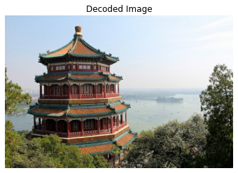

# Foreword

For datasets large enough, that may not fit in RAM, Tensorflow's Data API makes it easy. You can create dataset, transform it, and tensorflow takes care of all the implementation details, such as multithreading, queuing, batching, prefetching, and so on. 

Data API can read from :
- CSV file, text file
- binary file
- SQL databases,
- Open source extensions available to read from all sorts of data sources. 

Data API performs :
- Data Preprocessing
- Transforms

In this chapter, we will cover Data API, the TFRecord format and Feature API. 


## The Data API

This represents a sequence of data items. Generally, we use datasets that gradually read data from disk, but for simplicity let's create a dataset entirely in RAM using ```tf.data.Dataset.from_tensor_slices(X)```. This function takes a tensor and creates a tf.data.Dataset whose elements are all the slices of X(along the first dimension)


```python
import tensorflow as tf
import numpy as np
from tensorflow import keras
import os
```


```python
X = tf.range(10) #any data tensor
dataset = tf.data.Dataset.from_tensor_slices(X)

dataset
```


    <TensorSliceDataset shapes: (), types: tf.int32>


```python
for item in dataset:
    print(item)
```

    tf.Tensor(0, shape=(), dtype=int32)
    tf.Tensor(1, shape=(), dtype=int32)
    tf.Tensor(2, shape=(), dtype=int32)
    tf.Tensor(3, shape=(), dtype=int32)
    tf.Tensor(4, shape=(), dtype=int32)
    tf.Tensor(5, shape=(), dtype=int32)
    tf.Tensor(6, shape=(), dtype=int32)
    tf.Tensor(7, shape=(), dtype=int32)
    tf.Tensor(8, shape=(), dtype=int32)
    tf.Tensor(9, shape=(), dtype=int32)


## Chaining Transformations
Once you have dataset, you can apply all sorts of transformations to it by calling its transformation methods. Each method returns a new dataset, so you can chain transformations. 
- ```repeat()``` method repeats the dataset. so ```repeat(3)``` will change dataset size to 30.
- ```batch(num)``` method will group the dataset in num sizes


```python
dataset = dataset.repeat(3).batch(7)
for item in dataset:
    print(item)
    
# if you use drop_remainder = true in batch method, last two tensor will be omitted
```

    tf.Tensor([0 1 2 3 4 5 6], shape=(7,), dtype=int32)
    tf.Tensor([7 8 9 0 1 2 3], shape=(7,), dtype=int32)
    tf.Tensor([4 5 6 7 8 9 0], shape=(7,), dtype=int32)
    tf.Tensor([1 2 3 4 5 6 7], shape=(7,), dtype=int32)
    tf.Tensor([8 9], shape=(2,), dtype=int32)


```python
# This creates a new dataset with all the items doubled
dataset = dataset.map(lambda x: x * 2)
```


```python
for item in dataset.take(3):
    print(item)
```

    tf.Tensor([ 0  2  4  6  8 10 12], shape=(7,), dtype=int32)
    tf.Tensor([14 16 18  0  2  4  6], shape=(7,), dtype=int32)
    tf.Tensor([ 8 10 12 14 16 18  0], shape=(7,), dtype=int32)


```python
# shuffling the data
tf.random.set_seed(42)
dataset = tf.data.Dataset.range(10).repeat(3)
dataset = dataset.shuffle(buffer_size = 3,seed = 42).batch(7)
for item in dataset:
    print(item)


```

    tf.Tensor([1 3 0 4 2 5 6], shape=(7,), dtype=int64)
    tf.Tensor([8 7 1 0 3 2 5], shape=(7,), dtype=int64)
    tf.Tensor([4 6 9 8 9 7 0], shape=(7,), dtype=int64)
    tf.Tensor([3 1 4 5 2 8 7], shape=(7,), dtype=int64)
    tf.Tensor([6 9], shape=(2,), dtype=int64)


### Working with California dataset (Split California Dataset)


```python
from sklearn.datasets import fetch_california_housing
from sklearn.model_selection import train_test_split
from sklearn.preprocessing import StandardScaler

housing = fetch_california_housing()

X_train_full,X_test,y_train_full,y_test = train_test_split(
    housing.data,housing.target.reshape(-1,1),random_state = 42
)

X_train, X_valid, y_train, y_valid = train_test_split(
    X_train_full,y_train_full,random_state = 42
)

scaler = StandardScaler()
scaler.fit(X_train)
X_mean = scaler.mean_
X_std = scaler.scale_
```

For a very large dataset that does not fit in memory, you will typically want to split it into many files first, then have Tensorflow read these files in parallel. To demonstrate this, let's start by splitting the housing dataset and save it to 20 CSV file:


```python
def save_to_multiple_csv_files(data,name_prefix,header = None,n_parts = 10):
    housing_dir = os.path.join("datasets","housing")
    os.makedirs(housing_dir, exist_ok = True)
    path_format = os.path.join(housing_dir,"my_{}_{:02d}.csv")
    
    filepaths = []
    m = len(data)
    for file_idx,row_indices in enumerate(np.array_split(np.arange(m),n_parts)):
        part_csv = path_format.format(name_prefix,file_idx)
        filepaths.append(part_csv)
        with open(part_csv,"wt",encoding = "utf-8") as f:
            if header is not None:
                f.write(header)
                f.write("\n")
            for row_idx in row_indices:
                f.write(",".join([repr(col) for col in data[row_idx]]))
                f.write("\n")
    return filepaths    
```


```python
train_data = np.c_[X_train,y_train]
valid_data = np.c_[X_valid,y_valid]
test_data = np.c_[X_test,y_test]

header_cols = housing.feature_names + ["MedianHouseValue"]
header = ",".join(header_cols)

train_filepaths = save_to_multiple_csv_files(
    train_data,"train",header,n_parts = 20
)
valid_filepaths = save_to_multiple_csv_files(
    valid_data,"valid",header,n_parts = 10
)
test_filepaths = save_to_multiple_csv_files(
    test_data,"test",header,n_parts = 10
)
```

Okay, now let's take a peek at the first few lines of one of these CSV files.


```python
import pandas as pd
pd.read_csv(train_filepaths[0]).head()
```


<div>
<style scoped>
    .dataframe tbody tr th:only-of-type {
        vertical-align: middle;
    }

    .dataframe tbody tr th {
        vertical-align: top;
    }

    .dataframe thead th {
        text-align: right;
    }
</style>
<table border="1" class="dataframe">
  <thead>
    <tr style="text-align: right;">
      <th></th>
      <th>MedInc</th>
      <th>HouseAge</th>
      <th>AveRooms</th>
      <th>AveBedrms</th>
      <th>Population</th>
      <th>AveOccup</th>
      <th>Latitude</th>
      <th>Longitude</th>
      <th>MedianHouseValue</th>
    </tr>
  </thead>
  <tbody>
    <tr>
      <th>0</th>
      <td>3.5214</td>
      <td>15.0</td>
      <td>3.049945</td>
      <td>1.106548</td>
      <td>1447.0</td>
      <td>1.605993</td>
      <td>37.63</td>
      <td>-122.43</td>
      <td>1.442</td>
    </tr>
    <tr>
      <th>1</th>
      <td>5.3275</td>
      <td>5.0</td>
      <td>6.490060</td>
      <td>0.991054</td>
      <td>3464.0</td>
      <td>3.443340</td>
      <td>33.69</td>
      <td>-117.39</td>
      <td>1.687</td>
    </tr>
    <tr>
      <th>2</th>
      <td>3.1000</td>
      <td>29.0</td>
      <td>7.542373</td>
      <td>1.591525</td>
      <td>1328.0</td>
      <td>2.250847</td>
      <td>38.44</td>
      <td>-122.98</td>
      <td>1.621</td>
    </tr>
    <tr>
      <th>3</th>
      <td>7.1736</td>
      <td>12.0</td>
      <td>6.289003</td>
      <td>0.997442</td>
      <td>1054.0</td>
      <td>2.695652</td>
      <td>33.55</td>
      <td>-117.70</td>
      <td>2.621</td>
    </tr>
    <tr>
      <th>4</th>
      <td>2.0549</td>
      <td>13.0</td>
      <td>5.312457</td>
      <td>1.085092</td>
      <td>3297.0</td>
      <td>2.244384</td>
      <td>33.93</td>
      <td>-116.93</td>
      <td>0.956</td>
    </tr>
  </tbody>
</table>
</div>


## Building an Input Pipeline
Let's suppose *train_filepaths* contains the list of file paths like shown below


```python
train_filepaths
```


    ['datasets/housing/my_train_00.csv',
     'datasets/housing/my_train_01.csv',
     'datasets/housing/my_train_02.csv',
     'datasets/housing/my_train_03.csv',
     'datasets/housing/my_train_04.csv',
     'datasets/housing/my_train_05.csv',
     'datasets/housing/my_train_06.csv',
     'datasets/housing/my_train_07.csv',
     'datasets/housing/my_train_08.csv',
     'datasets/housing/my_train_09.csv',
     'datasets/housing/my_train_10.csv',
     'datasets/housing/my_train_11.csv',
     'datasets/housing/my_train_12.csv',
     'datasets/housing/my_train_13.csv',
     'datasets/housing/my_train_14.csv',
     'datasets/housing/my_train_15.csv',
     'datasets/housing/my_train_16.csv',
     'datasets/housing/my_train_17.csv',
     'datasets/housing/my_train_18.csv',
     'datasets/housing/my_train_19.csv']


```python
filepath_dataset = tf.data.Dataset.list_files(train_filepaths,seed = 42)
```


```python
for filepath in filepath_dataset:
    print(filepath)
```

    tf.Tensor(b'datasets/housing/my_train_15.csv', shape=(), dtype=string)
    tf.Tensor(b'datasets/housing/my_train_08.csv', shape=(), dtype=string)
    tf.Tensor(b'datasets/housing/my_train_03.csv', shape=(), dtype=string)
    tf.Tensor(b'datasets/housing/my_train_01.csv', shape=(), dtype=string)
    tf.Tensor(b'datasets/housing/my_train_10.csv', shape=(), dtype=string)
    tf.Tensor(b'datasets/housing/my_train_05.csv', shape=(), dtype=string)
    tf.Tensor(b'datasets/housing/my_train_19.csv', shape=(), dtype=string)
    tf.Tensor(b'datasets/housing/my_train_16.csv', shape=(), dtype=string)
    tf.Tensor(b'datasets/housing/my_train_02.csv', shape=(), dtype=string)
    tf.Tensor(b'datasets/housing/my_train_09.csv', shape=(), dtype=string)
    tf.Tensor(b'datasets/housing/my_train_00.csv', shape=(), dtype=string)
    tf.Tensor(b'datasets/housing/my_train_07.csv', shape=(), dtype=string)
    tf.Tensor(b'datasets/housing/my_train_12.csv', shape=(), dtype=string)
    tf.Tensor(b'datasets/housing/my_train_04.csv', shape=(), dtype=string)
    tf.Tensor(b'datasets/housing/my_train_17.csv', shape=(), dtype=string)
    tf.Tensor(b'datasets/housing/my_train_11.csv', shape=(), dtype=string)
    tf.Tensor(b'datasets/housing/my_train_14.csv', shape=(), dtype=string)
    tf.Tensor(b'datasets/housing/my_train_18.csv', shape=(), dtype=string)
    tf.Tensor(b'datasets/housing/my_train_06.csv', shape=(), dtype=string)
    tf.Tensor(b'datasets/housing/my_train_13.csv', shape=(), dtype=string)


Next, we can call ```interleave()``` method to read from 5 files at a time and interleave their lines (skipping the first line of each file, which is the header row, using the ```skip()``` method):


```python
n_readers = 5
dataset = filepath_dataset.interleave(
    lambda filepath: tf.data.TextLineDataset(filepath).skip(1),
    cycle_length = n_readers
)
```

The ```interleave()``` method will create a dataset that will pull 5 file paths from the filepath_dataset, and for each one it will call the function we gave it ( a lambda in this example) to create a new dataset, in this case a *TextLineDataset*. It will then cycle through these 5 datasets, reading one line at a time from each until all datasets are out of items. Then it will get the next 5 file paths from the *filepath_dataset*, and interleave them the same way, and so on until it runs out of file paths. 


```python
for line in dataset.take(5):
    print(line.numpy())
```

    b'4.6477,38.0,5.03728813559322,0.911864406779661,745.0,2.5254237288135593,32.64,-117.07,1.504'
    b'8.72,44.0,6.163179916317992,1.0460251046025104,668.0,2.794979079497908,34.2,-118.18,4.159'
    b'3.8456,35.0,5.461346633416459,0.9576059850374065,1154.0,2.8778054862842892,37.96,-122.05,1.598'
    b'3.3456,37.0,4.514084507042254,0.9084507042253521,458.0,3.2253521126760565,36.67,-121.7,2.526'
    b'3.6875,44.0,4.524475524475524,0.993006993006993,457.0,3.195804195804196,34.04,-118.15,1.625'


These are the first rows (ignoring header row) of 5 csv files, chosen randomly. But notice that these are just byte strings, we need to parse them, and also scale the data. 


```python
n_inputs = 8  #X_train.shape[-1]

@tf.function
def preprocess(line):
    defs = [0.] * n_inputs + [tf.constant([],dtype = tf.float32)]
    fields = tf.io.decode_csv(line,record_defaults = defs)
    x = tf.stack(fields[:-1])
    y = tf.stack(fields[-1:])
    return (x - X_mean) / X_std, y
```


```python
preprocess(b'4.6477,38.0,5.03728813559322,0.911864406779661,745.0,2.5254237288135593,32.64,-117.07,1.504')
```


    (<tf.Tensor: shape=(8,), dtype=float32, numpy=
     array([ 0.39593136,  0.74167496, -0.16415128, -0.40340805, -0.61991787,
            -0.18355484, -1.4084505 ,  1.2565969 ], dtype=float32)>,
     <tf.Tensor: shape=(1,), dtype=float32, numpy=array([1.504], dtype=float32)>)


- First, Mean and Standard deviation of each features were pre computed 
- The preprocess function takes one CSV line, and starts by parsing it. For this it uses the ```tf.io.csv_decode()``` function, which takes two argument: first - line to parse, second - array containing the default value for each column in csv file


#### Putting everything together


```python
def csv_reader_dataset(filepaths,repeat = None,n_readers = 5,
                      n_read_threads = None, shuffle_buffer_size = 10000,
                      n_parse_threads = 5, batch_size = 32):
    
    dataset = tf.data.Dataset.list_files(filepaths).repeat(repeat)
    dataset = dataset.interleave(
        lambda filepath: tf.data.TextLineDataset(filepath).skip(1),
        cycle_length = n_readers, num_parallel_calls = n_read_threads
    )
    dataset = dataset.shuffle(shuffle_buffer_size)
    dataset = dataset.map(preprocess, num_parallel_calls = n_parse_threads)
    dataset = dataset.batch(batch_size)
    
    return dataset.prefetch(1)
```

The above function ```csv_reader_dataset()``` is just the single function implementation of what we did above. There is one thing that is different i.e ```dataset.prefetch(1)```, which will do its best to create a batch of data ahead. In other word, when we are training single batch, another batch is ready to be trained. 

Let's implement this ```csv_reader_dataset()``` function to see how it works. 


```python
train_set = csv_reader_dataset(train_filepaths,batch_size = 3)

for X_batch, y_batch in train_set.take(2):
    print("\r\nX = ",X_batch)
    print("\r\ny = ",y_batch)
```

    
    X =  tf.Tensor(
    [[ 1.1832466  -0.2867314   0.256955   -0.0914653   0.6741611   0.05366582
      -0.7432092   0.71184903]
     [-0.44522637  1.8491895  -0.32066625 -0.14044929 -0.10611927 -0.06691425
      -0.691678    0.7318402 ]
     [ 0.3091969   0.5043504   0.20859428 -0.2770272   0.6084533   0.27369827
      -0.84627515  0.7818199 ]], shape=(3, 8), dtype=float32)
    
    y =  tf.Tensor(
    [[3.151]
     [2.226]
     [2.141]], shape=(3, 1), dtype=float32)
    
    X =  tf.Tensor(
    [[-1.2879554   1.4536486  -0.5052248   0.20396037 -0.49580315  0.43515173
      -0.7666345   0.6568782 ]
     [-0.64608806 -1.0778131  -0.35905546  0.09489206  1.0309911  -0.22977838
      -0.72447133  0.9767287 ]
     [ 1.7620009  -0.6822723   0.7482188  -0.23329605 -0.6326944  -0.32895038
      -1.3241241   1.1716374 ]], shape=(3, 8), dtype=float32)
    
    y =  tf.Tensor(
    [[1.141]
     [1.228]
     [3.923]], shape=(3, 1), dtype=float32)


```python
# Using the dataset with keras.

train_set = csv_reader_dataset(train_filepaths,repeat = None)
valid_set = csv_reader_dataset(valid_filepaths)
test_set = csv_reader_dataset(test_filepaths)
```


```python
keras.backend.clear_session()
np.random.seed(42)
tf.random.set_seed(42)

model = keras.models.Sequential([
    keras.layers.Dense(30,activation = "relu",input_shape = X_train.shape[1:]),
    keras.layers.Dense(1)
])
model.compile(loss = "mse", optimizer = keras.optimizers.SGD(lr = 1e-3))
```


```python
batch_size = 32
model.fit(train_set,steps_per_epoch = len(X_train) // batch_size,epochs = 10,
         validation_data = valid_set,
         validation_steps = len(X_valid) // batch_size)
```

    Epoch 1/10
    362/362 [==============================] - 1s 2ms/step - loss: 1.6673 - val_loss: 0.7947
    Epoch 2/10
    362/362 [==============================] - 1s 2ms/step - loss: 0.6921 - val_loss: 0.6932
    Epoch 3/10
    362/362 [==============================] - 1s 2ms/step - loss: 0.6194 - val_loss: 0.6581
    Epoch 4/10
    362/362 [==============================] - 1s 2ms/step - loss: 0.5927 - val_loss: 0.5646
    Epoch 5/10
    362/362 [==============================] - 1s 2ms/step - loss: 0.5848 - val_loss: 0.5157
    Epoch 6/10
    362/362 [==============================] - 1s 2ms/step - loss: 0.5374 - val_loss: 0.5809
    Epoch 7/10
    362/362 [==============================] - 1s 2ms/step - loss: 0.5425 - val_loss: 0.5223
    Epoch 8/10
    362/362 [==============================] - 1s 2ms/step - loss: 0.5046 - val_loss: 0.5885
    Epoch 9/10
    362/362 [==============================] - 1s 2ms/step - loss: 0.4988 - val_loss: 0.5105
    Epoch 10/10
    362/362 [==============================] - 1s 2ms/step - loss: 0.4836 - val_loss: 0.4388


    <tensorflow.python.keras.callbacks.History at 0x7f6040096ac0>


```python
model.evaluate(test_set,steps = len(X_test)//batch_size)
```

    161/161 [==============================] - 0s 1ms/step - loss: 0.4803


    0.4803062081336975


## The TFRecord Format
The TFRecord format is Tensorflow's preferred format for storing large amount of data, such as images or audio, and reading it efficiently. It is a very simple binary format that just contains a sequence of binary records of varying sizes.

Let's take a look at a simple example. 
- You can create a TFRecord file using ```tf.io.TFRecordWriter``` class
- You can use ```tf.data.TFRecordDataset``` to read one or more TFRecord files


```python
# First Write
with tf.io.TFRecordWriter("my_data.tfrecord") as f:
    f.write(b"This is the first record")
    f.write(b"This is the second record")

# Next read
filepaths = ["my_data.tfrecord"]
dataset = tf.data.TFRecordDataset(filepaths)
for item in dataset:
    print(item)
```

    tf.Tensor(b'This is the first record', shape=(), dtype=string)
    tf.Tensor(b'This is the second record', shape=(), dtype=string)


You can read multiple TFRecord files with just one TFRecordDataset. By default it will read them one at a time, but if you set num_parallel_reads = 3, it will read 3 at a time in parallel and interleave their records:


```python
filepaths = ["my_test_{}.tfrecord".format(i) for i in range(5)]
for i, filepath in enumerate(filepaths):
    with tf.io.TFRecordWriter(filepath) as f:
        for j in range(3):
            f.write("File {} record {}".format(i,j).encode("utf-8"))
            
dataset = tf.data.TFRecordDataset(filepaths, num_parallel_reads = 3)
for item in dataset:
    print(item)
```

    tf.Tensor(b'File 0 record 0', shape=(), dtype=string)
    tf.Tensor(b'File 1 record 0', shape=(), dtype=string)
    tf.Tensor(b'File 2 record 0', shape=(), dtype=string)
    tf.Tensor(b'File 0 record 1', shape=(), dtype=string)
    tf.Tensor(b'File 1 record 1', shape=(), dtype=string)
    tf.Tensor(b'File 2 record 1', shape=(), dtype=string)
    tf.Tensor(b'File 0 record 2', shape=(), dtype=string)
    tf.Tensor(b'File 1 record 2', shape=(), dtype=string)
    tf.Tensor(b'File 2 record 2', shape=(), dtype=string)
    tf.Tensor(b'File 3 record 0', shape=(), dtype=string)
    tf.Tensor(b'File 4 record 0', shape=(), dtype=string)
    tf.Tensor(b'File 3 record 1', shape=(), dtype=string)
    tf.Tensor(b'File 4 record 1', shape=(), dtype=string)
    tf.Tensor(b'File 3 record 2', shape=(), dtype=string)
    tf.Tensor(b'File 4 record 2', shape=(), dtype=string)


#### Compressed TFRecord Files
It is sometimes useful to compress TFRecord files, especially if they need to be loaded via a network connection. you can create a TFRecord file by setting the options argument.


```python
options = tf.io.TFRecordOptions(compression_type = "GZIP")
with tf.io.TFRecordWriter("my_compressed.tfrecord",options) as f:
    f.write(b"This is the first record")
    f.write(b"And this is the second record")
```


```python
dataset = tf.data.TFRecordDataset(["my_compressed.tfrecord"],
                                 compression_type = "GZIP")

for item in dataset:
    print(item)
```

    tf.Tensor(b'This is the first record', shape=(), dtype=string)
    tf.Tensor(b'And this is the second record', shape=(), dtype=string)


### A Brief Introduction to Protocol Buffers

Even though each record can use any binary format you want, TFRecord files usually contain serialized protocol buffers (also called protobufs). This is a portable, extensible and efficient binary format developed at Google. 

Protocol buffers are defined using a simple language that looks like this:


```python
%%writefile person.proto
syntax = "proto3"; 
message Person { 
       string name = 1;
       int32 id = 2;
       repeated string email = 3;
     }
```

    Overwriting person.proto


From above protobuf, we can say
- We are using protobuf version 3
- Each person object may (optionally) have a name of type string, an id of type int32, and zero or more email fields, each of type string.
- The number 1, 2, and 3 are the field identifiers: they will be used in each record's binary representation. 

And let's compile it (the --descriptor_set_out and --include_imports options are only required for the ```tf.io.decode_proto()``` example below):


```python
!protoc person.proto --python_out=. --descriptor_set_out=person.desc --include_imports
```


```python
!ls person*
```

    person.desc  person_pb2.py  person.proto


```python
from person_pb2 import Person

person = Person(name = "Al", id = 123, email = ["a@b.com"]) # create a person
print(person)
```

    name: "Al"
    id: 123
    email: "a@b.com"
    


```python
person.name # read a field
```


    'Al'


```python
person.email[0] # repeated fields can be accessed like arrays
```


    'a@b.com'


```python
person.name = "Alice" # modify a field
```


```python
person.email.append("c@d.com") # add email id
```


```python
s = person.SerializeToString() # serialize to a byte string
s
```


    b'\n\x05Alice\x10{\x1a\x07a@b.com\x1a\x07c@d.com'


```python
person2 = Person() # create a new person
person2.ParseFromString(s) # parse the byte string (27 bytes)
```


    27


```python
person2 == person
```


    True


```python
person2.name
```


    'Alice'


```python
person2.email
```


    ['a@b.com', 'c@d.com']


### Custom Protobuf

In rare cases, you may want to parse a custom protobuf( like we just created) in Tensorflow. For this you can use the ```tf.io.decode_proto()``` function


```python
person_tf = tf.io.decode_proto(
    bytes = s,
    message_type = "Person",
    field_names = ["name","id","email"],
    output_types = [tf.string,tf.int32,tf.string],
    descriptor_source = "person.desc"
)
person_tf.values
```


    [<tf.Tensor: shape=(1,), dtype=string, numpy=array([b'Alice'], dtype=object)>,
     <tf.Tensor: shape=(1,), dtype=int32, numpy=array([123], dtype=int32)>,
     <tf.Tensor: shape=(2,), dtype=string, numpy=array([b'a@b.com', b'c@d.com'], dtype=object)>]


## Tensorflow Protobufs

The main protobuf typically used in a TFRecord file is the *Example* protobuf, which represents one instance in a dataset. It contains a list of named features, where each feature can either be a list of byte strings, a list of floats or a list of integers. 

TFRecord ---(one instance)---> Example ---(has)---> list of named features.

Here is the definition of the tf.train.Example protobuf:

```
syntax = "proto3";
message BytesList { repeated bytes value = 1;}
message FloatList { repeated float value = 1 [packed = True];}
message Int64List { repeated int64 value = 1 [packed = True];}
message Feature {
    oneof kind{
        BytesList bytes_list = 1;
        FloatList float_list = 2;
        Int64List int64_list = 3;
    }
};
message Features { map<string,Feature> feature = 1;};
message Example { Features features = 1;};
```


Here is how you could create a tf.train.Example representing the same person as earlier, and write it to TFRecord file:


```python
BytesList = tf.train.BytesList
FloatList = tf.train.FloatList
Int64List = tf.train.Int64List
Feature = tf.train.Feature
Features = tf.train.Features
Example = tf.train.Example
```


```python
person_example = Example(
    features = Features(
        feature = {
            "name": Feature(bytes_list=BytesList(value = [b"Alice"])),
            "id": Feature(int64_list=Int64List(value = [123])),
            "emails": Feature(bytes_list=BytesList(value = [b"a@b.com",
                                                            b"c@d.com"]))
        }
    )
)

with tf.io.TFRecordWriter("my_contacts.tfrecord") as f:
    f.write(person_example.SerializeToString())
```

## Loading and Parsing

To load the serialized Example protobufs, we will use a *tf.data.TFRecordDataset* once again, and we will parse each example using *tf.io.parse_single_example()*.


```python
feature_description = {
    "name":tf.io.FixedLenFeature([],tf.string,default_value = ""),
    "id":tf.io.FixedLenFeature([],tf.int64,default_value = 0),
    "emails":tf.io.VarLenFeature(tf.string),
}

for serialized_example in tf.data.TFRecordDataset(["my_contacts.tfrecord"]):
    parsed_example = tf.io.parse_single_example(serialized_example,
                                               feature_description)
```


```python
parsed_example
```


    {'emails': <tensorflow.python.framework.sparse_tensor.SparseTensor at 0x7f60386a8640>,
     'id': <tf.Tensor: shape=(), dtype=int64, numpy=123>,
     'name': <tf.Tensor: shape=(), dtype=string, numpy=b'Alice'>}


```python
parsed_example["emails"].values[0]
```


    <tf.Tensor: shape=(), dtype=string, numpy=b'a@b.com'>


The fixed length features are parsed as regular tensors, but the variable length features are parsed as sparse tensors. You can convert a sparse tensor to a dense tensor using tf.sparse.to_dense().


```python
tf.sparse.to_dense(parsed_example["emails"],default_value = b"")
```


    <tf.Tensor: shape=(2,), dtype=string, numpy=array([b'a@b.com', b'c@d.com'], dtype=object)>


```python
parsed_example["emails"].values
```


    <tf.Tensor: shape=(2,), dtype=string, numpy=array([b'a@b.com', b'c@d.com'], dtype=object)>


## Putting Images in TFRecords

Let's get real. Let's put real image in TFRecord


```python
from sklearn.datasets import load_sample_images
import matplotlib.pyplot as plt


img = load_sample_images()["images"][0]
plt.imshow(img)
plt.axis("off")
plt.title("Original Image")
plt.show()
```


    

    


```python
data = tf.io.encode_jpeg(img)
example_with_image = Example(
    features = Features(
        feature = {
            "image":Feature(bytes_list = BytesList(value = [data.numpy()])),
        }
    )
)
serialized_example = example_with_image.SerializeToString()
# then save to TFRecord
```


```python
feature_description = {"image":tf.io.VarLenFeature(tf.string)}
example_with_image = tf.io.parse_single_example(serialized_example,
                                               feature_description)

decoded_img = tf.io.decode_jpeg(example_with_image["image"].values[0])
```


```python
plt.imshow(decoded_img)
plt.title("Decoded Image")
plt.axis("off")
plt.show()
```


    

    


**Features API** can also be used for preprocessing data and handling that. More on that later on. 
